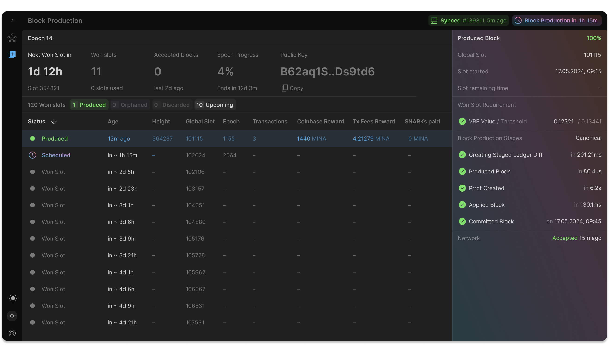

  <picture>
    <source media="(prefers-color-scheme: dark)" srcset="docs/assets/OpenMinaGH_Light.svg">
    <source media="(prefers-color-scheme: light)" srcset="docs/assets/OpenMinaGH_Dark.svg">
    
  </picture>

![Beta][beta-badge] [![release-badge]][release-link] [![Changelog][changelog-badge]][changelog] [![Apache licensed]][Apache link]

_**Open Mina 节点**是一个用 **Rust** 实现的快速且安全的 Mina 协议实现。_  
_目前处于**公开测试阶段**，加入我们的 [Discord 社区](https://discord.com/channels/484437221055922177/1290662938734231552)来帮助测试未来的版本。_

---

## 入门指南

### 从源码构建

- [Rust 节点](/docs/building-from-source-guide.md#how-to-build-and-launch-a-node-from-source) 和 [仪表盘](./docs/building-from-source-guide.md#how-to-launch-the-ui)

### 通过 Docker 在开发网络运行节点

- [非出块节点](/docs/alpha-testing-guide.md) 连接到对等节点并在开发网络上同步节点；无需开发网络权益。
- [出块节点](/docs/block-producer-guide.md) 在开发网络上产生区块；需要足够的开发网络权益。
- [本地出块演示](/docs/local-demo-guide.md) 在自定义本地链上产生区块，无需开发网络权益。

---

## 发布流程

**本项目处于测试阶段**。我们保持每月发布周期，[每月提供更新](https://github.com/openmina/openmina/releases)。

## 核心功能

- **Mina 网络**：连接对等节点、同步、广播消息
- **区块生产**：根据 Mina 共识生产、验证和应用区块
- **SNARK 生成**：为交易生成 SNARK 证明
- **调试**：使用归档节点数据的区块重放器

## 仓库结构

- [core/](core) - 提供需要在节点不同组件之间共享的基本类型
- [ledger/](ledger) - Rust 实现的 Mina 账本
- [snark/](snark) - Snark/证明验证
- [p2p/](p2p) - OpenMina 节点的 P2p 实现
- [node/](node) - 组合节点的所有业务逻辑
  - [native/](node/native) - 节点的操作系统特定部分，用于在本地运行节点（Linux/Mac/Windows）
  - [testing/](node/testing) - OpenMina 节点的测试框架
- [cli/](cli) - OpenMina 命令行工具
- [frontend/](frontend) - OpenMina 前端

## Open Mina 文档

### 什么是 Open Mina？

- [为什么我们要开发 Open Mina](docs/why-openmina.zh.md)

### 核心组件

- [P2P 通信](https://github.com/openmina/openmina/blob/documentation/docs/p2p_service.md)
  - [GossipSub](https://github.com/openmina/mina-wiki/blob/3ea9041e52fb2e606918f6c60bd3a32b8652f016/p2p/mina-gossip.md)
- [扫描状态](docs/scan-state.md)
- [SNARKs](docs/snark-work.md)

### 开发者工具

- [前端](./docs/building-from-source-guide.md#how-to-launch-the-ui)

### Mina 测试框架

- [完整测试文档](docs/testing/testing.md)

### 如何运行

- [非出块节点](./docs/alpha-testing-guide.md)
- [出块节点](./docs/block-producer-guide.md)
- [本地出块演示](./docs/local-demo-guide.md)

[changelog]: ./CHANGELOG.md
[beta-badge]: https://img.shields.io/badge/status-beta-yellow
[changelog-badge]: https://img.shields.io/badge/changelog-Changelog-%23E05735
[release-badge]: https://img.shields.io/github/v/release/openmina/openmina
[release-link]: https://github.com/openmina/openmina/releases/latest
[Apache licensed]: https://img.shields.io/badge/license-Apache_2.0-blue.svg
[Apache link]: https://github.com/openmina/openmina/blob/master/LICENSE
