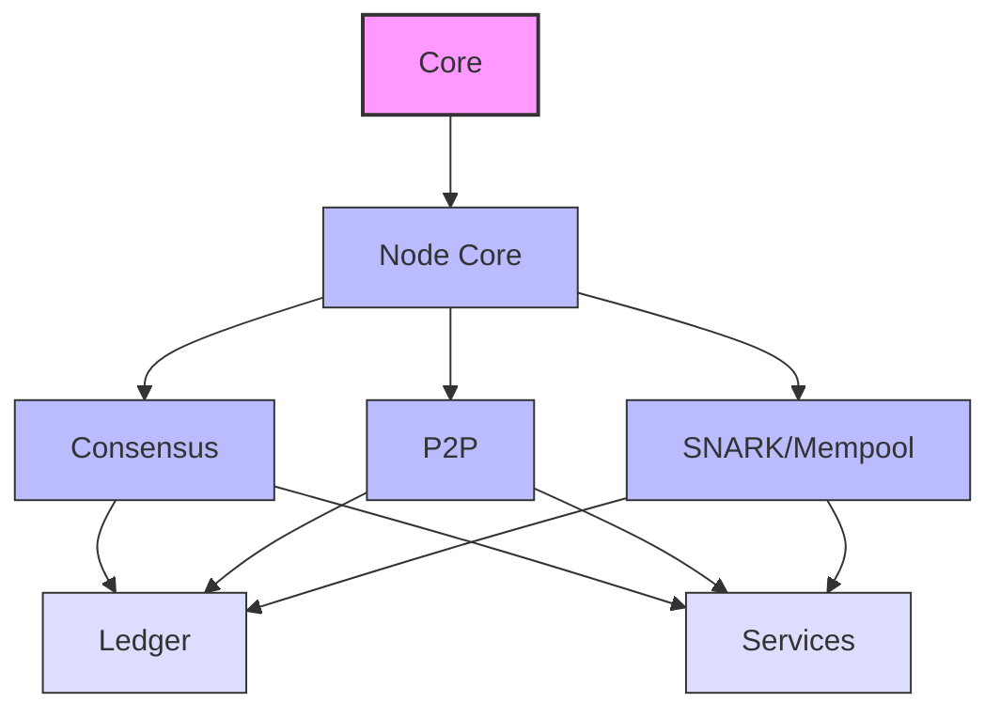

# OpenMina Architecture

## Big Picture Overview

OpenMina is a Rust implementation of the Mina Protocol blockchain node, designed with a focus on modularity, testability, and performance. The architecture follows a Redux-inspired state machine pattern, where all state transitions are explicit and triggered by well-defined actions.

### Core Architectural Principles

1. **State Machine Pattern**: All state is managed in a centralized store, with transitions occurring through pure reducer functions.
2. **Unidirectional Data Flow**: Actions flow in one direction through the system, making behavior predictable and traceable.
3. **Separation of Concerns**: Clear distinction between state management (reducers), side effects (services), and action dispatching.
4. **Immutable State**: State is treated as immutable, with all changes creating new state objects rather than modifying existing ones.
5. **Explicit Effects**: Side effects are isolated in service implementations, making the core logic pure and testable.

### Key Architectural Components

#### State Management

-   **State**: The central state object containing all application data, organized hierarchically.
-   **Actions**: Typed messages that describe state changes or trigger effects.
-   **Reducers**: Pure functions that compute new state based on current state and an action.
-   **Substate**: A mechanism for accessing specific slices of state with controlled visibility.
-   **Dispatcher**: Manages the queuing and execution of actions.

#### Effect Handling

-   **Services**: Implementations of external functionality (networking, cryptography, etc.).
-   **Effect Handlers**: Functions that translate actions into service calls.
-   **Callbacks**: Mechanism for specifying follow-up actions when effects complete.
-   **Event Source**: Central entry point for external events into the state machine.

#### Execution Model

-   **Store**: Combines state, reducers, and services into a cohesive execution unit.
-   **Middleware**: Intercepts actions for logging, debugging, or other cross-cutting concerns.
-   **Recorder**: Records all inputs to enable deterministic replay for debugging.
-   **Timeouts**: Centralized timeout management to ensure determinism in testing.

## Complete List of OpenMina Components

### Core State Machine Components

1. **Node Core** (`node/src/`)

    - Central hub of the state machine architecture
    - Contains the main state definition and action types
    - Manages the global reducer and effects functions
    - Coordinates interactions between all other components
    - Implements the main execution loop (`run_forever`)

2. **Transition Frontier** (`node/src/transition_frontier/`)

    - Manages the blockchain's current state and history
    - Handles block processing, validation, and chain selection
    - Still uses old-style state machine patterns
    - Core component for maintaining consensus

3. **Consensus** (`node/src/consensus/` and `core/src/consensus/`)

    - Implements the Ouroboros Samasika consensus protocol
    - Manages block production and validation rules
    - Coordinates with VRF for leader election
    - Interfaces with the ledger for state transitions

4. **Mempool** (`node/src/mempool/`)

    - Manages pending transactions
    - Implements transaction validation and prioritization
    - Provides transaction selection for block production
    - Handles transaction propagation policies

5. **Snark Pool** (`node/src/snark_pool/`)

    - Manages SNARK work and proofs
    - Implements validation and storage of SNARK work
    - Provides SNARK selection for block production
    - Handles SNARK work propagation

6. **Event Source** (`node/src/event_source/`)

    - Manages external events coming into the state machine
    - Converts service responses into actions
    - Central entry point for asynchronous operations

7. **Recorder** (`node/src/recorder/`)
    - Records all inputs to the state machine
    - Enables deterministic replay for debugging
    - Critical for testing and issue reproduction

### Service Components

8. **P2P** (`p2p/`)

    - Implements peer-to-peer networking
    - Handles peer discovery, connection management
    - Implements gossip protocols for data propagation
    - Provides RPC mechanisms for direct communication
    - Contains both state machine logic and network service implementation

9. **Ledger** (`ledger/`)

    - Implements the Mina blockchain state
    - Handles transaction processing and validation
    - Contains the account database and merkle tree implementation
    - Includes prover code for generating zero-knowledge proofs
    - Manages the staged ledger for block production

10. **SNARK** (`snark/`)

    - Implements verification of zero-knowledge proofs
    - Contains state machine logic for proof verification workflow
    - Interfaces with the ledger for actual cryptographic operations
    - Manages verification queues and results

11. **VRF** (`vrf/`)

    - Implements Verifiable Random Function for leader election
    - Runs as a separate service thread
    - Provides randomness for consensus protocol
    - Should ideally be in `core/` but evolved into a more coupled module

12. **Archive Node Service** (`node/common/src/service/archive/`)
    - Provides historical blockchain data
    - Implements database storage and retrieval
    - Supports queries for past blocks and transactions
    - Interacts with state machine through simple actions

### Platform-Specific Components

13. **Native** (`node/native/`)

    -   OS-specific implementation for running on Linux/Mac/Windows
    -   Handles native threading, I/O, and system integration
    -   Implements service interfaces for native platforms
    -   Provides CLI integration

14. **Web** (`node/web/`)
    -   WebAssembly implementation for browser environments
    -   Adapts the state machine to run in web contexts
    -   Implements service interfaces for web platform
    -   Handles browser-specific limitations

### Support Components

15. **Core** (`core/`)

    -   Provides basic types and utilities used across components
    -   Implements common data structures and algorithms
    -   Contains network configuration and constants
    -   Includes channel implementations for inter-thread communication
    -   Defines the `Substate` pattern for state management

16. **Account** (`node/account/`)

    -   Manages user accounts and keys
    -   Implements wallet functionality
    -   Handles transaction signing
    -   Provides account state queries

17. **Common** (`node/common/`)

    -   Shared utilities and types for node components
    -   Implements common service interfaces
    -   Provides logging and metrics infrastructure
    -   Contains error handling utilities

18. **Invariants** (`node/invariants/`)
    -   Implements runtime checks for system integrity
    -   Detects inconsistent states without crashing
    -   Provides warnings for potential issues
    -   Supports debugging and testing

### Testing Components

19. **Testing Framework** (`node/testing/`)

    -   Provides infrastructure for testing the node
    -   Implements scenario runners and simulators
    -   Supports deterministic testing with recorded inputs
    -   Enables property-based testing of state machine

20. **P2P Testing** (`p2p/testing/`)
    -   Specialized testing tools for P2P functionality
    -   Simulates network conditions and peer behaviors
    -   Tests discovery and gossip protocols
    -   Validates connection management

### Tool Components

21. **CLI** (`cli/`)

    -   Command-line interface for node operation
    -   Implements commands for node management
    -   Provides debugging and monitoring tools
    -   Includes replay functionality for debugging

22. **Frontend** (`frontend/`)

    -   Web-based user interface
    -   Visualizes node state and network
    -   Provides monitoring and management capabilities
    -   Implements dashboard for node operators

23. **Tools** (`tools/`)
    -   Collection of utility applications
    -   Includes transport testing, sandbox environments
    -   Provides specialized tools for hash verification, ledger inspection
    -   Implements analysis tools for network behavior

### Cryptographic Components

24. **Poseidon** (`poseidon/`)

    -   Implements the Poseidon hash function
    -   Optimized for zero-knowledge proof systems
    -   Used throughout the ledger and consensus components
    -   Critical for performance of cryptographic operations

25. **Mina P2P Messages** (`mina-p2p-messages/`)
    -   Defines the protocol messages for network communication
    -   Implements serialization and deserialization
    -   Ensures compatibility with the Mina protocol
    -   Shared with other Mina implementations

## State Machine Evolution

The OpenMina codebase is transitioning from an older state machine pattern to a more refined approach:

### Old Pattern

-   Direct state mutation in reducers
-   Global effects dispatched from reducers
-   Tight coupling between components
-   Limited testability due to side effects

### New Pattern

-   Immutable state updates via `Substate`
-   Explicit effect actions and handlers
-   Callbacks for control flow
-   Clear separation between stateful and effectful actions

This evolution improves modularity, testability, and reasoning about the system's behavior, while maintaining the core unidirectional data flow principle.

## Component Coupling Analysis

Understanding how tightly components are coupled helps with maintenance, refactoring, and onboarding new developers. This section analyzes dependencies between major components.

### Coupling Matrix

The following matrix shows the approximate coupling level between major components:

-   **High**: Direct dependencies, frequent interactions, shared state
-   **Medium**: Some dependencies, occasional interactions
-   **Low**: Few dependencies, minimal interactions
-   **None**: No direct dependencies

| Component      | Node Core | Consensus | P2P    | Ledger | Mempool | SNARK Pool | VRF  | Archive |
| -------------- | --------- | --------- | ------ | ------ | ------- | ---------- | ---- | ------- |
| **Node Core**  | -         | High      | High   | High   | High    | High       | High | Medium  |
| **Consensus**  | High      | -         | Medium | High   | High    | Medium     | High | Low     |
| **P2P**        | High      | Medium    | -      | Low    | Medium  | Medium     | Low  | Low     |
| **Ledger**     | High      | High      | Low    | -      | Medium  | Medium     | Low  | Medium  |
| **Mempool**    | High      | High      | Medium | Medium | -       | Low        | Low  | Low     |
| **SNARK Pool** | High      | Medium    | Medium | Medium | Low     | -          | Low  | Low     |
| **VRF**        | High      | High      | Low    | Low    | Low     | Low        | -    | None    |
| **Archive**    | Medium    | Low       | Low    | Medium | Low     | Low        | None | -       |

### Most Coupled Components

1. **Node Core**: As the central hub, it has high coupling with almost all components, serving as the integration point.
2. **Consensus**: Tightly coupled with Node Core, Ledger, and VRF due to its central role in block validation and production.
3. **P2P**: Highly coupled with Node Core as it handles all network communication.

### Most Independent Components

1. **Archive**: Relatively independent, mainly interacting with Ledger and Node Core.
2. **VRF**: Despite its importance, has focused interactions primarily with Consensus.
3. **Tools**: (Not shown in matrix) Generally independent utilities with minimal coupling.

### Dependency Flow Analysis

The system's dependency flow generally follows this pattern:

### Refactoring Opportunities

Based on coupling analysis, these areas present opportunities for reducing coupling:

1. **Node Core to Component Communication**: The high coupling between Node Core and other components could be reduced by implementing more explicit interfaces.

2. **Consensus Dependencies**: Consensus is tightly coupled with multiple components. Introducing more abstraction layers could improve modularity.

3. **P2P Integration**: The P2P layer interacts with multiple components. A more standardized message passing approach could reduce coupling.

4. **VRF Integration**: While VRF has focused coupling, it could be better encapsulated to interact primarily through Consensus rather than directly with Node Core.

### Architectural Boundaries

The system has several natural boundaries where interfaces are well-defined:

1. **Core/Node Boundary**: Core provides fundamental types and utilities used throughout the system.
2. **Node/Service Boundary**: Services provide a clean interface for external interactions.
3. **Platform Boundaries**: Native and Web implementations provide platform-specific adaptations.

These boundaries represent areas where the architecture successfully manages coupling through clear interfaces.
