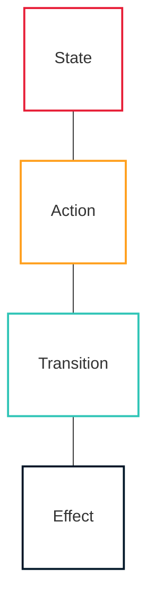

# OpenMina Architecture Documentation

This documentation provides a comprehensive overview of the OpenMina architecture, with a special focus on the state machine pattern that forms the core of the system.

## Documentation Structure

### Architecture

-   [System Overview](architecture/system-overview.md) - High-level overview of the entire system
-   [State Machine Architecture](architecture/state-machine-architecture.md) - Detailed explanation of the state machine pattern
-   [State Machines in OpenMina](architecture/state-machines/README.md) - How state machines are implemented in OpenMina
    -   [State Definition](architecture/state-machines/state-definition.md) - How state is defined and structured
    -   [Actions and Enabling Conditions](architecture/state-machines/actions.md) - How actions trigger state changes
    -   [Reducers](architecture/state-machines/reducers.md) - How state is updated in response to actions
    -   [Effects](architecture/state-machines/effects.md) - How side effects are handled
    -   [State Transitions](architecture/state-machines/state-transitions.md) - Common state transition patterns

### Components

-   [Transition Frontier](components/transition-frontier/README.md) - Blockchain state management
    -   [Genesis State Machine](components/transition-frontier/genesis-state-machine.md) - Initialization of the blockchain
    -   [Candidates State Machine](components/transition-frontier/candidates-state-machine.md) - Block candidate management
    -   [Sync State Machine](components/transition-frontier/sync-state-machine.md) - Blockchain synchronization
-   [SNARK System](components/snark/README.md) - Zero-knowledge proof verification
    -   [Block Verification State Machine](components/snark/block-verification-state-machine.md) - Block proof verification
    -   [Transaction Verification State Machine](components/snark/transaction-verification-state-machine.md) - Transaction proof verification
    -   [Work Verification State Machine](components/snark/work-verification-state-machine.md) - SNARK work verification
-   [P2P Communication](components/p2p/README.md) - Network communication
    -   [Connection State Machine](components/p2p/connection-state-machine.md) - Connection establishment and management
    -   [Peer State Machine](components/p2p/peer-state-machine.md) - Peer interaction
    -   [Channel State Machines](components/p2p/channel-state-machines.md) - Communication channels
-   [Block Producer](components/block-producer/README.md) - Block production
    -   [Slot Selection State Machine](components/block-producer/slot-selection-state-machine.md) - Slot winning and selection
    -   [Block Production State Machine](components/block-producer/block-production-state-machine.md) - Block creation and proving

### Implementation Patterns

-   [Common Patterns](patterns/README.md) - Recurring patterns in the codebase
    -   [State Machine Composition](patterns/state-machine-composition.md) - How state machines are composed
    -   [Async Operations](patterns/async-operations.md) - How asynchronous operations are handled
    -   [Error Handling](patterns/error-handling.md) - How errors are handled in state machines
    -   [Testing State Machines](patterns/testing-state-machines.md) - How to test state machines

## Diagram Legend

Throughout this documentation, we use consistent visual elements in our diagrams:

-   **States**: Represented by boxes with red borders
-   **Actions**: Represented by boxes with orange borders
-   **Transitions**: Represented by arrows with teal borders
-   **Effects**: Represented by boxes with dark blue borders

## Getting Started

If you're new to OpenMina, we recommend starting with the [System Overview](architecture/system-overview.md) to get a high-level understanding of the system. Then, proceed to the [State Machine Architecture](architecture/state-machine-architecture.md) to understand the core architectural pattern used throughout the codebase.

For developers looking to contribute, the [Common Patterns](patterns/README.md) section provides valuable insights into how to work with the codebase effectively.
