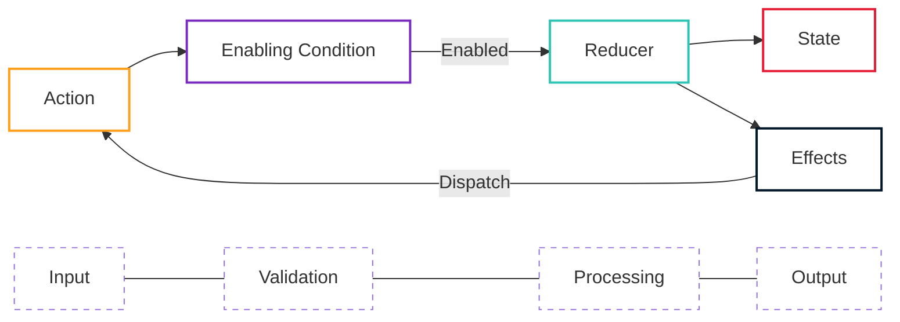

# State Machine Architecture

OpenMina uses a state machine architecture that provides a predictable and debuggable flow of data and operations. This document explains the core concepts of this architecture and how it's implemented in OpenMina.

## What is a State Machine?

A state machine is a mathematical model of computation that consists of a set of states, a set of inputs (actions), and a set of transitions between states based on inputs. In the context of software, a state machine architecture provides a structured way to manage application state and behavior.

## Architecture Diagram



**Diagram Legend:**
- **Action**: Operation to be performed (input to the state machine)
- **Enabling Condition**: Validates if an action can be processed in the current state
- **Reducer**: Pure function that updates state based on action
- **State**: Current state of the system
- **Effects**: Handles side effects and may dispatch new actions

## Core Concepts

### State

The state is the core of the state machine. It represents the current state of the system and is carefully designed to represent the flow of the application.

In OpenMina, state is typically defined as a Rust struct or enum:

```rust
#[derive(Serialize, Deserialize, Debug, Clone)]
pub enum TransitionFrontierGenesisState {
    Idle,
    LedgerLoadPending {
        time: redux::Timestamp,
    },
    LedgerLoadSuccess {
        time: redux::Timestamp,
        data: GenesisConfigLoaded,
    },
    // ...
}
```

Benefits of this state-centric approach:
1. Easy to debug, since state represents the flow
2. Easy to read/process, since state definition conveys a lot of information
3. Minimized or non-existent impossible/duplicate states

### Action

An action is an object representing some sort of operation to be performed. Actions can be nested based on their context.

```rust
pub enum Action {
    CheckTimeouts(CheckTimeoutsAction),
    P2p(P2pAction),
    // ...
}

pub struct CheckTimeoutsAction {}

pub enum P2pAction {
    Connect {
        peer_id: PeerId,
        address: Multiaddr,
    },
    // ...
}
```

Actions are defined in various files throughout the codebase, with the root action defined in [node/src/action.rs](../../node/src/action.rs).

### Enabling Condition

Each action must implement the `EnablingCondition` trait, which determines whether the action can be processed based on the current state.

```rust
pub trait EnablingCondition<State> {
    /// Enabling condition for the Action.
    ///
    /// Checks if the given action is enabled for a given state.
    fn is_enabled(&self, state: &State, time: Timestamp) -> bool {
        // ...
    }
}
```

Enabling conditions help restrict the flow of actions and prevent impossible or duplicate states.

### Reducer

Reducers are functions that update the state based on an action. They are pure functions that take the current state and an action and return a new state.

In the newer architecture, reducers accept a `Substate` context as their first argument, which provides:
- A mutable reference to the substate that the reducer will mutate
- An immutable reference to the global state
- A mutable reference to a `Dispatcher`

```rust
fn reducer(substate: &mut Substate<MyState>, action: &MyAction) {
    // Update state based on action
    match action {
        MyAction::SomeAction { param } => {
            substate.some_field = param.clone();
            
            // Dispatch a new action if needed
            let dispatcher = substate.dispatcher();
            dispatcher.dispatch(AnotherAction {});
        },
        // ...
    }
}
```

### Effects

Effects handle side effects that may occur as a result of an action. They can dispatch new actions but should be kept as simple as possible.

```rust
fn effects(state: &MyState, action: &MyEffectfulAction) -> Vec<Action> {
    match action {
        MyEffectfulAction::DoSomething { param } => {
            // This would be handled by a service
            // The service would then dispatch a result action
            vec![]
        },
        MyEffectfulAction::SomethingResult { result } => {
            match result {
                Ok(value) => {
                    // Success, dispatch action to update state
                    vec![Action::MyAction(MyAction::SomethingSuccess { value })]
                },
                Err(error) => {
                    // Error, dispatch action to handle error
                    vec![Action::MyAction(MyAction::SomethingFailed { error })]
                },
            }
        },
        // ...
    }
}
```

## Action Types

Actions are divided into two categories:

### Stateful Actions

These actions update the state and have a `reducer` function. They closely resemble the traditional state machine code, and most of the state machine logic should reside here.

### Effectful Actions

These actions involve calling external services and have an `effects` function. They should serve as thin layers for handling service interactions.

```rust
pub enum TransitionFrontierGenesisEffectfulAction {
    LedgerLoadInit {
        config: Arc<GenesisConfig>,
    },
    ProveInit {
        block_hash: StateHash,
        input: Box<ProverExtendBlockchainInputStableV2>,
    },
    // ...
}
```

## State Machine Composition

OpenMina uses a composition pattern for state machines, where the global state is composed of multiple component states, each with its own state machine.

```rust
pub struct State {
    pub p2p: P2p,
    pub ledger: LedgerState,
    pub snark: SnarkState,
    pub transition_frontier: TransitionFrontierState,
    // ...
}
```

Each component state machine has its own actions, reducers, and effects, but they can interact with each other through the global state and by dispatching actions that affect other components.

## Practical Considerations

When working with this architecture, conventional means of reading and writing code may not apply. The code follows the actual execution that the CPU will perform, with nothing abstracted or hidden away.

For more practical examples of how this architecture works in practice, see [State Machines in OpenMina](state-machines/README.md).
