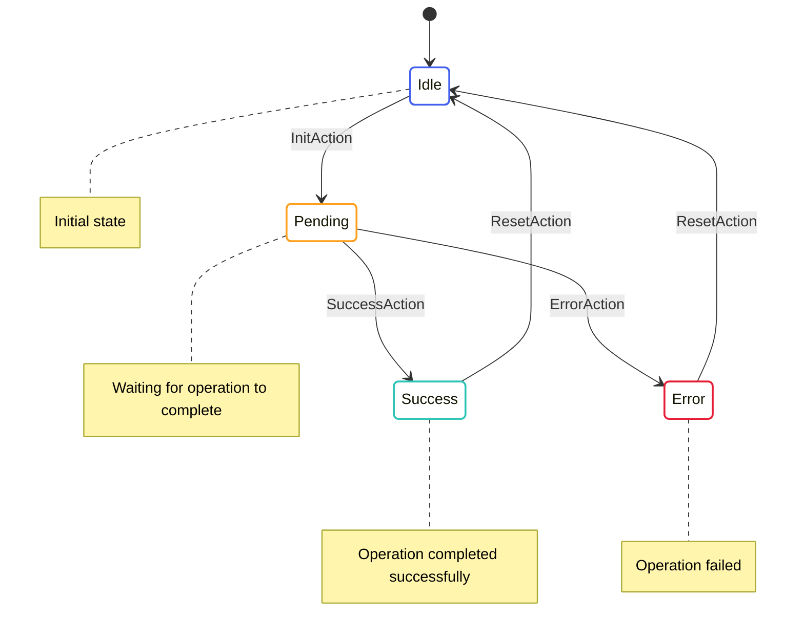

# State Machines in OpenMina

This document provides an overview of how state machines are implemented in OpenMina, with a focus on the practical aspects of working with the codebase.

## State Machine Implementation

OpenMina implements state machines using a pattern inspired by Redux, but with some unique characteristics tailored to the needs of a blockchain node:

1. **State-Centric Design**: The state is carefully designed to represent the flow of the application.
2. **Pure Reducers**: Reducers are pure functions that update the state based on actions.
3. **Enabling Conditions**: Actions have enabling conditions that determine if they can be processed.
4. **Effects**: Side effects are handled separately from state updates.
5. **Composition**: State machines are composed to form the global state machine.

## State Machine Components

A complete state machine in OpenMina consists of the following components:

### State Definition

The state definition is a Rust struct or enum that represents the current state of a component. It typically includes:

- The current status (e.g., `Idle`, `Pending`, `Success`, `Error`)
- Timestamps for tracking when state transitions occurred
- Data relevant to the current state

For more details, see [State Definition](state-definition.md).

### Actions

Actions are objects that represent operations to be performed. They are typically defined as Rust enums with variants for different types of actions. Actions can be:

- **Stateful Actions**: Update the state directly
- **Effectful Actions**: Trigger side effects

For more details, see [Actions and Enabling Conditions](actions.md).

### Reducers

Reducers are functions that update the state based on actions. They are pure functions that take the current state and an action and return a new state. In OpenMina, reducers:

- Accept a `Substate` context that provides access to the state and a dispatcher
- Match on the action type to determine how to update the state
- Update the state in-place through the mutable reference

For more details, see [Reducers](reducers.md).

### Effects

Effects handle side effects that may occur as a result of an action. They:

- Are separate from reducers to maintain reducer purity
- Can dispatch new actions
- Interact with services for IO or computationally heavy tasks

For more details, see [Effects](effects.md).

## State Machine Diagram



This diagram shows a typical state machine flow in OpenMina, with states and transitions between them.

## Common State Transition Patterns

OpenMina uses several common patterns for state transitions:

1. **Idle-Pending-Success/Error**: A common pattern for asynchronous operations
2. **Init-Pending-Ready**: Used for initialization sequences
3. **Hierarchical States**: States can contain substates for more complex flows

For more details, see [State Transitions](state-transitions.md).

## Example: P2P Connection State Machine

Here's a simplified example of a state machine for P2P connections:

```rust
// State definition
pub enum P2pConnectionState {
    Disconnected,
    Connecting {
        time: Timestamp,
        attempts: u32,
    },
    Connected {
        time: Timestamp,
        peer_id: PeerId,
    },
    Error {
        time: Timestamp,
        error: String,
    },
}

// Action definition
pub enum P2pConnectionAction {
    Connect {
        peer_id: PeerId,
        address: Multiaddr,
    },
    Connected {
        peer_id: PeerId,
    },
    ConnectionFailed {
        error: String,
    },
    Disconnect,
}

// Enabling condition
impl EnablingCondition<State> for P2pConnectionAction {
    fn is_enabled(&self, state: &State, _time: Timestamp) -> bool {
        match self {
            P2pConnectionAction::Connect { .. } => {
                matches!(state.p2p_connection, P2pConnectionState::Disconnected)
            },
            // ...
        }
    }
}

// Reducer
fn reducer(substate: &mut Substate<P2pConnectionState>, action: &P2pConnectionAction) {
    match action {
        P2pConnectionAction::Connect { peer_id, address } => {
            *substate = P2pConnectionState::Connecting {
                time: substate.time(),
                attempts: 1,
            };
            
            // Dispatch effectful action
            let dispatcher = substate.dispatcher();
            dispatcher.dispatch(P2pConnectionEffectfulAction::ConnectInit {
                peer_id: peer_id.clone(),
                address: address.clone(),
            });
        },
        // ...
    }
}

// Effects
fn effects(state: &P2pConnectionState, action: &P2pConnectionEffectfulAction) -> Vec<Action> {
    match action {
        P2pConnectionEffectfulAction::ConnectInit { peer_id, address } => {
            // This would be handled by a service
            vec![]
        },
        P2pConnectionEffectfulAction::ConnectResult { peer_id, result } => {
            match result {
                Ok(()) => {
                    vec![Action::P2pConnection(P2pConnectionAction::Connected {
                        peer_id: peer_id.clone(),
                    })]
                },
                Err(error) => {
                    vec![Action::P2pConnection(P2pConnectionAction::ConnectionFailed {
                        error: error.clone(),
                    })]
                },
            }
        },
        // ...
    }
}
```

This example shows how a P2P connection state machine might be implemented in OpenMina, with states, actions, enabling conditions, reducers, and effects.

## Next Steps

To learn more about specific aspects of state machines in OpenMina, see:

- [State Definition](state-definition.md)
- [Actions and Enabling Conditions](actions.md)
- [Reducers](reducers.md)
- [Effects](effects.md)
- [State Transitions](state-transitions.md)
