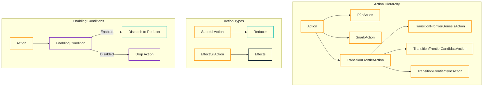

# Actions and Enabling Conditions

This document explains how actions and enabling conditions are defined and used in OpenMina's state machines.

## Actions

Actions are objects that represent operations to be performed. They are the inputs to the state machine and trigger state transitions.

### Action Structure

In OpenMina, actions are typically defined as Rust enums with variants for different types of actions. Each variant can have associated data that provides additional information about the action.

```rust
pub enum P2pAction {
    Connect {
        peer_id: PeerId,
        address: Multiaddr,
    },
    Connected {
        peer_id: PeerId,
    },
    ConnectionFailed {
        peer_id: PeerId,
        error: String,
    },
    Disconnect {
        peer_id: PeerId,
    },
    // ...
}
```

In this example, `P2pAction` is an enum with variants for different P2P actions, such as connecting to a peer, handling a successful connection, handling a failed connection, and disconnecting from a peer.

### Action Hierarchy

Actions in OpenMina are organized in a hierarchy, with the root action defined in [node/src/action.rs](../../../node/src/action.rs):

```rust
pub enum Action {
    CheckTimeouts(CheckTimeoutsAction),
    P2p(P2pAction),
    Ledger(LedgerAction),
    Snark(SnarkAction),
    TransitionFrontier(TransitionFrontierAction),
    SnarkPool(SnarkPoolAction),
    ExternalSnarkWorker(ExternalSnarkWorkerAction),
    TransactionPool(TransactionPoolAction),
    BlockProducer(BlockProducerAction),
    Rpc(RpcAction),
    WatchedAccounts(WatchedAccountsAction),
    // ...
}
```

This hierarchy allows actions to be dispatched to the appropriate component state machine.

### Action Types

OpenMina uses two main types of actions:

#### Stateful Actions

Stateful actions update the state directly through a reducer. They are the primary way to change the state of the system.

```rust
pub enum TransitionFrontierAction {
    Genesis(TransitionFrontierGenesisAction),
    GenesisEffect(TransitionFrontierGenesisEffectfulAction),
    GenesisInject,
    GenesisProvenInject,
    Candidate(TransitionFrontierCandidateAction),
    Sync(TransitionFrontierSyncAction),
    Synced {
        needed_protocol_states: BTreeSet<StateHash>,
    },
    SyncFailed {
        error: SyncError,
        needed_protocol_states: BTreeSet<StateHash>,
    },
}
```

#### Effectful Actions

Effectful actions trigger side effects, such as IO operations or computationally heavy tasks. They don't update the state directly but may dispatch stateful actions as a result of the side effect.

```rust
pub enum TransitionFrontierGenesisEffectfulAction {
    LedgerLoadInit {
        config: Arc<GenesisConfig>,
    },
    ProveInit {
        block_hash: StateHash,
        input: Box<ProverExtendBlockchainInputStableV2>,
    },
}
```

## Enabling Conditions

Enabling conditions determine whether an action can be processed based on the current state. They help prevent impossible or duplicate states by ensuring that actions are only processed when they make sense.

### Enabling Condition Structure

In OpenMina, enabling conditions are implemented as a trait that actions must implement:

```rust
pub trait EnablingCondition<State> {
    /// Enabling condition for the Action.
    ///
    /// Checks if the given action is enabled for a given state.
    fn is_enabled(&self, state: &State, time: Timestamp) -> bool {
        // Default implementation returns true
        true
    }
}
```

Actions implement this trait to specify when they can be processed:

```rust
impl EnablingCondition<State> for P2pAction {
    fn is_enabled(&self, state: &State, _time: Timestamp) -> bool {
        match self {
            P2pAction::Connect { peer_id, .. } => {
                // Check if we're already connected to this peer
                !state.p2p.peers.contains_key(peer_id)
            },
            P2pAction::Disconnect { peer_id } => {
                // Check if we're connected to this peer
                state.p2p.peers.contains_key(peer_id)
            },
            // ...
        }
    }
}
```

### Enabling Condition Examples

Here are some common patterns for enabling conditions:

#### State-Based Conditions

These conditions check the current state to determine if an action is enabled:

```rust
impl EnablingCondition<State> for TransitionFrontierGenesisAction {
    fn is_enabled(&self, state: &State, _time: Timestamp) -> bool {
        match self {
            TransitionFrontierGenesisAction::Produce => {
                matches!(state.transition_frontier.genesis, TransitionFrontierGenesisState::Idle)
            },
            TransitionFrontierGenesisAction::LedgerLoadSuccess { .. } => {
                matches!(
                    state.transition_frontier.genesis,
                    TransitionFrontierGenesisState::LedgerLoadPending { .. }
                )
            },
            // ...
        }
    }
}
```

#### Data-Based Conditions

These conditions check data in the state to determine if an action is enabled:

```rust
impl EnablingCondition<State> for TransitionFrontierCandidateAction {
    fn is_enabled(&self, state: &State, _time: Timestamp) -> bool {
        match self {
            TransitionFrontierCandidateAction::BlockReceived { block, .. } => {
                // Check if we already have this block
                let block_hash = block.hash();
                !state.transition_frontier.candidates.blocks.contains_key(&block_hash)
            },
            // ...
        }
    }
}
```

#### Time-Based Conditions

These conditions check the current time to determine if an action is enabled:

```rust
impl EnablingCondition<State> for CheckTimeoutsAction {
    fn is_enabled(&self, state: &State, time: Timestamp) -> bool {
        // Only check timeouts every 100ms
        time.saturating_sub(state.last_check_timeouts) >= Duration::from_millis(100)
    }
}
```

## Action Dispatch

Actions are dispatched to the state machine using a dispatcher, which is typically provided by the `Substate` context:

```rust
fn reducer(substate: &mut Substate<MyState>, action: &MyAction) {
    match action {
        MyAction::SomeAction { param } => {
            // Update state
            substate.some_field = param.clone();
            
            // Dispatch a new action
            let dispatcher = substate.dispatcher();
            dispatcher.dispatch(AnotherAction {});
        },
        // ...
    }
}
```

Actions can be dispatched from reducers or effects, allowing for complex state machine flows.

## Action Metadata

Actions in OpenMina are wrapped with metadata that includes information such as the time the action was dispatched:

```rust
pub struct ActionWithMeta<A> {
    pub action: A,
    pub meta: ActionMeta,
}
```

This metadata is used for various purposes, such as tracking when actions were dispatched and providing timing information for enabling conditions.

## Action Diagram



This diagram shows the action hierarchy, action types, and enabling conditions in OpenMina.

## Best Practices

When defining actions and enabling conditions in OpenMina, follow these best practices:

1. **Be Specific**: Define specific actions for specific operations rather than generic actions.
2. **Include Necessary Data**: Include all necessary data in the action to perform the operation.
3. **Use Enabling Conditions**: Use enabling conditions to prevent impossible or duplicate states.
4. **Document Actions**: Document the purpose and expected behavior of each action.
5. **Keep Actions Simple**: Keep actions focused on a single operation.
6. **Use Appropriate Action Types**: Use stateful actions for state updates and effectful actions for side effects.
7. **Handle All Cases**: Ensure that enabling conditions handle all possible states.

## Example: Block Verification Actions

Here's a more detailed example of actions for block verification:

```rust
pub enum SnarkBlockVerifyAction {
    Verify {
        block_hash: StateHash,
        input: Box<ProverExtendBlockchainInputStableV2>,
    },
    VerifySuccess {
        block_hash: StateHash,
    },
    VerifyFailed {
        block_hash: StateHash,
        error: String,
    },
}

pub enum SnarkBlockVerifyEffectfulAction {
    VerifyInit {
        block_hash: StateHash,
        input: Box<ProverExtendBlockchainInputStableV2>,
    },
}

impl EnablingCondition<State> for SnarkBlockVerifyAction {
    fn is_enabled(&self, state: &State, _time: Timestamp) -> bool {
        match self {
            SnarkBlockVerifyAction::Verify { block_hash, .. } => {
                // Check if we're already verifying this block
                !state.snark.block_verify.verifying.contains_key(block_hash)
            },
            SnarkBlockVerifyAction::VerifySuccess { block_hash } => {
                // Check if we're verifying this block
                state.snark.block_verify.verifying.contains_key(block_hash)
            },
            SnarkBlockVerifyAction::VerifyFailed { block_hash, .. } => {
                // Check if we're verifying this block
                state.snark.block_verify.verifying.contains_key(block_hash)
            },
        }
    }
}
```

This example shows actions for block verification, including stateful actions for initiating verification, handling successful verification, and handling failed verification, as well as an effectful action for the actual verification process. The enabling conditions ensure that actions are only processed when they make sense based on the current state.
