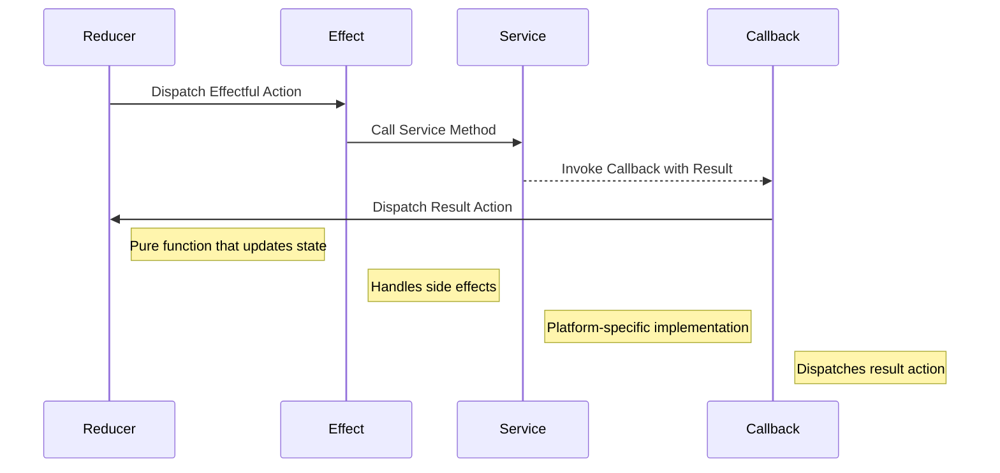

# Effects

This document explains how effects are defined and used in OpenMina's state machines.

## What are Effects?

Effects handle side effects that may occur as a result of an action. They are responsible for interacting with the outside world, such as making network requests, reading from or writing to disk, or performing computationally intensive operations.

## Effect Structure

In OpenMina, effects are typically implemented as methods on the action type:

```rust
impl TransitionFrontierGenesisEffectfulAction {
    pub fn effects<S>(&self, _: &ActionMeta, store: &mut Store<S>)
    where
        S: redux::Service + TransitionFrontierGenesisService,
    {
        match self {
            TransitionFrontierGenesisEffectfulAction::LedgerLoadInit { config } => {
                store.service.load_genesis(config.clone());
            },
            TransitionFrontierGenesisEffectfulAction::ProveInit { block_hash, input } => {
                store.service.prove(block_hash.clone(), input.clone());
            },
        }
    }
}
```

## Effectful Actions

Effectful actions are a special type of action that triggers side effects. They are typically defined as a separate enum from stateful actions:

```rust
pub enum TransitionFrontierGenesisEffectfulAction {
    LedgerLoadInit {
        config: Arc<GenesisConfig>,
    },
    ProveInit {
        block_hash: StateHash,
        input: Box<ProverExtendBlockchainInputStableV2>,
    },
}
```

Effectful actions are dispatched by reducers and handled by the effects function.

## Service Abstraction

Effects interact with services, which are abstractions for IO or computationally heavy tasks:

```rust
pub trait TransitionFrontierGenesisService: redux::Service {
    fn load_genesis(&mut self, config: Arc<GenesisConfig>);
    fn prove(&mut self, block_hash: StateHash, input: Box<ProverExtendBlockchainInputStableV2>);
}
```

Services are implemented by the platform-specific code and injected into the state machine.

## Action Dispatching

Effects can dispatch new actions using the store provided to the effects function:

```rust
impl BlockVerifyEffectfulAction {
    pub fn effects<S>(&self, _: &ActionMeta, store: &mut Store<S>)
    where
        S: redux::Service + BlockVerifyService,
    {
        match self {
            BlockVerifyEffectfulAction::VerifyInit { block_hash, input } => {
                store.service.verify(
                    block_hash.clone(),
                    input.clone(),
                    Box::new(move |result| {
                        match result {
                            Ok(()) => {
                                store.dispatch(BlockVerifyAction::VerifySuccess {
                                    block_hash: block_hash.clone(),
                                });
                            },
                            Err(error) => {
                                store.dispatch(BlockVerifyAction::VerifyFailed {
                                    block_hash: block_hash.clone(),
                                    error: error.to_string(),
                                });
                            },
                        }
                    }),
                );
            },
        }
    }
}
```

This allows effects to trigger state transitions based on the result of side effects.

## Separation of Concerns

The separation of reducers and effects provides several benefits:

1. **Pure Reducers**: Reducers can remain pure functions, making them easier to test and reason about.
2. **Testable Effects**: Effects can be tested in isolation, with mock services.
3. **Platform Independence**: The core logic can be platform-independent, with platform-specific code isolated in services.
4. **Predictable State Transitions**: State transitions are always triggered by actions, making them predictable and debuggable.

## Effect Composition

Effects can be composed to handle different types of effectful actions:

```rust
pub fn transition_frontier_effects<S>(
    store: &mut Store<S>,
    action: ActionWithMeta<TransitionFrontierAction>,
) where
    S: TransitionFrontierService,
{
    let (action, meta) = action.split();

    match action {
        TransitionFrontierAction::Genesis(a) => {
            // Handle genesis actions
        },
        TransitionFrontierAction::GenesisEffect(a) => {
            a.effects(&meta, store);
        },
        TransitionFrontierAction::Candidate(a) => {
            // Handle candidate actions
        },
        // ... other action handlers
    }
}
```

This allows for a modular and maintainable codebase, where each effect is responsible for a specific type of effectful action.

## Error Handling

Effects should handle errors gracefully, typically by dispatching an error action:

```rust
store.service.verify(
    block_hash.clone(),
    input.clone(),
    Box::new(move |result| {
        match result {
            Ok(()) => {
                store.dispatch(BlockVerifyAction::VerifySuccess {
                    block_hash: block_hash.clone(),
                });
            },
            Err(error) => {
                store.dispatch(BlockVerifyAction::VerifyFailed {
                    block_hash: block_hash.clone(),
                    error: error.to_string(),
                });
            },
        }
    }),
);
```

This allows the state machine to handle errors in a predictable way.

## Asynchronous Effects

Effects often involve asynchronous operations, such as network requests or disk IO. These are handled using callbacks:

```rust
store.service.load_genesis(
    config.clone(),
    Box::new(move |result| {
        match result {
            Ok(data) => {
                store.dispatch(TransitionFrontierGenesisAction::LedgerLoadSuccess {
                    data,
                });
            },
            Err(error) => {
                store.dispatch(TransitionFrontierGenesisAction::LedgerLoadFailed {
                    error: error.to_string(),
                });
            },
        }
    }),
);
```

This allows the state machine to continue processing other actions while waiting for the asynchronous operation to complete.

## Effect Diagram



## Best Practices

When implementing effects in OpenMina, follow these best practices:

1. **Keep Effects Simple**: Effects should be simple and mainly focus on dispatching new actions.
2. **Use Service Abstraction**: Use service abstraction to isolate platform-specific code.
3. **Handle Errors Gracefully**: Handle errors by dispatching error actions.
4. **Use Callbacks for Asynchronous Operations**: Use callbacks to handle asynchronous operations.
5. **Test Effects**: Write tests for effects to ensure they behave as expected.
6. **Keep Effects Pure**: Effects should not modify state directly, only dispatch actions.
7. **Document Service Interface**: Document the service interface to make it clear how effects interact with services.

## Example: Block Verification Effects

Here's a more detailed example of effects for block verification:

```rust
impl BlockVerifyEffectfulAction {
    pub fn effects<S>(&self, _: &ActionMeta, store: &mut Store<S>)
    where
        S: redux::Service + BlockVerifyService,
    {
        match self {
            BlockVerifyEffectfulAction::VerifyInit { block_hash, input } => {
                // Log the verification request
                log::info!("Verifying block {}", block_hash);

                // Call the service to verify the block
                store.service.verify(
                    block_hash.clone(),
                    input.clone(),
                    Box::new(move |result| {
                        match result {
                            Ok(()) => {
                                // Log the successful verification
                                log::info!("Block {} verified successfully", block_hash);

                                // Dispatch success action
                                store.dispatch(BlockVerifyAction::VerifySuccess {
                                    block_hash: block_hash.clone(),
                                });
                            },
                            Err(error) => {
                                // Log the verification failure
                                log::error!("Failed to verify block {}: {}", block_hash, error);

                                // Dispatch failure action
                                store.dispatch(BlockVerifyAction::VerifyFailed {
                                    block_hash: block_hash.clone(),
                                    error: error.to_string(),
                                });
                            },
                        }
                    }),
                );
            },
        }
    }
}
```

This example shows how effects handle side effects, interact with services, and dispatch actions based on the result of side effects.
