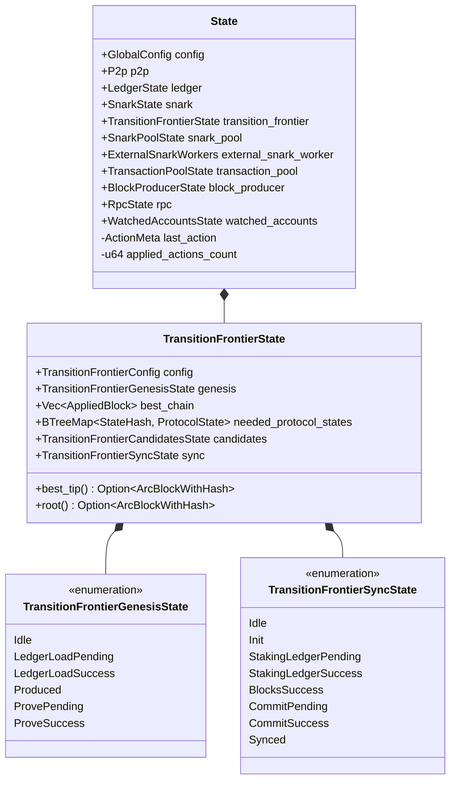

# State Definition

This document explains how state is defined and structured in OpenMina's state machines.

## State Structure

In OpenMina, state is typically defined as a Rust struct or enum that represents the current state of a component. The state definition is a crucial part of the state machine, as it determines what information is stored and how it's organized.

## State Types

OpenMina uses two main approaches to state definition:

### Enum-Based State

Enum-based state is used when a component can be in one of several distinct states, with different data associated with each state. This is particularly useful for representing state machines with clear state transitions.

```rust
#[derive(Serialize, Deserialize, Debug, Clone)]
pub enum TransitionFrontierGenesisState {
    Idle,
    LedgerLoadPending {
        time: redux::Timestamp,
    },
    LedgerLoadSuccess {
        time: redux::Timestamp,
        data: GenesisConfigLoaded,
    },
    Produced {
        time: redux::Timestamp,
        negative_one: v2::MinaStateProtocolStateValueStableV2,
        genesis: v2::MinaStateProtocolStateValueStableV2,
        genesis_hash: v2::StateHash,
        genesis_producer_stake_proof: v2::MinaBaseSparseLedgerBaseStableV2,
    },
    ProvePending {
        time: redux::Timestamp,
        negative_one: v2::MinaStateProtocolStateValueStableV2,
        genesis: v2::MinaStateProtocolStateValueStableV2,
        genesis_hash: v2::StateHash,
        genesis_producer_stake_proof: v2::MinaBaseSparseLedgerBaseStableV2,
    },
    // ...
}
```

In this example, `TransitionFrontierGenesisState` can be in one of several states, such as `Idle`, `LedgerLoadPending`, `LedgerLoadSuccess`, etc. Each state variant can have associated data that's relevant to that state.

### Struct-Based State

Struct-based state is used when a component has a more complex state that doesn't fit neatly into distinct variants. This is useful for components that have multiple independent pieces of state.

```rust
#[derive(Serialize, Deserialize, Debug, Clone)]
pub struct TransitionFrontierState {
    pub config: TransitionFrontierConfig,
    /// Genesis block generation/proving state
    pub genesis: TransitionFrontierGenesisState,
    /// Current best known chain, from root of the transition frontier to best tip
    pub best_chain: Vec<AppliedBlock>,
    /// Needed protocol states for applying transactions in the root
    /// scan state that we don't have in the `best_chain` list.
    pub needed_protocol_states: BTreeMap<StateHash, MinaStateProtocolStateValueStableV2>,
    pub candidates: TransitionFrontierCandidatesState,
    /// Transition frontier synchronization state
    pub sync: TransitionFrontierSyncState,
    // ...
}
```

In this example, `TransitionFrontierState` is a struct with multiple fields, each representing a different aspect of the transition frontier's state.

## State Composition

OpenMina uses a composition pattern for state, where the global state is composed of multiple component states, each with its own state machine.

```rust
pub struct State {
    pub config: GlobalConfig,
    pub p2p: P2p,
    pub ledger: LedgerState,
    pub snark: SnarkState,
    pub transition_frontier: TransitionFrontierState,
    pub snark_pool: SnarkPoolState,
    pub external_snark_worker: ExternalSnarkWorkers,
    pub transaction_pool: TransactionPoolState,
    pub block_producer: BlockProducerState,
    pub rpc: RpcState,
    pub watched_accounts: WatchedAccountsState,
    last_action: ActionMeta,
    applied_actions_count: u64,
}
```

This composition allows each component to have its own state machine while still being part of the global state.

## State Initialization

States are typically initialized with default values or with configuration parameters. For example:

```rust
impl TransitionFrontierState {
    pub fn new(config: TransitionFrontierConfig, archive_enabled: bool) -> Self {
        Self {
            config,
            genesis: TransitionFrontierGenesisState::Idle,
            candidates: TransitionFrontierCandidatesState::new(),
            best_chain: Vec::with_capacity(290),
            needed_protocol_states: Default::default(),
            sync: TransitionFrontierSyncState::Idle,
            blacklist: Default::default(),
            chain_diff: None,
            archive_enabled,
        }
    }
    // ...
}
```

## State Access

States often provide methods for accessing and querying their data. For example:

```rust
impl TransitionFrontierState {
    // ...
    pub fn best_tip(&self) -> Option<&ArcBlockWithHash> {
        self.best_chain.last().map(|b| &b.block)
    }

    pub fn root(&self) -> Option<&ArcBlockWithHash> {
        self.best_chain.first().map(|b| &b.block)
    }

    pub fn best_tip_breadcrumb(&self) -> Option<&AppliedBlock> {
        self.best_chain.last()
    }
    // ...
}
```

## State Diagram



This diagram shows the composition of the global state and the transition frontier state, including the enum-based states for genesis and sync.

## Best Practices

When defining state in OpenMina, follow these best practices:

1. **Be Explicit**: Use explicit state variants rather than boolean flags or option types when possible.
2. **Include Timestamps**: Include timestamps in state variants to track when state transitions occurred.
3. **Use Composition**: Compose states from smaller, more focused states.
4. **Provide Access Methods**: Provide methods for accessing and querying state data.
5. **Document State Transitions**: Document the valid state transitions in comments or diagrams.
6. **Minimize State Duplication**: Avoid duplicating data across different state variants.
7. **Use Appropriate Types**: Use appropriate Rust types for state data, such as `BTreeMap` for ordered maps and `Vec` for sequences.

## Example: P2P Channel State

Here's a more detailed example of a state definition for a P2P channel:

```rust
#[derive(Serialize, Deserialize, Debug, Clone)]
pub enum P2pChannelsSnarkState {
    Disabled,
    Enabled,
    Init {
        time: redux::Timestamp,
    },
    Pending {
        time: redux::Timestamp,
    },
    Ready {
        time: redux::Timestamp,
        /// We are the requestors here.
        local: SnarkPropagationState,
        /// We are the responders here.
        remote: SnarkPropagationState,
        /// Last sent snark index.
        next_send_index: u64,
    },
}

#[derive(Serialize, Deserialize, Debug, Clone)]
pub enum SnarkPropagationState {
    WaitingForRequest {
        time: redux::Timestamp,
    },
    Requested {
        time: redux::Timestamp,
        requested_limit: u8,
    },
    Responding {
        time: redux::Timestamp,
        requested_limit: u8,
        promised_count: u8,
        current_count: u8,
    },
    Responded {
        time: redux::Timestamp,
        count: u8,
    },
}
```

This example shows a more complex state definition with nested enum states. The `P2pChannelsSnarkState` enum represents the state of a SNARK channel, and the `SnarkPropagationState` enum represents the state of SNARK propagation within that channel.

The state also includes helper methods for querying the state:

```rust
impl P2pChannelsSnarkState {
    pub fn is_ready(&self) -> bool {
        matches!(self, Self::Ready { .. })
    }

    pub fn can_send_request(&self) -> bool {
        matches!(
            self,
            Self::Ready {
                local: SnarkPropagationState::WaitingForRequest { .. }
                    | SnarkPropagationState::Responded { .. },
                ..
            }
        )
    }

    pub fn next_send_index_and_limit(&self) -> (u64, u8) {
        match self {
            Self::Ready {
                remote,
                next_send_index,
                ..
            } => match remote {
                SnarkPropagationState::Requested {
                    requested_limit, ..
                } => (*next_send_index, *requested_limit),
                _ => (*next_send_index, 0),
            },
            _ => (0, 0),
        }
    }
}
```

These methods make it easier to work with the state by providing a higher-level API for common operations.
