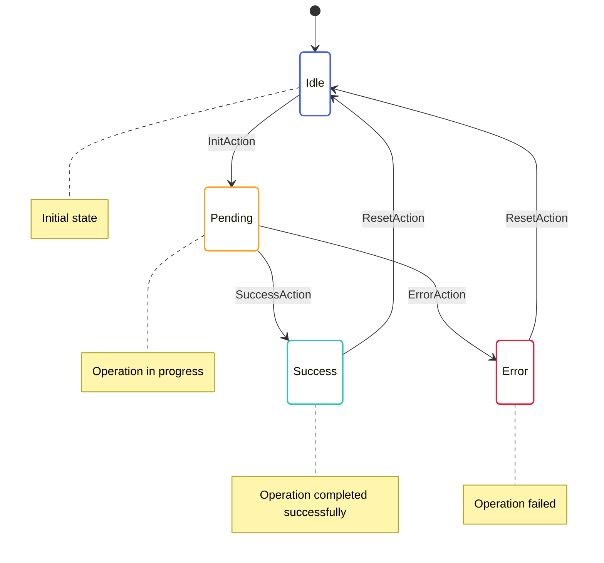
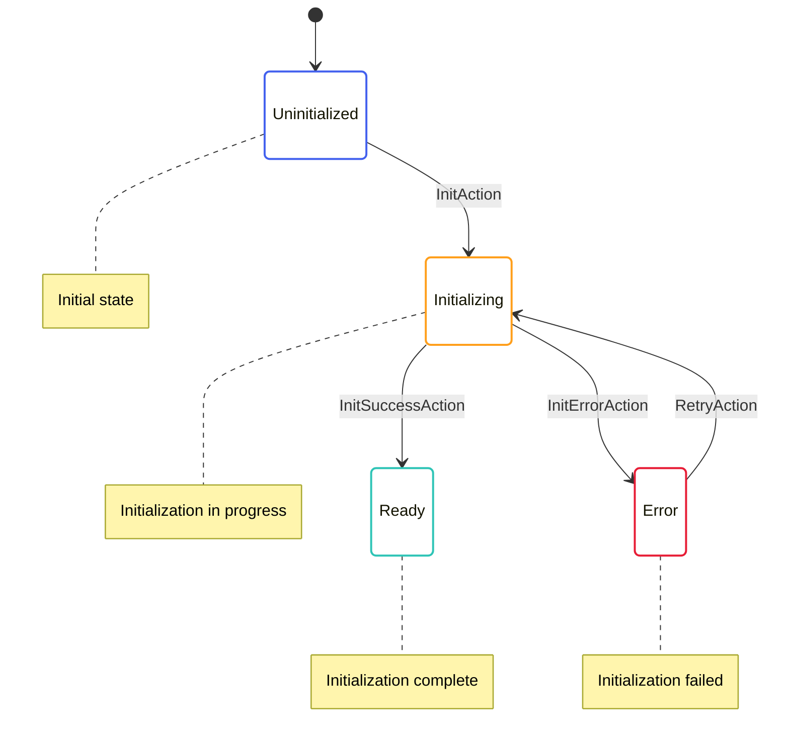
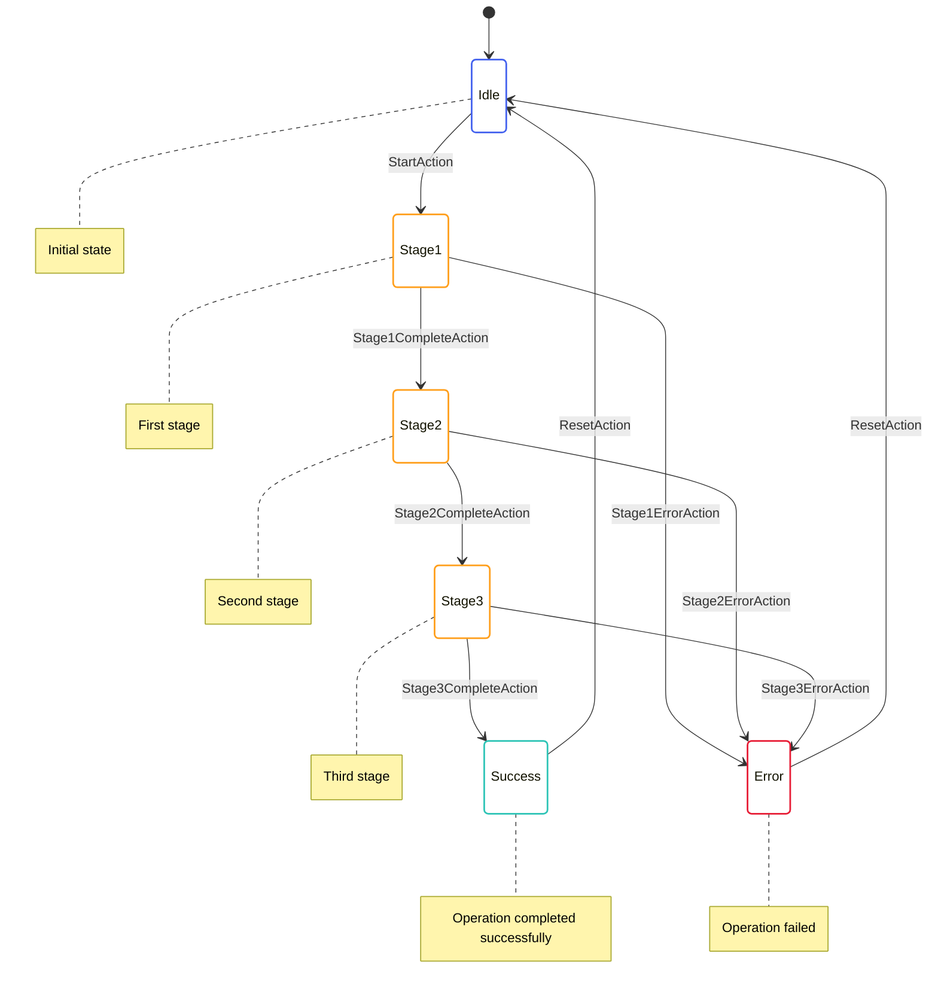
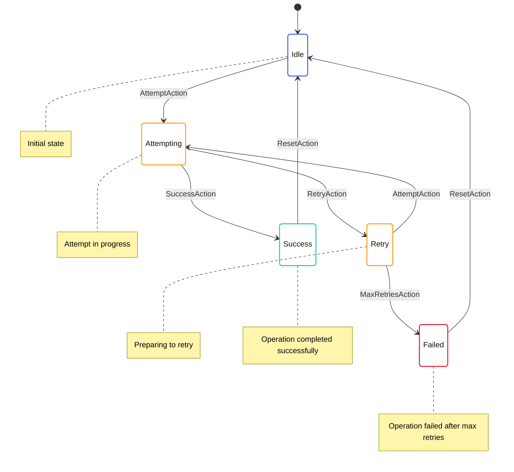
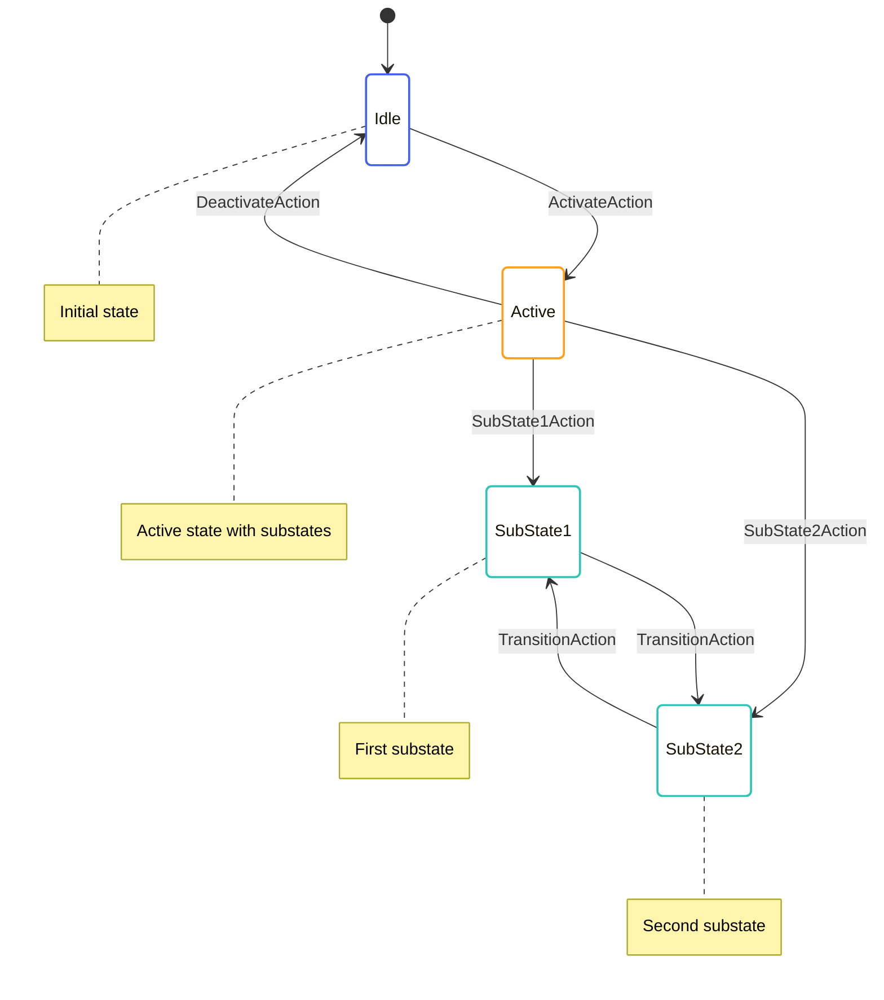

# State Transitions

This document explains common state transition patterns used in OpenMina's state machines.

## What are State Transitions?

State transitions are changes in the state of a state machine in response to actions. They are the core of the state machine pattern, defining how the state evolves over time.

## Common State Transition Patterns

OpenMina uses several common patterns for state transitions:

### Idle-Pending-Success/Error Pattern

This is the most common pattern for asynchronous operations:



This pattern is used for operations like:
- Loading data from disk
- Network requests
- Computationally intensive operations

Example:
```rust
pub enum TransitionFrontierGenesisState {
    Idle,
    LedgerLoadPending {
        time: redux::Timestamp,
    },
    LedgerLoadSuccess {
        time: redux::Timestamp,
        data: GenesisConfigLoaded,
    },
    LedgerLoadError {
        time: redux::Timestamp,
        error: String,
    },
}
```

### Init-Pending-Ready Pattern

This pattern is used for initialization sequences:



This pattern is used for operations like:
- Initializing a component
- Loading configuration
- Setting up resources

Example:
```rust
pub enum P2pState {
    Uninitialized,
    Initializing {
        time: redux::Timestamp,
    },
    Ready {
        time: redux::Timestamp,
        peers: BTreeMap<PeerId, PeerState>,
    },
    Error {
        time: redux::Timestamp,
        error: String,
    },
}
```

### Multi-Stage Operation Pattern

This pattern is used for operations that involve multiple stages:



This pattern is used for operations like:
- Block production
- Sync process
- Complex initialization sequences

Example:
```rust
pub enum BlockProducerCurrentState {
    Idle {
        time: redux::Timestamp,
    },
    WonSlot {
        time: redux::Timestamp,
        won_slot: BlockProducerWonSlot,
    },
    WonSlotTransactionsGet {
        time: redux::Timestamp,
        won_slot: BlockProducerWonSlot,
        chain: Vec<AppliedBlock>,
    },
    WonSlotTransactionsSuccess {
        time: redux::Timestamp,
        won_slot: BlockProducerWonSlot,
        chain: Vec<AppliedBlock>,
        transactions: Vec<SignedCommandWithStatus>,
    },
    BlockProvePending {
        time: redux::Timestamp,
        won_slot: BlockProducerWonSlot,
        chain: Vec<AppliedBlock>,
        transactions: Vec<SignedCommandWithStatus>,
        staged_ledger_diff: StagedLedgerDiffStableV2,
        block: ArcBlockWithHash,
    },
    BlockProveSuccess {
        time: redux::Timestamp,
        won_slot: BlockProducerWonSlot,
        chain: Vec<AppliedBlock>,
        transactions: Vec<SignedCommandWithStatus>,
        staged_ledger_diff: StagedLedgerDiffStableV2,
        block: ArcBlockWithHash,
    },
    Produced {
        time: redux::Timestamp,
        won_slot: BlockProducerWonSlot,
        block: ArcBlockWithHash,
    },
}
```

### Retry Pattern

This pattern is used for operations that may need to be retried:



This pattern is used for operations like:
- Network connections
- Service requests
- Resource acquisition

Example:
```rust
pub enum P2pConnectionState {
    Idle,
    Connecting {
        time: redux::Timestamp,
        attempts: u32,
        max_attempts: u32,
    },
    Connected {
        time: redux::Timestamp,
        peer_id: PeerId,
    },
    Retrying {
        time: redux::Timestamp,
        attempts: u32,
        max_attempts: u32,
        retry_delay: Duration,
    },
    Failed {
        time: redux::Timestamp,
        attempts: u32,
        max_attempts: u32,
        error: String,
    },
}
```

### Hierarchical State Pattern

This pattern is used for states that have substates:



This pattern is used for operations like:
- Complex state machines
- States with multiple dimensions
- States that need to track multiple pieces of information

Example:
```rust
pub enum P2pChannelsState {
    Disabled,
    Enabled {
        snark: P2pChannelsSnarkState,
        block: P2pChannelsBlockState,
        transaction: P2pChannelsTransactionState,
    },
}

pub enum P2pChannelsSnarkState {
    Idle,
    Ready {
        time: redux::Timestamp,
        local: SnarkPropagationState,
        remote: SnarkPropagationState,
        next_send_index: u64,
    },
}
```

## State Transition Implementation

State transitions are implemented in reducers, which update the state based on actions:

```rust
impl TransitionFrontierGenesisState {
    pub fn reducer<State, Action>(
        mut state_context: Substate<Action, State, Self>,
        action: ActionWithMeta<TransitionFrontierGenesisAction>,
    ) where
        State: SubstateAccess<Self>,
        Action: From<TransitionFrontierGenesisAction>
            + From<TransitionFrontierGenesisEffectfulAction>
            + From<redux::AnyAction>
            + EnablingCondition<State>,
    {
        let Ok(state) = state_context.get_substate_mut() else {
            // TODO: log or propagate
            return;
        };
        let (action, meta) = action.split();

        match action {
            TransitionFrontierGenesisAction::Produce => {
                match state {
                    TransitionFrontierGenesisState::Idle => {
                        // Transition to pending state
                        *state = TransitionFrontierGenesisState::LedgerLoadPending {
                            time: meta.time(),
                        };

                        // Dispatch effectful action
                        let dispatcher = state_context.dispatcher();
                        dispatcher.dispatch(TransitionFrontierGenesisEffectfulAction::LedgerLoadInit {
                            config: Arc::new(GenesisConfig::default()),
                        });
                    }
                    // ...
                }
            },
            // ... other action handlers
        }
    }
}
```

## State Transition Validation

State transitions are validated using enabling conditions, which determine whether an action can be processed based on the current state:

```rust
impl EnablingCondition<State> for TransitionFrontierGenesisAction {
    fn is_enabled(&self, state: &State, _time: Timestamp) -> bool {
        match self {
            TransitionFrontierGenesisAction::Produce => {
                matches!(state.transition_frontier.genesis, TransitionFrontierGenesisState::Idle)
            },
            TransitionFrontierGenesisAction::LedgerLoadSuccess { .. } => {
                matches!(
                    state.transition_frontier.genesis,
                    TransitionFrontierGenesisState::LedgerLoadPending { .. }
                )
            },
            // ... other action handlers
        }
    }
}
```

## State Transition Debugging

State transitions can be debugged by logging state changes:

```rust
impl TransitionFrontierGenesisState {
    pub fn reducer<State, Action>(
        mut state_context: Substate<Action, State, Self>,
        action: ActionWithMeta<TransitionFrontierGenesisAction>,
    ) where
        // ...
    {
        let Ok(state) = state_context.get_substate_mut() else {
            // TODO: log or propagate
            return;
        };
        let (action, meta) = action.split();

        // Log the action and current state
        log::debug!("Reducing action {:?} on state {:?}", action, state);

        match action {
            // ... action handlers
        }

        // Log the new state
        log::debug!("New state: {:?}", state);
    }
}
```

## Best Practices

When implementing state transitions in OpenMina, follow these best practices:

1. **Use Explicit State Variants**: Use explicit state variants rather than boolean flags or option types.
2. **Include Timestamps**: Include timestamps in state variants to track when state transitions occurred.
3. **Use Pattern Matching**: Use pattern matching to handle different state and action combinations.
4. **Validate State Transitions**: Use enabling conditions to validate state transitions.
5. **Keep State Transitions Simple**: Keep state transitions focused on updating the state, delegating side effects to effects.
6. **Document State Transitions**: Document the valid state transitions for each state.
7. **Test State Transitions**: Write tests for state transitions to ensure they behave as expected.

## Example: Block Verification State Transitions

Here's a more detailed example of state transitions for block verification:

```rust
pub enum BlockVerifyState {
    Idle,
    Verifying {
        time: redux::Timestamp,
        block_hash: StateHash,
        input: Box<ProverExtendBlockchainInputStableV2>,
    },
    Verified {
        time: redux::Timestamp,
        block_hash: StateHash,
    },
    Failed {
        time: redux::Timestamp,
        block_hash: StateHash,
        error: String,
    },
}

impl BlockVerifyState {
    pub fn reducer<State, Action>(
        mut state_context: Substate<Action, State, Self>,
        action: ActionWithMeta<BlockVerifyAction>,
    ) where
        // ...
    {
        let Ok(state) = state_context.get_substate_mut() else {
            // TODO: log or propagate
            return;
        };
        let (action, meta) = action.split();

        match action {
            BlockVerifyAction::Verify { block_hash, input } => {
                // Transition to verifying state
                *state = BlockVerifyState::Verifying {
                    time: meta.time(),
                    block_hash: block_hash.clone(),
                    input: input.clone(),
                };

                // Dispatch effectful action
                let dispatcher = state_context.dispatcher();
                dispatcher.dispatch(BlockVerifyEffectfulAction::VerifyInit {
                    block_hash: block_hash.clone(),
                    input: input.clone(),
                });
            },
            BlockVerifyAction::VerifySuccess { block_hash } => {
                // Transition to verified state
                *state = BlockVerifyState::Verified {
                    time: meta.time(),
                    block_hash: block_hash.clone(),
                };
            },
            BlockVerifyAction::VerifyFailed { block_hash, error } => {
                // Transition to failed state
                *state = BlockVerifyState::Failed {
                    time: meta.time(),
                    block_hash: block_hash.clone(),
                    error: error.clone(),
                };
            },
        }
    }
}
```

This example shows how state transitions are implemented for block verification, with explicit state variants and timestamps.
