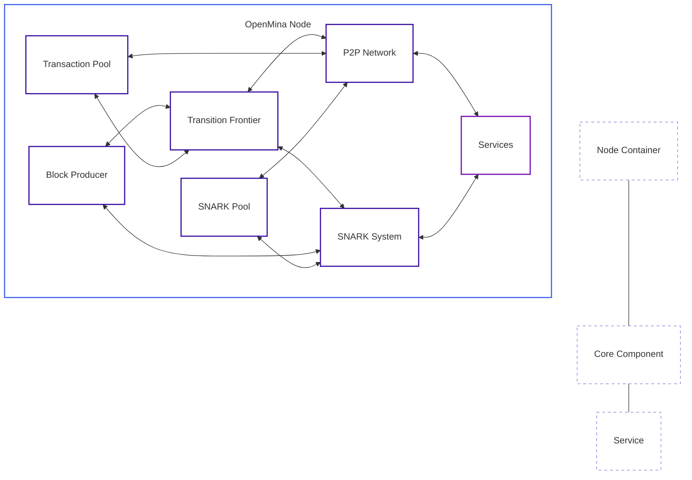

# System Overview

This document provides a high-level overview of the OpenMina system architecture, its main components, and how they interact with each other.

## System Architecture Diagram



**Diagram Legend:**

-   **Node Container**: The main OpenMina node that contains all components
-   **Core Component**: Primary functional units (Transition Frontier, SNARK System, P2P Network, etc.)
-   **Service**: Abstracted components for IO or computationally heavy tasks

## Main Components

### Transition Frontier

The Transition Frontier is responsible for managing the blockchain state and transitions. It:

-   Maintains the best chain of blocks
-   Handles block candidates and verification
-   Manages the genesis state
-   Synchronizes with other nodes

**Key Code Files:**

-   [node/src/transition_frontier/mod.rs](../../node/src/transition_frontier/mod.rs)
-   [node/src/transition_frontier/transition_frontier_state.rs](../../node/src/transition_frontier/transition_frontier_state.rs)

### SNARK System

The SNARK (Succinct Non-interactive ARgument of Knowledge) system handles zero-knowledge proof verification, which is essential for the Mina protocol. It:

-   Verifies transaction proofs
-   Verifies block proofs
-   Manages SNARK work verification

**Key Code Files:**

-   [snark/src/lib.rs](../../snark/src/lib.rs)
-   [core/src/snark/snark.rs](../../core/src/snark/snark.rs)

### P2P Network

The P2P (Peer-to-Peer) network component manages communication between nodes in the network. It:

-   Establishes and maintains connections with peers
-   Handles message passing between nodes
-   Implements the LibP2P networking stack
-   Manages encryption and security

**Key Code Files:**

-   [p2p/readme.md](../../p2p/readme.md)
-   [core/src/p2p](../../core/src/p2p)

### Block Producer

The Block Producer is responsible for creating new blocks. It:

-   Monitors the network for slot opportunities
-   Selects transactions from the transaction pool
-   Creates and proves new blocks
-   Broadcasts produced blocks to the network

**Key Code Files:**

-   [node/src/block_producer/block_producer_state.rs](../../node/src/block_producer/block_producer_state.rs)

### Transaction Pool

The Transaction Pool manages pending transactions. It:

-   Validates incoming transactions
-   Stores valid transactions
-   Provides transactions to the block producer
-   Removes transactions that have been included in blocks

### SNARK Pool

The SNARK Pool manages SNARK work. It:

-   Tracks available SNARK jobs
-   Manages SNARK work commitments
-   Stores completed SNARK work
-   Provides SNARK work to the block producer

**Key Code Files:**

-   [node/src/snark_pool/snark_pool_state.rs](../../node/src/snark_pool/snark_pool_state.rs)

### Services

Services are abstracted components that handle IO or computationally heavy tasks that run in separate threads. This abstraction allows the core logic to be platform-independent and easier to test.

**Key Code Files:**

-   [node/src/service.rs](../../node/src/service.rs)

## State Machine Architecture

OpenMina uses a state machine architecture where:

-   **States** represent the current state of the system
-   **Actions** represent operations to be performed
-   **Reducers** update the state based on actions
-   **Effects** handle side effects and may dispatch new actions

This architecture provides a predictable and debuggable flow of data and operations.

For more details on the state machine architecture, see [State Machine Architecture](state-machine-architecture.md).

## Global State

The global state of the OpenMina node is defined in [node/src/state.rs](../../node/src/state.rs):

```rust
pub struct State {
    pub config: GlobalConfig,
    pub p2p: P2p,
    pub ledger: LedgerState,
    pub snark: SnarkState,
    pub transition_frontier: TransitionFrontierState,
    pub snark_pool: SnarkPoolState,
    pub external_snark_worker: ExternalSnarkWorkers,
    pub transaction_pool: TransactionPoolState,
    pub block_producer: BlockProducerState,
    pub rpc: RpcState,
    pub watched_accounts: WatchedAccountsState,
    last_action: ActionMeta,
    applied_actions_count: u64,
}
```

This global state contains all the component states and is updated by the global reducer in response to actions dispatched to the system.
