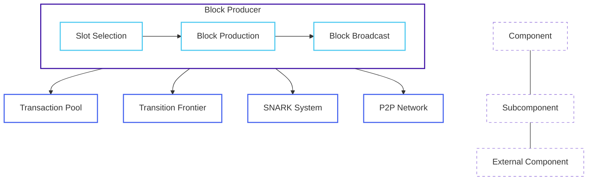

# Block Producer

The Block Producer is a core component of the OpenMina node that is responsible for creating new blocks. It monitors the network for slot opportunities, selects transactions from the transaction pool, creates and proves new blocks, and broadcasts produced blocks to the network.

## Component Overview

The Block Producer component consists of several subcomponents, each with its own state machine:

- **Slot Selection**: Determines when the node has won a slot and should produce a block
- **Block Production**: Creates and proves a new block

## Component Diagram



**Diagram Legend:**
- **Component**: The main Block Producer component
- **Subcomponent**: Functional units within the Block Producer
- **External Component**: Components that interact with the Block Producer

## State Definition

The Block Producer state is defined in [node/src/block_producer/block_producer_state.rs](../../../node/src/block_producer/block_producer_state.rs):

```rust
#[derive(Serialize, Deserialize, Debug, Clone)]
pub struct BlockProducerState {
    pub config: BlockProducerConfig,
    pub current: BlockProducerCurrentState,
    pub last_produced_block: Option<ArcBlockWithHash>,
    pub last_produced_block_timestamp: Option<Timestamp>,
}

#[derive(Serialize, Deserialize, Debug, Clone)]
pub enum BlockProducerCurrentState {
    Idle {
        time: redux::Timestamp,
    },
    WonSlotDiscarded {
        time: redux::Timestamp,
        won_slot: BlockProducerWonSlot,
        reason: BlockProducerWonSlotDiscardReason,
    },
    WonSlot {
        time: redux::Timestamp,
        won_slot: BlockProducerWonSlot,
    },
    WonSlotWait {
        time: redux::Timestamp,
        won_slot: BlockProducerWonSlot,
    },
    WonSlotProduceInit {
        time: redux::Timestamp,
        won_slot: BlockProducerWonSlot,
        /// Chain that we are extending.
        chain: Vec<AppliedBlock>,
    },
    WonSlotTransactionsGet {
        time: redux::Timestamp,
        won_slot: BlockProducerWonSlot,
        /// Chain that we are extending.
        chain: Vec<AppliedBlock>,
    },
    WonSlotTransactionsSuccess {
        time: redux::Timestamp,
        won_slot: BlockProducerWonSlot,
        /// Chain that we are extending.
        chain: Vec<AppliedBlock>,
        /// Transactions to include in the block.
        transactions: Vec<SignedCommandWithStatus>,
    },
    StagedLedgerDiffCreatePending {
        time: redux::Timestamp,
        won_slot: BlockProducerWonSlot,
        /// Chain that we are extending.
        chain: Vec<AppliedBlock>,
        /// Transactions to include in the block.
        transactions: Vec<SignedCommandWithStatus>,
    },
    StagedLedgerDiffCreateSuccess {
        time: redux::Timestamp,
        won_slot: BlockProducerWonSlot,
        /// Chain that we are extending.
        chain: Vec<AppliedBlock>,
        /// Transactions to include in the block.
        transactions: Vec<SignedCommandWithStatus>,
        /// Staged ledger diff.
        staged_ledger_diff: StagedLedgerDiffStableV2,
    },
    BlockUnprovenBuilt {
        time: redux::Timestamp,
        won_slot: BlockProducerWonSlot,
        /// Chain that we are extending.
        chain: Vec<AppliedBlock>,
        /// Transactions to include in the block.
        transactions: Vec<SignedCommandWithStatus>,
        /// Staged ledger diff.
        staged_ledger_diff: StagedLedgerDiffStableV2,
        /// Unproven block.
        block: ArcBlockWithHash,
    },
    BlockProvePending {
        time: redux::Timestamp,
        won_slot: BlockProducerWonSlot,
        /// Chain that we are extending.
        chain: Vec<AppliedBlock>,
        /// Transactions to include in the block.
        transactions: Vec<SignedCommandWithStatus>,
        /// Staged ledger diff.
        staged_ledger_diff: StagedLedgerDiffStableV2,
        /// Unproven block.
        block: ArcBlockWithHash,
    },
    BlockProveSuccess {
        time: redux::Timestamp,
        won_slot: BlockProducerWonSlot,
        /// Chain that we are extending.
        chain: Vec<AppliedBlock>,
        /// Transactions to include in the block.
        transactions: Vec<SignedCommandWithStatus>,
        /// Staged ledger diff.
        staged_ledger_diff: StagedLedgerDiffStableV2,
        /// Proven block.
        block: ArcBlockWithHash,
    },
    Produced {
        time: redux::Timestamp,
        won_slot: BlockProducerWonSlot,
        /// Produced block.
        block: ArcBlockWithHash,
    },
    Injected {
        time: redux::Timestamp,
        /// Injected block.
        block: ArcBlockWithHash,
    },
}
```

This state includes:
- Configuration for the block producer
- Current state of the block producer
- Last produced block
- Last produced block timestamp

The current state can be one of several variants, representing different stages of the block production process.

## Actions

The Block Producer component defines several actions for interacting with the state:

```rust
pub enum BlockProducerAction {
    CheckSlot,
    WonSlot {
        won_slot: BlockProducerWonSlot,
    },
    WonSlotDiscard {
        reason: BlockProducerWonSlotDiscardReason,
    },
    WonSlotWait,
    WonSlotProduce,
    WonSlotTransactionsGet,
    WonSlotTransactionsSuccess {
        transactions: Vec<SignedCommandWithStatus>,
    },
    StagedLedgerDiffCreate,
    StagedLedgerDiffCreateSuccess {
        staged_ledger_diff: StagedLedgerDiffStableV2,
    },
    BlockUnprovenBuild,
    BlockUnprovenBuildSuccess {
        block: ArcBlockWithHash,
    },
    BlockProve,
    BlockProveSuccess {
        block: ArcBlockWithHash,
    },
    BlockInject,
    BlockInjectSuccess,
    Reset,
}
```

These actions allow for:
- Checking if the node has won a slot
- Handling won slots
- Discarding won slots
- Waiting for the right time to produce a block
- Producing a block
- Getting transactions for the block
- Creating a staged ledger diff
- Building an unproven block
- Proving the block
- Injecting the block into the transition frontier
- Resetting the block producer state

## State Machines

The Block Producer component includes several state machines:

- [Slot Selection State Machine](slot-selection-state-machine.md): Determines when the node has won a slot and should produce a block
- [Block Production State Machine](block-production-state-machine.md): Creates and proves a new block

Each state machine has its own state, actions, reducers, and effects.

## Interactions with Other Components

The Block Producer interacts with several other components:

- **Transaction Pool**: For getting transactions to include in the block
- **Transition Frontier**: For getting the current best chain and injecting produced blocks
- **SNARK System**: For proving blocks
- **P2P Network**: For broadcasting produced blocks

These interactions are managed through actions and effects.

## Key Workflows

### Slot Selection

1. The `CheckSlot` action is dispatched periodically
2. The block producer checks if it has won the current slot
3. If it has won the slot, the `WonSlot` action is dispatched
4. The state transitions to `WonSlot`
5. If the slot should be discarded (e.g., because the node is syncing), the `WonSlotDiscard` action is dispatched
6. Otherwise, the `WonSlotWait` action is dispatched to wait for the right time to produce the block

### Block Production

1. When it's time to produce the block, the `WonSlotProduce` action is dispatched
2. The state transitions to `WonSlotProduceInit`
3. The `WonSlotTransactionsGet` action is dispatched to get transactions for the block
4. When transactions are received, the `WonSlotTransactionsSuccess` action is dispatched
5. The `StagedLedgerDiffCreate` action is dispatched to create a staged ledger diff
6. When the staged ledger diff is created, the `StagedLedgerDiffCreateSuccess` action is dispatched
7. The `BlockUnprovenBuild` action is dispatched to build an unproven block
8. When the unproven block is built, the `BlockUnprovenBuildSuccess` action is dispatched
9. The `BlockProve` action is dispatched to prove the block
10. When the block is proven, the `BlockProveSuccess` action is dispatched
11. The `BlockInject` action is dispatched to inject the block into the transition frontier
12. When the block is injected, the `BlockInjectSuccess` action is dispatched
13. The state transitions to `Produced`

## Implementation Details

### Slot Selection

The block producer uses a VRF (Verifiable Random Function) to determine if it has won a slot. The VRF is based on:
- The node's private key
- The current slot number
- The current epoch seed

### Block Building

The block building process involves:
1. Selecting transactions from the transaction pool
2. Creating a staged ledger diff
3. Building a block with the staged ledger diff
4. Proving the block

### Block Injection

Once a block is produced, it is injected into the transition frontier, which:
1. Validates the block
2. Adds it to the best chain
3. Broadcasts it to other nodes

## Next Steps

To learn more about specific aspects of the Block Producer component, see:

- [Slot Selection State Machine](slot-selection-state-machine.md)
- [Block Production State Machine](block-production-state-machine.md)
