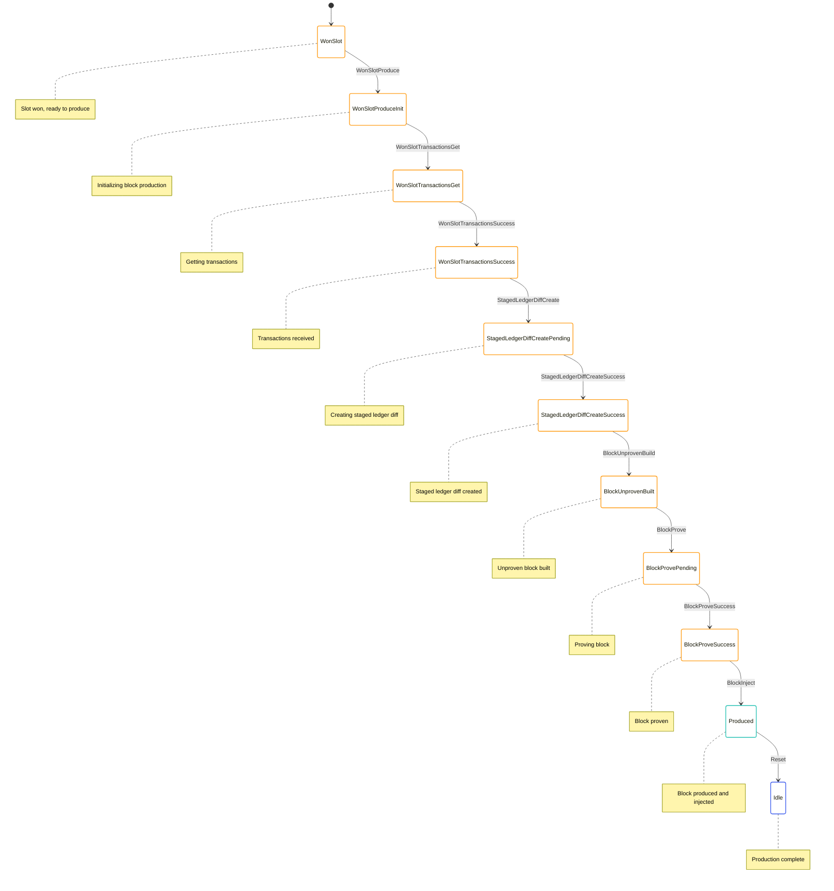

# Block Production State Machine

The Block Production State Machine is responsible for creating and proving new blocks. It handles the process of selecting transactions, creating a staged ledger diff, building an unproven block, proving the block, and injecting it into the transition frontier.

## State Diagram



## State Definition

The Block Production State Machine state is part of the Block Producer state, defined in [node/src/block_producer/block_producer_state.rs](../../../node/src/block_producer/block_producer_state.rs):

```rust
#[derive(Serialize, Deserialize, Debug, Clone)]
pub enum BlockProducerCurrentState {
    Idle {
        time: redux::Timestamp,
    },
    WonSlot {
        time: redux::Timestamp,
        won_slot: BlockProducerWonSlot,
    },
    WonSlotProduceInit {
        time: redux::Timestamp,
        won_slot: BlockProducerWonSlot,
        /// Chain that we are extending.
        chain: Vec<AppliedBlock>,
    },
    WonSlotTransactionsGet {
        time: redux::Timestamp,
        won_slot: BlockProducerWonSlot,
        /// Chain that we are extending.
        chain: Vec<AppliedBlock>,
    },
    WonSlotTransactionsSuccess {
        time: redux::Timestamp,
        won_slot: BlockProducerWonSlot,
        /// Chain that we are extending.
        chain: Vec<AppliedBlock>,
        /// Transactions to include in the block.
        transactions: Vec<SignedCommandWithStatus>,
    },
    StagedLedgerDiffCreatePending {
        time: redux::Timestamp,
        won_slot: BlockProducerWonSlot,
        /// Chain that we are extending.
        chain: Vec<AppliedBlock>,
        /// Transactions to include in the block.
        transactions: Vec<SignedCommandWithStatus>,
    },
    StagedLedgerDiffCreateSuccess {
        time: redux::Timestamp,
        won_slot: BlockProducerWonSlot,
        /// Chain that we are extending.
        chain: Vec<AppliedBlock>,
        /// Transactions to include in the block.
        transactions: Vec<SignedCommandWithStatus>,
        /// Staged ledger diff.
        staged_ledger_diff: StagedLedgerDiffStableV2,
    },
    BlockUnprovenBuilt {
        time: redux::Timestamp,
        won_slot: BlockProducerWonSlot,
        /// Chain that we are extending.
        chain: Vec<AppliedBlock>,
        /// Transactions to include in the block.
        transactions: Vec<SignedCommandWithStatus>,
        /// Staged ledger diff.
        staged_ledger_diff: StagedLedgerDiffStableV2,
        /// Unproven block.
        block: ArcBlockWithHash,
    },
    BlockProvePending {
        time: redux::Timestamp,
        won_slot: BlockProducerWonSlot,
        /// Chain that we are extending.
        chain: Vec<AppliedBlock>,
        /// Transactions to include in the block.
        transactions: Vec<SignedCommandWithStatus>,
        /// Staged ledger diff.
        staged_ledger_diff: StagedLedgerDiffStableV2,
        /// Unproven block.
        block: ArcBlockWithHash,
    },
    BlockProveSuccess {
        time: redux::Timestamp,
        won_slot: BlockProducerWonSlot,
        /// Chain that we are extending.
        chain: Vec<AppliedBlock>,
        /// Transactions to include in the block.
        transactions: Vec<SignedCommandWithStatus>,
        /// Staged ledger diff.
        staged_ledger_diff: StagedLedgerDiffStableV2,
        /// Proven block.
        block: ArcBlockWithHash,
    },
    Produced {
        time: redux::Timestamp,
        won_slot: BlockProducerWonSlot,
        /// Produced block.
        block: ArcBlockWithHash,
    },
}
```

This state includes:
- `WonSlot`: Slot won, ready to produce a block
- `WonSlotProduceInit`: Initializing block production
- `WonSlotTransactionsGet`: Getting transactions for the block
- `WonSlotTransactionsSuccess`: Transactions received
- `StagedLedgerDiffCreatePending`: Creating a staged ledger diff
- `StagedLedgerDiffCreateSuccess`: Staged ledger diff created
- `BlockUnprovenBuilt`: Unproven block built
- `BlockProvePending`: Proving the block
- `BlockProveSuccess`: Block proven
- `Produced`: Block produced and injected
- `Idle`: Production complete

## Actions

The Block Production State Machine uses the following actions from the Block Producer actions:

```rust
pub enum BlockProducerAction {
    WonSlotProduce,
    WonSlotTransactionsGet,
    WonSlotTransactionsSuccess {
        transactions: Vec<SignedCommandWithStatus>,
    },
    StagedLedgerDiffCreate,
    StagedLedgerDiffCreateSuccess {
        staged_ledger_diff: StagedLedgerDiffStableV2,
    },
    BlockUnprovenBuild,
    BlockUnprovenBuildSuccess {
        block: ArcBlockWithHash,
    },
    BlockProve,
    BlockProveSuccess {
        block: ArcBlockWithHash,
    },
    BlockInject,
    BlockInjectSuccess,
    Reset,
}
```

These actions allow for:
- Initiating block production
- Getting transactions for the block
- Creating a staged ledger diff
- Building an unproven block
- Proving the block
- Injecting the block into the transition frontier
- Resetting the state

The Block Production State Machine also uses effectful actions:

```rust
pub enum BlockProducerEffectfulAction {
    WonSlotTransactionsGetInit {
        chain: Vec<AppliedBlock>,
    },
    StagedLedgerDiffCreateInit {
        chain: Vec<AppliedBlock>,
        transactions: Vec<SignedCommandWithStatus>,
    },
    BlockProveInit {
        block_hash: StateHash,
        input: Box<ProverExtendBlockchainInputStableV2>,
    },
}
```

These actions allow for:
- Initializing transaction retrieval
- Initializing staged ledger diff creation
- Initializing block proving

## Enabling Conditions

The Block Production State Machine defines enabling conditions for its actions:

```rust
impl EnablingCondition<State> for BlockProducerAction {
    fn is_enabled(&self, state: &State, _time: Timestamp) -> bool {
        match self {
            BlockProducerAction::WonSlotProduce => {
                matches!(state.block_producer.current, BlockProducerCurrentState::WonSlot { .. })
            },
            BlockProducerAction::WonSlotTransactionsGet => {
                matches!(state.block_producer.current, BlockProducerCurrentState::WonSlotProduceInit { .. })
            },
            BlockProducerAction::WonSlotTransactionsSuccess { .. } => {
                matches!(state.block_producer.current, BlockProducerCurrentState::WonSlotTransactionsGet { .. })
            },
            BlockProducerAction::StagedLedgerDiffCreate => {
                matches!(state.block_producer.current, BlockProducerCurrentState::WonSlotTransactionsSuccess { .. })
            },
            BlockProducerAction::StagedLedgerDiffCreateSuccess { .. } => {
                matches!(state.block_producer.current, BlockProducerCurrentState::StagedLedgerDiffCreatePending { .. })
            },
            BlockProducerAction::BlockUnprovenBuild => {
                matches!(state.block_producer.current, BlockProducerCurrentState::StagedLedgerDiffCreateSuccess { .. })
            },
            BlockProducerAction::BlockUnprovenBuildSuccess { .. } => {
                matches!(state.block_producer.current, BlockProducerCurrentState::StagedLedgerDiffCreateSuccess { .. })
            },
            BlockProducerAction::BlockProve => {
                matches!(state.block_producer.current, BlockProducerCurrentState::BlockUnprovenBuilt { .. })
            },
            BlockProducerAction::BlockProveSuccess { .. } => {
                matches!(state.block_producer.current, BlockProducerCurrentState::BlockProvePending { .. })
            },
            BlockProducerAction::BlockInject => {
                matches!(state.block_producer.current, BlockProducerCurrentState::BlockProveSuccess { .. })
            },
            BlockProducerAction::BlockInjectSuccess => {
                matches!(state.block_producer.current, BlockProducerCurrentState::BlockProveSuccess { .. })
            },
            BlockProducerAction::Reset => {
                matches!(state.block_producer.current, BlockProducerCurrentState::Produced { .. })
            },
            // ... other action handlers
        }
    }
}
```

These enabling conditions ensure that actions are only processed when they make sense based on the current state.

## Reducer

The Block Production State Machine reducer is part of the Block Producer reducer, defined in [node/src/block_producer/block_producer_reducer.rs](../../../node/src/block_producer/block_producer_reducer.rs):

```rust
impl BlockProducerState {
    pub fn reducer(
        mut state_context: crate::Substate<Self>,
        action: BlockProducerActionWithMetaRef<'_>,
    ) {
        let Ok(state) = state_context.get_substate_mut() else {
            // TODO: log or propagate
            return;
        };
        let (action, meta) = action.split();

        match action {
            BlockProducerAction::WonSlotProduce => {
                if let BlockProducerCurrentState::WonSlot { time, won_slot } = &state.current {
                    // Get the current best chain
                    let global_state = state_context.get_global_state();
                    let best_chain = global_state.transition_frontier().best_chain.clone();
                    
                    if best_chain.is_empty() {
                        // No chain to extend
                        let dispatcher = state_context.dispatcher();
                        dispatcher.dispatch(BlockProducerAction::WonSlotDiscard {
                            reason: BlockProducerWonSlotDiscardReason::NoChain,
                        });
                    } else {
                        // Start block production
                        state.current = BlockProducerCurrentState::WonSlotProduceInit {
                            time: meta.time(),
                            won_slot: won_slot.clone(),
                            chain: best_chain,
                        };
                        
                        // Continue with block production
                        let dispatcher = state_context.dispatcher();
                        dispatcher.dispatch(BlockProducerAction::WonSlotTransactionsGet);
                    }
                }
            },
            BlockProducerAction::WonSlotTransactionsGet => {
                if let BlockProducerCurrentState::WonSlotProduceInit { time, won_slot, chain } = &state.current {
                    // Transition to transactions get state
                    state.current = BlockProducerCurrentState::WonSlotTransactionsGet {
                        time: meta.time(),
                        won_slot: won_slot.clone(),
                        chain: chain.clone(),
                    };
                    
                    // Dispatch effectful action to get transactions
                    let dispatcher = state_context.dispatcher();
                    dispatcher.dispatch(BlockProducerEffectfulAction::WonSlotTransactionsGetInit {
                        chain: chain.clone(),
                    });
                }
            },
            BlockProducerAction::WonSlotTransactionsSuccess { transactions } => {
                if let BlockProducerCurrentState::WonSlotTransactionsGet { time, won_slot, chain } = &state.current {
                    if transactions.is_empty() {
                        // No transactions to include
                        let dispatcher = state_context.dispatcher();
                        dispatcher.dispatch(BlockProducerAction::WonSlotDiscard {
                            reason: BlockProducerWonSlotDiscardReason::NoTransactions,
                        });
                    } else {
                        // Transition to transactions success state
                        state.current = BlockProducerCurrentState::WonSlotTransactionsSuccess {
                            time: meta.time(),
                            won_slot: won_slot.clone(),
                            chain: chain.clone(),
                            transactions: transactions.clone(),
                        };
                        
                        // Continue with block production
                        let dispatcher = state_context.dispatcher();
                        dispatcher.dispatch(BlockProducerAction::StagedLedgerDiffCreate);
                    }
                }
            },
            BlockProducerAction::StagedLedgerDiffCreate => {
                if let BlockProducerCurrentState::WonSlotTransactionsSuccess { time, won_slot, chain, transactions } = &state.current {
                    // Transition to staged ledger diff create pending state
                    state.current = BlockProducerCurrentState::StagedLedgerDiffCreatePending {
                        time: meta.time(),
                        won_slot: won_slot.clone(),
                        chain: chain.clone(),
                        transactions: transactions.clone(),
                    };
                    
                    // Dispatch effectful action to create staged ledger diff
                    let dispatcher = state_context.dispatcher();
                    dispatcher.dispatch(BlockProducerEffectfulAction::StagedLedgerDiffCreateInit {
                        chain: chain.clone(),
                        transactions: transactions.clone(),
                    });
                }
            },
            BlockProducerAction::StagedLedgerDiffCreateSuccess { staged_ledger_diff } => {
                if let BlockProducerCurrentState::StagedLedgerDiffCreatePending { time, won_slot, chain, transactions } = &state.current {
                    // Transition to staged ledger diff create success state
                    state.current = BlockProducerCurrentState::StagedLedgerDiffCreateSuccess {
                        time: meta.time(),
                        won_slot: won_slot.clone(),
                        chain: chain.clone(),
                        transactions: transactions.clone(),
                        staged_ledger_diff: staged_ledger_diff.clone(),
                    };
                    
                    // Continue with block production
                    let dispatcher = state_context.dispatcher();
                    dispatcher.dispatch(BlockProducerAction::BlockUnprovenBuild);
                }
            },
            BlockProducerAction::BlockUnprovenBuild => {
                if let BlockProducerCurrentState::StagedLedgerDiffCreateSuccess { time, won_slot, chain, transactions, staged_ledger_diff } = &state.current {
                    // Build the unproven block
                    let block = build_unproven_block(
                        won_slot,
                        chain.last().unwrap(),
                        staged_ledger_diff,
                    );
                    
                    // Dispatch success action
                    let dispatcher = state_context.dispatcher();
                    dispatcher.dispatch(BlockProducerAction::BlockUnprovenBuildSuccess {
                        block: block.clone(),
                    });
                }
            },
            BlockProducerAction::BlockUnprovenBuildSuccess { block } => {
                if let BlockProducerCurrentState::StagedLedgerDiffCreateSuccess { time, won_slot, chain, transactions, staged_ledger_diff } = &state.current {
                    // Transition to block unproven built state
                    state.current = BlockProducerCurrentState::BlockUnprovenBuilt {
                        time: meta.time(),
                        won_slot: won_slot.clone(),
                        chain: chain.clone(),
                        transactions: transactions.clone(),
                        staged_ledger_diff: staged_ledger_diff.clone(),
                        block: block.clone(),
                    };
                    
                    // Continue with block production
                    let dispatcher = state_context.dispatcher();
                    dispatcher.dispatch(BlockProducerAction::BlockProve);
                }
            },
            BlockProducerAction::BlockProve => {
                if let BlockProducerCurrentState::BlockUnprovenBuilt { time, won_slot, chain, transactions, staged_ledger_diff, block } = &state.current {
                    // Transition to block prove pending state
                    state.current = BlockProducerCurrentState::BlockProvePending {
                        time: meta.time(),
                        won_slot: won_slot.clone(),
                        chain: chain.clone(),
                        transactions: transactions.clone(),
                        staged_ledger_diff: staged_ledger_diff.clone(),
                        block: block.clone(),
                    };
                    
                    // Create proof input
                    let input = create_proof_input(block);
                    
                    // Dispatch effectful action to prove block
                    let dispatcher = state_context.dispatcher();
                    dispatcher.dispatch(BlockProducerEffectfulAction::BlockProveInit {
                        block_hash: block.hash().clone(),
                        input: Box::new(input),
                    });
                }
            },
            BlockProducerAction::BlockProveSuccess { block } => {
                if let BlockProducerCurrentState::BlockProvePending { time, won_slot, chain, transactions, staged_ledger_diff, .. } = &state.current {
                    // Transition to block prove success state
                    state.current = BlockProducerCurrentState::BlockProveSuccess {
                        time: meta.time(),
                        won_slot: won_slot.clone(),
                        chain: chain.clone(),
                        transactions: transactions.clone(),
                        staged_ledger_diff: staged_ledger_diff.clone(),
                        block: block.clone(),
                    };
                    
                    // Continue with block production
                    let dispatcher = state_context.dispatcher();
                    dispatcher.dispatch(BlockProducerAction::BlockInject);
                }
            },
            BlockProducerAction::BlockInject => {
                if let BlockProducerCurrentState::BlockProveSuccess { time, won_slot, block, .. } = &state.current {
                    // Inject the block into the transition frontier
                    let global_state = state_context.get_global_state();
                    let dispatcher = state_context.dispatcher();
                    
                    // Dispatch action to inject block
                    dispatcher.dispatch(Action::TransitionFrontier(
                        TransitionFrontierAction::Candidate(
                            TransitionFrontierCandidateAction::BlockReceived {
                                block: block.block.clone(),
                                sender: None, // Local production
                            },
                        ),
                    ));
                    
                    // Dispatch success action
                    dispatcher.dispatch(BlockProducerAction::BlockInjectSuccess);
                }
            },
            BlockProducerAction::BlockInjectSuccess => {
                if let BlockProducerCurrentState::BlockProveSuccess { time, won_slot, block, .. } = &state.current {
                    // Transition to produced state
                    state.current = BlockProducerCurrentState::Produced {
                        time: meta.time(),
                        won_slot: won_slot.clone(),
                        block: block.clone(),
                    };
                    
                    // Update last produced block
                    state.last_produced_block = Some(block.clone());
                    state.last_produced_block_timestamp = Some(meta.time());
                }
            },
            BlockProducerAction::Reset => {
                if let BlockProducerCurrentState::Produced { .. } = &state.current {
                    // Transition to idle state
                    state.current = BlockProducerCurrentState::Idle {
                        time: meta.time(),
                    };
                }
            },
            // ... other action handlers
        }
    }
}
```

This reducer handles the state transitions based on the actions received.

## Effects

The Block Production State Machine effectful actions are handled by the effects function in [node/src/block_producer_effectful/block_producer_effectful_effects.rs](../../../node/src/block_producer_effectful/block_producer_effectful_effects.rs):

```rust
impl BlockProducerEffectfulAction {
    pub fn effects<S>(&self, _: &ActionMeta, store: &mut Store<S>)
    where
        S: redux::Service + BlockProducerService,
    {
        match self {
            BlockProducerEffectfulAction::WonSlotTransactionsGetInit { chain } => {
                // Get transactions from the transaction pool
                store.service.get_transactions(
                    chain.clone(),
                    Box::new(move |result| {
                        match result {
                            Ok(transactions) => {
                                // Dispatch success action
                                store.dispatch(BlockProducerAction::WonSlotTransactionsSuccess {
                                    transactions,
                                });
                            },
                            Err(error) => {
                                // Log the error
                                log::error!("Failed to get transactions: {}", error);
                                
                                // Dispatch discard action
                                store.dispatch(BlockProducerAction::WonSlotDiscard {
                                    reason: BlockProducerWonSlotDiscardReason::Other(
                                        format!("Failed to get transactions: {}", error),
                                    ),
                                });
                            },
                        }
                    }),
                );
            },
            BlockProducerEffectfulAction::StagedLedgerDiffCreateInit { chain, transactions } => {
                // Create staged ledger diff
                store.service.create_staged_ledger_diff(
                    chain.clone(),
                    transactions.clone(),
                    Box::new(move |result| {
                        match result {
                            Ok(staged_ledger_diff) => {
                                // Dispatch success action
                                store.dispatch(BlockProducerAction::StagedLedgerDiffCreateSuccess {
                                    staged_ledger_diff,
                                });
                            },
                            Err(error) => {
                                // Log the error
                                log::error!("Failed to create staged ledger diff: {}", error);
                                
                                // Dispatch discard action
                                store.dispatch(BlockProducerAction::WonSlotDiscard {
                                    reason: BlockProducerWonSlotDiscardReason::Other(
                                        format!("Failed to create staged ledger diff: {}", error),
                                    ),
                                });
                            },
                        }
                    }),
                );
            },
            BlockProducerEffectfulAction::BlockProveInit { block_hash, input } => {
                // Prove the block
                store.service.prove(
                    block_hash.clone(),
                    input.clone(),
                    Box::new(move |result| {
                        match result {
                            Ok(block) => {
                                // Dispatch success action
                                store.dispatch(BlockProducerAction::BlockProveSuccess {
                                    block,
                                });
                            },
                            Err(error) => {
                                // Log the error
                                log::error!("Failed to prove block: {}", error);
                                
                                // Dispatch discard action
                                store.dispatch(BlockProducerAction::WonSlotDiscard {
                                    reason: BlockProducerWonSlotDiscardReason::Other(
                                        format!("Failed to prove block: {}", error),
                                    ),
                                });
                            },
                        }
                    }),
                );
            },
        }
    }
}
```

This effects function delegates to the service for handling the actual operations.

## Key Workflows

### Block Production

1. The `WonSlotProduce` action is dispatched when a slot is won
2. The state transitions to `WonSlotProduceInit`
3. The `WonSlotTransactionsGet` action is dispatched to get transactions
4. The state transitions to `WonSlotTransactionsGet`
5. The `WonSlotTransactionsGetInit` effectful action is dispatched to get transactions
6. When transactions are received, the `WonSlotTransactionsSuccess` action is dispatched
7. The state transitions to `WonSlotTransactionsSuccess`
8. The `StagedLedgerDiffCreate` action is dispatched to create a staged ledger diff
9. The state transitions to `StagedLedgerDiffCreatePending`
10. The `StagedLedgerDiffCreateInit` effectful action is dispatched to create a staged ledger diff
11. When the staged ledger diff is created, the `StagedLedgerDiffCreateSuccess` action is dispatched
12. The state transitions to `StagedLedgerDiffCreateSuccess`
13. The `BlockUnprovenBuild` action is dispatched to build an unproven block
14. The `BlockUnprovenBuildSuccess` action is dispatched with the built block
15. The state transitions to `BlockUnprovenBuilt`
16. The `BlockProve` action is dispatched to prove the block
17. The state transitions to `BlockProvePending`
18. The `BlockProveInit` effectful action is dispatched to prove the block
19. When the block is proven, the `BlockProveSuccess` action is dispatched
20. The state transitions to `BlockProveSuccess`
21. The `BlockInject` action is dispatched to inject the block into the transition frontier
22. The `BlockInjectSuccess` action is dispatched
23. The state transitions to `Produced`
24. The `Reset` action is dispatched to reset the state
25. The state transitions to `Idle`

## Implementation Details

### Transaction Selection

Transactions are selected from the transaction pool based on several criteria:

1. **Validity**: Only valid transactions are selected
2. **Fee**: Higher fee transactions are preferred
3. **Size**: Transactions are selected to fit within the block size limit
4. **Dependencies**: Transactions with dependencies are ordered correctly

### Staged Ledger Diff Creation

The staged ledger diff is created by applying the selected transactions to the current ledger:

1. **Apply Transactions**: Apply each transaction to the ledger
2. **Update Accounts**: Update account balances and nonces
3. **Collect Fees**: Collect transaction fees
4. **Create Diff**: Create a diff of the ledger changes

### Block Building

The unproven block is built using:

1. **Previous Block**: The previous block in the chain
2. **Slot**: The slot that was won
3. **Staged Ledger Diff**: The diff of ledger changes
4. **Producer**: The block producer's information

### Block Proving

The block is proven using the SNARK system:

1. **Create Proof Input**: Create the input for the prover
2. **Generate Proof**: Generate a SNARK proof for the block
3. **Attach Proof**: Attach the proof to the block

## Interactions with Other Components

The Block Production State Machine interacts with:

- **Transition Frontier**: For getting the current best chain and injecting produced blocks
- **Transaction Pool**: For getting transactions to include in the block
- **SNARK System**: For proving blocks

These interactions are managed through actions and effects.

## Error Handling

The Block Production State Machine handles errors by:

- Discarding slots when errors occur
- Providing detailed error messages
- Logging errors for debugging purposes

This allows for proper monitoring and debugging of the block production process.
