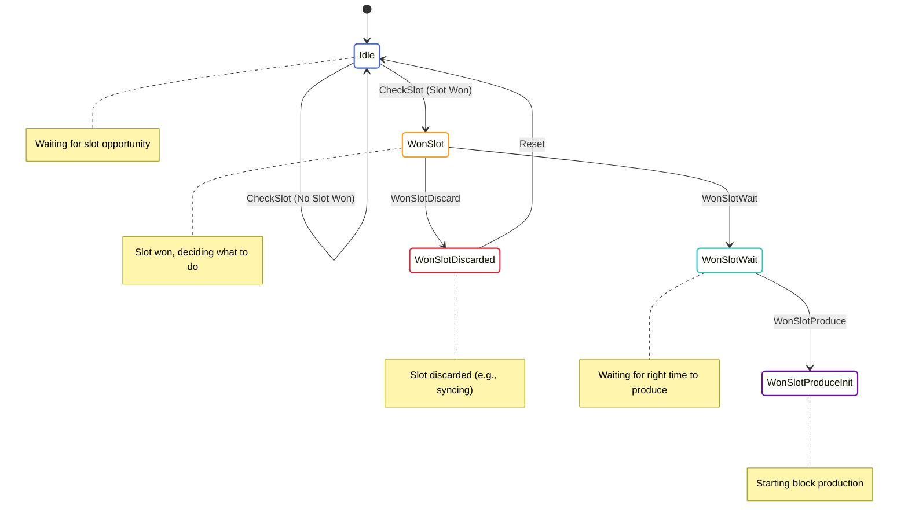

# Slot Selection State Machine

The Slot Selection State Machine is responsible for determining when the node has won a slot and should produce a block. It monitors the network for slot opportunities and triggers the block production process when a slot is won.

## State Diagram



## State Definition

The Slot Selection State Machine is part of the Block Producer state, defined in [node/src/block_producer/block_producer_state.rs](../../../node/src/block_producer/block_producer_state.rs):

```rust
#[derive(Serialize, Deserialize, Debug, Clone)]
pub enum BlockProducerCurrentState {
    Idle {
        time: redux::Timestamp,
    },
    WonSlotDiscarded {
        time: redux::Timestamp,
        won_slot: BlockProducerWonSlot,
        reason: BlockProducerWonSlotDiscardReason,
    },
    WonSlot {
        time: redux::Timestamp,
        won_slot: BlockProducerWonSlot,
    },
    WonSlotWait {
        time: redux::Timestamp,
        won_slot: BlockProducerWonSlot,
    },
    WonSlotProduceInit {
        time: redux::Timestamp,
        won_slot: BlockProducerWonSlot,
        /// Chain that we are extending.
        chain: Vec<AppliedBlock>,
    },
    // ... other states related to block production
}

#[derive(Serialize, Deserialize, Debug, Clone)]
pub struct BlockProducerWonSlot {
    pub global_slot: Slot,
    pub epoch: u32,
    pub slot_in_epoch: u32,
    pub vrf_output: VrfOutputTruncated,
    pub delegator: PublicKey,
    pub producer: PublicKey,
    pub producer_private_key: PrivateKey,
    pub producer_vrf_private_key: VrfPrivateKey,
}

#[derive(Serialize, Deserialize, Debug, Clone)]
pub enum BlockProducerWonSlotDiscardReason {
    Syncing,
    NoChain,
    NoTransactions,
    Other(String),
}
```

The relevant states for slot selection are:
- `Idle`: Waiting for slot opportunity
- `WonSlot`: Slot won, deciding what to do
- `WonSlotDiscarded`: Slot discarded (e.g., because the node is syncing)
- `WonSlotWait`: Waiting for the right time to produce the block
- `WonSlotProduceInit`: Starting block production

## Actions

The Slot Selection State Machine uses the following actions from the Block Producer actions:

```rust
pub enum BlockProducerAction {
    CheckSlot,
    WonSlot {
        won_slot: BlockProducerWonSlot,
    },
    WonSlotDiscard {
        reason: BlockProducerWonSlotDiscardReason,
    },
    WonSlotWait,
    WonSlotProduce,
    // ... other actions related to block production
    Reset,
}
```

These actions allow for:
- Checking if the node has won a slot
- Handling won slots
- Discarding won slots
- Waiting for the right time to produce a block
- Starting block production
- Resetting the state

## Enabling Conditions

The Slot Selection State Machine defines enabling conditions for its actions:

```rust
impl EnablingCondition<State> for BlockProducerAction {
    fn is_enabled(&self, state: &State, _time: Timestamp) -> bool {
        match self {
            BlockProducerAction::CheckSlot => {
                matches!(state.block_producer.current, BlockProducerCurrentState::Idle { .. })
            },
            BlockProducerAction::WonSlot { .. } => {
                matches!(state.block_producer.current, BlockProducerCurrentState::Idle { .. })
            },
            BlockProducerAction::WonSlotDiscard { .. } => {
                matches!(state.block_producer.current, BlockProducerCurrentState::WonSlot { .. })
            },
            BlockProducerAction::WonSlotWait => {
                matches!(state.block_producer.current, BlockProducerCurrentState::WonSlot { .. })
            },
            BlockProducerAction::WonSlotProduce => {
                matches!(state.block_producer.current, BlockProducerCurrentState::WonSlotWait { .. })
            },
            // ... other enabling conditions
            BlockProducerAction::Reset => true,
        }
    }
}
```

These enabling conditions ensure that actions are only processed when they make sense based on the current state.

## Reducer

The Slot Selection State Machine reducer is part of the Block Producer reducer, defined in [node/src/block_producer/block_producer_reducer.rs](../../../node/src/block_producer/block_producer_reducer.rs):

```rust
impl BlockProducerState {
    pub fn reducer(
        mut state_context: crate::Substate<Self>,
        action: BlockProducerActionWithMetaRef<'_>,
    ) {
        let Ok(state) = state_context.get_substate_mut() else {
            // TODO: log or propagate
            return;
        };
        let (action, meta) = action.split();

        match action {
            BlockProducerAction::CheckSlot => {
                // Check if we have won the current slot
                let global_state = state_context.get_global_state();
                let current_slot = global_state.consensus().current_slot();
                
                if let Some(won_slot) = check_slot(current_slot, &state.config) {
                    // We won the slot, dispatch WonSlot action
                    let dispatcher = state_context.dispatcher();
                    dispatcher.dispatch(BlockProducerAction::WonSlot {
                        won_slot,
                    });
                }
            },
            BlockProducerAction::WonSlot { won_slot } => {
                // We won a slot, update state
                state.current = BlockProducerCurrentState::WonSlot {
                    time: meta.time(),
                    won_slot: won_slot.clone(),
                };
                
                // Check if we should discard the slot
                let global_state = state_context.get_global_state();
                if global_state.transition_frontier().is_syncing() {
                    // We're syncing, discard the slot
                    let dispatcher = state_context.dispatcher();
                    dispatcher.dispatch(BlockProducerAction::WonSlotDiscard {
                        reason: BlockProducerWonSlotDiscardReason::Syncing,
                    });
                } else {
                    // We're not syncing, wait for the right time to produce
                    let dispatcher = state_context.dispatcher();
                    dispatcher.dispatch(BlockProducerAction::WonSlotWait);
                }
            },
            BlockProducerAction::WonSlotDiscard { reason } => {
                if let BlockProducerCurrentState::WonSlot { time, won_slot } = &state.current {
                    // Discard the slot
                    state.current = BlockProducerCurrentState::WonSlotDiscarded {
                        time: meta.time(),
                        won_slot: won_slot.clone(),
                        reason: reason.clone(),
                    };
                }
            },
            BlockProducerAction::WonSlotWait => {
                if let BlockProducerCurrentState::WonSlot { time, won_slot } = &state.current {
                    // Wait for the right time to produce
                    state.current = BlockProducerCurrentState::WonSlotWait {
                        time: meta.time(),
                        won_slot: won_slot.clone(),
                    };
                    
                    // Schedule WonSlotProduce action for the right time
                    let slot_time = calculate_slot_time(&won_slot.global_slot);
                    let now = meta.time();
                    
                    if now >= slot_time {
                        // It's already time to produce
                        let dispatcher = state_context.dispatcher();
                        dispatcher.dispatch(BlockProducerAction::WonSlotProduce);
                    } else {
                        // Schedule for later
                        // This would be handled by a timer or similar mechanism
                    }
                }
            },
            BlockProducerAction::WonSlotProduce => {
                if let BlockProducerCurrentState::WonSlotWait { time, won_slot } = &state.current {
                    // Get the current best chain
                    let global_state = state_context.get_global_state();
                    let best_chain = global_state.transition_frontier().best_chain.clone();
                    
                    if best_chain.is_empty() {
                        // No chain to extend
                        let dispatcher = state_context.dispatcher();
                        dispatcher.dispatch(BlockProducerAction::WonSlotDiscard {
                            reason: BlockProducerWonSlotDiscardReason::NoChain,
                        });
                    } else {
                        // Start block production
                        state.current = BlockProducerCurrentState::WonSlotProduceInit {
                            time: meta.time(),
                            won_slot: won_slot.clone(),
                            chain: best_chain,
                        };
                        
                        // Continue with block production
                        let dispatcher = state_context.dispatcher();
                        dispatcher.dispatch(BlockProducerAction::WonSlotTransactionsGet);
                    }
                }
            },
            // ... other action handlers
            BlockProducerAction::Reset => {
                // Reset to idle state
                state.current = BlockProducerCurrentState::Idle {
                    time: meta.time(),
                };
            },
        }
    }
}
```

This reducer handles the state transitions based on the actions received.

## Key Workflows

### Slot Checking

1. The `CheckSlot` action is dispatched periodically
2. The block producer checks if it has won the current slot using a VRF
3. If it has won the slot, the `WonSlot` action is dispatched
4. The state transitions to `WonSlot`

### Slot Handling

1. When in the `WonSlot` state, the block producer checks if it should discard the slot
2. If the node is syncing, the `WonSlotDiscard` action is dispatched
3. The state transitions to `WonSlotDiscarded`
4. If the node is not syncing, the `WonSlotWait` action is dispatched
5. The state transitions to `WonSlotWait`

### Slot Timing

1. When in the `WonSlotWait` state, the block producer calculates the right time to produce the block
2. If it's already time to produce, the `WonSlotProduce` action is dispatched immediately
3. If it's not yet time to produce, the `WonSlotProduce` action is scheduled for later
4. When the `WonSlotProduce` action is dispatched, the state transitions to `WonSlotProduceInit`
5. The block production process begins

## Implementation Details

### VRF-Based Slot Selection

The block producer uses a VRF (Verifiable Random Function) to determine if it has won a slot:

```rust
fn check_slot(current_slot: Slot, config: &BlockProducerConfig) -> Option<BlockProducerWonSlot> {
    // Get the current epoch and slot in epoch
    let epoch = current_slot.epoch;
    let slot_in_epoch = current_slot.slot;
    
    // Get the epoch seed
    let epoch_seed = get_epoch_seed(epoch);
    
    // Check each stake delegation
    for delegation in &config.delegations {
        // Calculate VRF output
        let vrf_output = calculate_vrf_output(
            &delegation.producer_vrf_private_key,
            &epoch_seed,
            slot_in_epoch,
        );
        
        // Check if VRF output is below threshold
        if is_vrf_output_below_threshold(vrf_output, delegation.stake_fraction) {
            // We won the slot
            return Some(BlockProducerWonSlot {
                global_slot: current_slot,
                epoch,
                slot_in_epoch,
                vrf_output,
                delegator: delegation.delegator.clone(),
                producer: delegation.producer.clone(),
                producer_private_key: delegation.producer_private_key.clone(),
                producer_vrf_private_key: delegation.producer_vrf_private_key.clone(),
            });
        }
    }
    
    // We didn't win the slot
    None
}
```

### Slot Timing

The block producer calculates the right time to produce a block based on the slot number:

```rust
fn calculate_slot_time(slot: &Slot) -> Timestamp {
    // Calculate the time at which the slot begins
    let slot_begin = GENESIS_TIME + (slot.value as u64 * SLOT_DURATION_MS);
    
    // Add a small delay to allow for network propagation
    let slot_time = slot_begin + SLOT_PRODUCTION_DELAY_MS;
    
    Timestamp::from_millis(slot_time)
}
```

## Interactions with Other Components

The Slot Selection State Machine interacts with:

- **Transition Frontier**: To check if the node is syncing and to get the current best chain
- **Consensus**: To get the current slot and epoch information

These interactions are managed through the global state and actions.

## Error Handling

The Slot Selection State Machine handles errors by:

- Discarding slots when the node is syncing
- Discarding slots when there is no chain to extend
- Providing detailed reasons for discarded slots

This allows for proper monitoring and debugging of the slot selection process.
