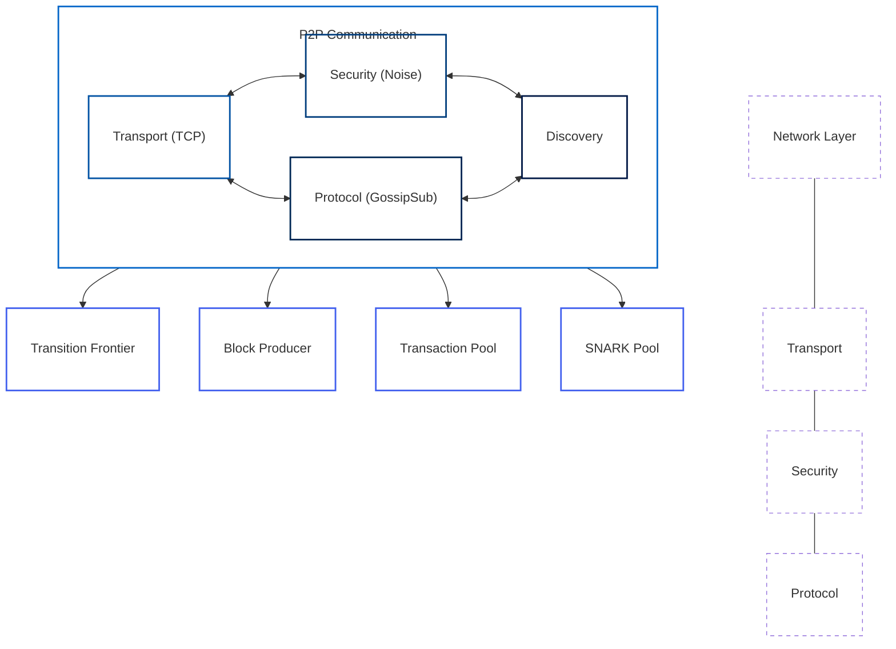

# P2P Communication

The P2P (Peer-to-Peer) communication component is responsible for managing network connections and message passing between nodes in the Mina network. It implements the LibP2P networking stack and provides a reliable, secure, and efficient communication layer.

## Component Overview

The P2P communication component consists of several subcomponents, each with its own state machine:

- **Connection**: Manages connection establishment and maintenance
- **Peer**: Manages peer interactions
- **Channel**: Manages communication channels for different message types

## Component Diagram



**Diagram Legend:**
- **P2P Communication**: Network component managing connections between nodes
- **Transport (TCP)**: Low-level data transmission using TCP protocol
- **Security (Noise)**: Encryption layer using the Noise protocol
- **Protocol (GossipSub)**: Message propagation using the GossipSub protocol
- **Discovery**: Peer discovery and connection management

## State Definition

The P2P communication state is defined in [p2p/src/p2p_state.rs](../../../p2p/src/p2p_state.rs):

```rust
pub struct P2pState {
    pub config: P2pConfig,
    pub peers: BTreeMap<PeerId, PeerState>,
    pub connecting_peers: BTreeMap<PeerId, ConnectingPeer>,
    pub channels: P2pChannelsState,
    pub discovery: P2pDiscoveryState,
}
```

This state includes:
- Configuration for the P2P component
- Connected peers
- Peers in the process of connecting
- Communication channels
- Peer discovery state

## Actions

The P2P communication component defines several actions for interacting with the state:

```rust
pub enum P2pAction {
    Connect {
        peer_id: PeerId,
        address: Multiaddr,
    },
    Connected {
        peer_id: PeerId,
    },
    ConnectionFailed {
        peer_id: PeerId,
        error: String,
    },
    Disconnect {
        peer_id: PeerId,
    },
    MessageReceived {
        peer_id: PeerId,
        message: Arc<MinaMessage>,
    },
    BroadcastMessage {
        message: Arc<MinaMessage>,
    },
    // ...
}
```

These actions allow for:
- Connecting to peers
- Handling connection success and failure
- Disconnecting from peers
- Receiving messages from peers
- Broadcasting messages to peers

## State Machines

The P2P communication component includes several state machines:

- [Connection State Machine](connection-state-machine.md): Manages connection establishment and maintenance
- [Peer State Machine](peer-state-machine.md): Manages peer interactions
- [Channel State Machines](channel-state-machines.md): Manages communication channels for different message types

Each state machine has its own state, actions, reducers, and effects.

## Interactions with Other Components

The P2P communication component interacts with several other components:

- **Transition Frontier**: For propagating blocks and sync messages
- **Block Producer**: For broadcasting produced blocks
- **Transaction Pool**: For propagating transactions
- **SNARK Pool**: For propagating SNARK work

These interactions are managed through actions and effects.

## Key Workflows

### Peer Connection

1. The P2P component dispatches a connect action
2. The connection state machine transitions to connecting
3. The P2P component attempts to establish a connection
4. If successful, the connection state machine transitions to connected
5. If unsuccessful, the connection state machine transitions to connection failed

### Message Propagation

1. A component dispatches a broadcast message action
2. The P2P component broadcasts the message to all connected peers
3. Peers receive the message and dispatch a message received action
4. The appropriate component processes the received message

### Peer Discovery

1. The P2P component periodically dispatches a discover peers action
2. The discovery state machine transitions to discovering
3. The P2P component queries known peers for additional peers
4. The discovery state machine transitions to discovered with the new peers
5. The P2P component attempts to connect to the new peers

## Implementation Details

### LibP2P Integration

The P2P component integrates with the LibP2P networking stack, which provides:

- Transport layer (TCP)
- Security layer (Noise)
- Protocol layer (GossipSub)
- Discovery mechanisms

### Message Types

The P2P component supports several message types:

- Block messages
- Transaction messages
- SNARK work messages
- Sync messages

Each message type has its own channel and handling logic.

### Connection Management

The P2P component manages connections to peers, including:

- Connection establishment
- Connection maintenance
- Connection termination
- Connection retry logic

## Next Steps

To learn more about specific aspects of the P2P communication component, see:

- [Connection State Machine](connection-state-machine.md)
- [Peer State Machine](peer-state-machine.md)
- [Channel State Machines](channel-state-machines.md)
