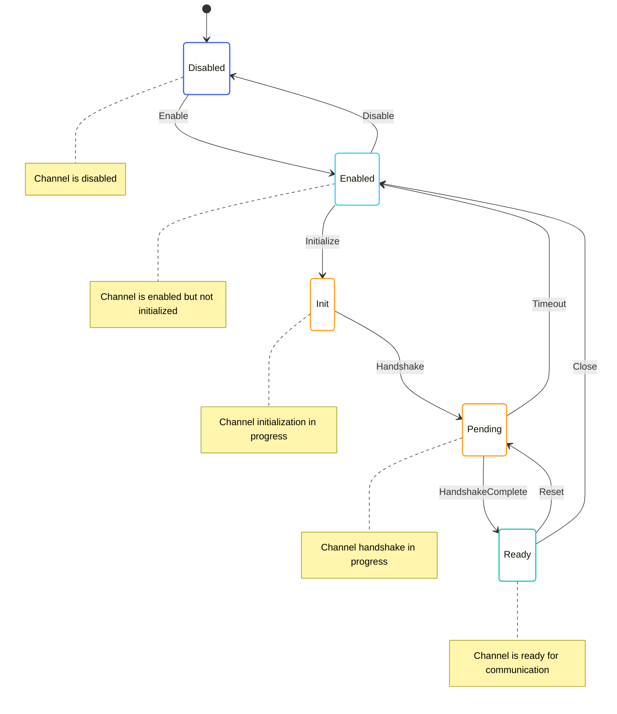

# Channel State Machines

The Channel State Machines are responsible for managing communication channels between peers. They handle the establishment, maintenance, and termination of channels for different types of messages, ensuring reliable and efficient communication.

## Channel Types

OpenMina uses several types of channels for different types of messages:

1. **Block Channel**: For exchanging blocks
2. **Transaction Channel**: For exchanging transactions
3. **SNARK Channel**: For exchanging SNARK work
4. **Sync Channel**: For synchronizing the blockchain

Each channel type has its own state machine with similar but slightly different behavior.

## State Diagram



## State Definition

The Channel State Machines are defined in [p2p/src/channels/channels_state.rs](../../../p2p/src/channels/channels_state.rs):

```rust
#[derive(Serialize, Deserialize, Debug, Clone)]
pub struct P2pChannelsState {
    pub block: P2pChannelsBlockState,
    pub transaction: P2pChannelsTransactionState,
    pub snark: P2pChannelsSnarkState,
    pub sync: P2pChannelsSyncState,
}

#[derive(Serialize, Deserialize, Debug, Clone)]
pub enum P2pChannelsBlockState {
    Disabled,
    Enabled,
    Init {
        time: redux::Timestamp,
    },
    Pending {
        time: redux::Timestamp,
    },
    Ready {
        time: redux::Timestamp,
        /// We are the requestors here.
        local: BlockPropagationState,
        /// We are the responders here.
        remote: BlockPropagationState,
        /// Last sent block index.
        next_send_index: u64,
    },
}

#[derive(Serialize, Deserialize, Debug, Clone)]
pub enum BlockPropagationState {
    WaitingForRequest {
        time: redux::Timestamp,
    },
    Requested {
        time: redux::Timestamp,
        requested_limit: u8,
    },
    Responding {
        time: redux::Timestamp,
        requested_limit: u8,
        promised_count: u8,
        current_count: u8,
    },
    Responded {
        time: redux::Timestamp,
        count: u8,
    },
}
```

Similar state definitions exist for the transaction, SNARK, and sync channels.

## Actions

The Channel State Machines define several actions for interacting with the state:

```rust
pub enum P2pChannelsAction {
    Block(P2pChannelsBlockAction),
    Transaction(P2pChannelsTransactionAction),
    Snark(P2pChannelsSnarkAction),
    Sync(P2pChannelsSyncAction),
}

pub enum P2pChannelsBlockAction {
    Enable,
    Disable,
    Initialize,
    Handshake,
    HandshakeComplete {
        local: BlockPropagationState,
        remote: BlockPropagationState,
    },
    RequestBlocks {
        limit: u8,
    },
    ReceiveBlockRequest {
        peer_id: PeerId,
        limit: u8,
    },
    SendBlockResponse {
        peer_id: PeerId,
        blocks: Vec<ArcBlockWithHash>,
    },
    ReceiveBlockResponse {
        peer_id: PeerId,
        blocks: Vec<ArcBlockWithHash>,
    },
    Reset,
    Close,
    Timeout,
}
```

Similar actions exist for the transaction, SNARK, and sync channels.

## Enabling Conditions

The Channel State Machines define enabling conditions for their actions:

```rust
impl EnablingCondition<State> for P2pChannelsBlockAction {
    fn is_enabled(&self, state: &State, _time: Timestamp) -> bool {
        match self {
            P2pChannelsBlockAction::Enable => {
                matches!(state.p2p.channels.block, P2pChannelsBlockState::Disabled)
            },
            P2pChannelsBlockAction::Disable => {
                !matches!(state.p2p.channels.block, P2pChannelsBlockState::Disabled)
            },
            P2pChannelsBlockAction::Initialize => {
                matches!(state.p2p.channels.block, P2pChannelsBlockState::Enabled)
            },
            P2pChannelsBlockAction::Handshake => {
                matches!(state.p2p.channels.block, P2pChannelsBlockState::Init { .. })
            },
            P2pChannelsBlockAction::HandshakeComplete { .. } => {
                matches!(state.p2p.channels.block, P2pChannelsBlockState::Pending { .. })
            },
            P2pChannelsBlockAction::RequestBlocks { .. } => {
                matches!(
                    state.p2p.channels.block,
                    P2pChannelsBlockState::Ready {
                        local: BlockPropagationState::WaitingForRequest { .. }
                            | BlockPropagationState::Responded { .. },
                        ..
                    }
                )
            },
            P2pChannelsBlockAction::ReceiveBlockRequest { .. } => {
                matches!(
                    state.p2p.channels.block,
                    P2pChannelsBlockState::Ready {
                        remote: BlockPropagationState::WaitingForRequest { .. }
                            | BlockPropagationState::Responded { .. },
                        ..
                    }
                )
            },
            P2pChannelsBlockAction::SendBlockResponse { .. } => {
                matches!(
                    state.p2p.channels.block,
                    P2pChannelsBlockState::Ready {
                        remote: BlockPropagationState::Responding { .. },
                        ..
                    }
                )
            },
            P2pChannelsBlockAction::ReceiveBlockResponse { .. } => {
                matches!(
                    state.p2p.channels.block,
                    P2pChannelsBlockState::Ready {
                        local: BlockPropagationState::Requested { .. },
                        ..
                    }
                )
            },
            P2pChannelsBlockAction::Reset => {
                matches!(state.p2p.channels.block, P2pChannelsBlockState::Ready { .. })
            },
            P2pChannelsBlockAction::Close => {
                matches!(state.p2p.channels.block, P2pChannelsBlockState::Ready { .. })
            },
            P2pChannelsBlockAction::Timeout => {
                matches!(state.p2p.channels.block, P2pChannelsBlockState::Pending { .. })
            },
        }
    }
}
```

Similar enabling conditions exist for the transaction, SNARK, and sync channels.

## Reducer

The Channel State Machines reducers are defined in [p2p/src/channels/channels_reducer.rs](../../../p2p/src/channels/channels_reducer.rs):

```rust
impl P2pChannelsBlockState {
    pub fn reducer<State, Action>(
        mut state_context: Substate<Action, State, Self>,
        action: ActionWithMeta<P2pChannelsBlockAction>,
    ) where
        State: SubstateAccess<Self>,
        Action: From<P2pChannelsBlockAction>
            + From<P2pChannelsBlockEffectfulAction>
            + From<redux::AnyAction>
            + EnablingCondition<State>,
    {
        let Ok(state) = state_context.get_substate_mut() else {
            // TODO: log or propagate
            return;
        };
        let (action, meta) = action.split();

        match action {
            P2pChannelsBlockAction::Enable => {
                // Transition to enabled state
                *state = P2pChannelsBlockState::Enabled;
            },
            P2pChannelsBlockAction::Disable => {
                // Transition to disabled state
                *state = P2pChannelsBlockState::Disabled;
            },
            P2pChannelsBlockAction::Initialize => {
                // Transition to init state
                *state = P2pChannelsBlockState::Init {
                    time: meta.time(),
                };

                // Dispatch effectful action to initiate handshake
                let dispatcher = state_context.dispatcher();
                dispatcher.dispatch(P2pChannelsBlockEffectfulAction::InitHandshake);
            },
            P2pChannelsBlockAction::Handshake => {
                // Transition to pending state
                *state = P2pChannelsBlockState::Pending {
                    time: meta.time(),
                };
            },
            P2pChannelsBlockAction::HandshakeComplete { local, remote } => {
                // Transition to ready state
                *state = P2pChannelsBlockState::Ready {
                    time: meta.time(),
                    local: local.clone(),
                    remote: remote.clone(),
                    next_send_index: 0,
                };
            },
            P2pChannelsBlockAction::RequestBlocks { limit } => {
                if let P2pChannelsBlockState::Ready { local, remote, next_send_index, .. } = state {
                    // Update local state
                    *local = BlockPropagationState::Requested {
                        time: meta.time(),
                        requested_limit: *limit,
                    };

                    // Dispatch effectful action to request blocks
                    let dispatcher = state_context.dispatcher();
                    dispatcher.dispatch(P2pChannelsBlockEffectfulAction::RequestBlocks {
                        limit: *limit,
                    });
                }
            },
            // ... other action handlers
        }
    }
}
```

Similar reducers exist for the transaction, SNARK, and sync channels.

## Effects

The Channel State Machines effectful actions are handled by the effects functions in [p2p/src/channels_effectful/channels_effectful_effects.rs](../../../p2p/src/channels_effectful/channels_effectful_effects.rs):

```rust
impl P2pChannelsBlockEffectfulAction {
    pub fn effects<S>(&self, _: &ActionMeta, store: &mut Store<S>)
    where
        S: redux::Service + P2pChannelsBlockService,
    {
        match self {
            P2pChannelsBlockEffectfulAction::InitHandshake => {
                // Log the handshake initiation
                log::info!("Initiating block channel handshake");

                // Call the service to initiate handshake
                store.service.init_handshake(
                    Box::new(move |result| {
                        match result {
                            Ok(()) => {
                                // Log the successful handshake
                                log::info!("Block channel handshake initiated");

                                // Dispatch handshake action
                                store.dispatch(P2pChannelsBlockAction::Handshake);
                            },
                            Err(error) => {
                                // Log the handshake failure
                                log::error!("Failed to initiate block channel handshake: {}", error);
                            },
                        }
                    }),
                );
            },
            P2pChannelsBlockEffectfulAction::RequestBlocks { limit } => {
                // Log the block request
                log::info!("Requesting {} blocks", limit);

                // Call the service to request blocks
                store.service.request_blocks(
                    *limit,
                    Box::new(move |result| {
                        match result {
                            Ok(blocks) => {
                                // Log the successful block request
                                log::info!("Received {} blocks", blocks.len());

                                // Dispatch block response action
                                store.dispatch(P2pChannelsBlockAction::ReceiveBlockResponse {
                                    peer_id: PeerId::random(), // This would be the actual peer ID in practice
                                    blocks,
                                });
                            },
                            Err(error) => {
                                // Log the block request failure
                                log::error!("Failed to request blocks: {}", error);
                            },
                        }
                    }),
                );
            },
            // ... other effectful action handlers
        }
    }
}
```

Similar effects functions exist for the transaction, SNARK, and sync channels.

## Key Workflows

### Channel Initialization

1. The `Enable` action is dispatched to enable the channel
2. The state transitions to `Enabled`
3. The `Initialize` action is dispatched to initialize the channel
4. The state transitions to `Init`
5. The `InitHandshake` effectful action is dispatched to initiate the handshake
6. The service initiates the handshake
7. The `Handshake` action is dispatched
8. The state transitions to `Pending`
9. When the handshake is complete, the `HandshakeComplete` action is dispatched
10. The state transitions to `Ready`

### Block Request and Response

1. The `RequestBlocks` action is dispatched with a limit
2. The local propagation state transitions to `Requested`
3. The `RequestBlocks` effectful action is dispatched to request blocks
4. The service requests blocks from the peer
5. When blocks are received, the `ReceiveBlockResponse` action is dispatched
6. The local propagation state transitions to `Responded`

### Channel Reset and Close

1. The `Reset` action is dispatched to reset the channel
2. The state transitions to `Pending`
3. The handshake process is repeated
4. The `Close` action is dispatched to close the channel
5. The state transitions to `Enabled`

## Implementation Details

### Channel Protocol

The channel protocol involves several steps:

1. **Handshake**: Negotiating protocol version and capabilities
2. **Request-Response**: Exchanging data using a request-response pattern
3. **Flow Control**: Managing the flow of data to prevent overwhelming the peer
4. **Error Handling**: Handling errors and retrying if necessary

### Propagation States

Each channel has local and remote propagation states:

1. **Local**: Represents our role as a requestor
2. **Remote**: Represents our role as a responder

The propagation states track the progress of data exchange:

1. **WaitingForRequest**: Waiting for a request
2. **Requested**: Request sent, waiting for response
3. **Responding**: Responding to a request
4. **Responded**: Response sent

### Flow Control

Flow control is implemented using limits and counters:

1. **Requested Limit**: The maximum number of items to request
2. **Promised Count**: The number of items promised in a response
3. **Current Count**: The number of items sent so far
4. **Next Send Index**: The index of the next item to send

## Interactions with Other Components

The Channel State Machines interact with:

- **Connection State Machine**: For establishing and maintaining connections
- **Peer State Machine**: For managing peer state
- **Transition Frontier**: For providing blocks and receiving sync data
- **Transaction Pool**: For providing and receiving transactions
- **SNARK Pool**: For providing and receiving SNARK work

These interactions are managed through actions and effects.

## Error Handling

The Channel State Machines handle errors by:

- Resetting channels that encounter errors
- Implementing timeouts for pending operations
- Logging errors for debugging purposes

This allows for robust communication in the face of network issues and peer misbehavior.
