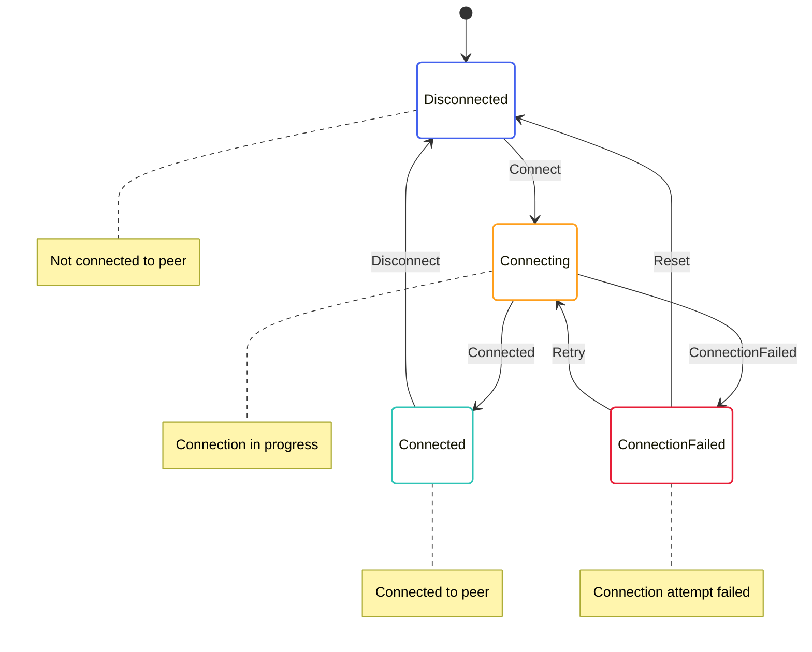

# Connection State Machine

The Connection State Machine is responsible for managing connections to peers in the network. It handles connection establishment, maintenance, and termination, ensuring reliable communication between nodes.

## State Diagram



## State Definition

The Connection State Machine state is defined in [p2p/src/connection/connection_state.rs](../../../p2p/src/connection/connection_state.rs):

```rust
#[derive(Serialize, Deserialize, Debug, Clone)]
pub enum ConnectionState {
    Disconnected,
    Connecting {
        time: redux::Timestamp,
        peer_id: PeerId,
        address: Multiaddr,
        attempts: u32,
        max_attempts: u32,
    },
    Connected {
        time: redux::Timestamp,
        peer_id: PeerId,
        address: Multiaddr,
    },
    ConnectionFailed {
        time: redux::Timestamp,
        peer_id: PeerId,
        address: Multiaddr,
        error: String,
        attempts: u32,
        max_attempts: u32,
    },
}
```

This state includes:
- `Disconnected`: Not connected to a peer
- `Connecting`: Connection attempt in progress
- `Connected`: Successfully connected to a peer
- `ConnectionFailed`: Connection attempt failed

## Actions

The Connection State Machine defines several actions for interacting with the state:

```rust
pub enum ConnectionAction {
    Connect {
        peer_id: PeerId,
        address: Multiaddr,
    },
    Connected {
        peer_id: PeerId,
        address: Multiaddr,
    },
    ConnectionFailed {
        peer_id: PeerId,
        address: Multiaddr,
        error: String,
    },
    Disconnect {
        peer_id: PeerId,
    },
    Retry {
        peer_id: PeerId,
    },
    Reset {
        peer_id: PeerId,
    },
}
```

These actions allow for:
- Initiating a connection to a peer
- Handling successful connections
- Handling failed connections
- Disconnecting from a peer
- Retrying a failed connection
- Resetting the connection state

The Connection State Machine also defines effectful actions for interacting with services:

```rust
pub enum ConnectionEffectfulAction {
    ConnectInit {
        peer_id: PeerId,
        address: Multiaddr,
    },
    DisconnectInit {
        peer_id: PeerId,
    },
}
```

These actions allow for:
- Initializing a connection to a peer
- Initializing a disconnection from a peer

## Enabling Conditions

The Connection State Machine defines enabling conditions for its actions:

```rust
impl EnablingCondition<State> for ConnectionAction {
    fn is_enabled(&self, state: &State, _time: Timestamp) -> bool {
        match self {
            ConnectionAction::Connect { peer_id, .. } => {
                // Check if we're already connected to this peer
                !state.p2p.connections.contains_key(peer_id)
                    || matches!(
                        state.p2p.connections.get(peer_id),
                        Some(ConnectionState::Disconnected)
                            | Some(ConnectionState::ConnectionFailed { .. })
                    )
            },
            ConnectionAction::Connected { peer_id, .. } => {
                // Check if we're connecting to this peer
                matches!(
                    state.p2p.connections.get(peer_id),
                    Some(ConnectionState::Connecting { .. })
                )
            },
            ConnectionAction::ConnectionFailed { peer_id, .. } => {
                // Check if we're connecting to this peer
                matches!(
                    state.p2p.connections.get(peer_id),
                    Some(ConnectionState::Connecting { .. })
                )
            },
            ConnectionAction::Disconnect { peer_id } => {
                // Check if we're connected to this peer
                matches!(
                    state.p2p.connections.get(peer_id),
                    Some(ConnectionState::Connected { .. })
                )
            },
            ConnectionAction::Retry { peer_id } => {
                // Check if we have a failed connection to this peer
                matches!(
                    state.p2p.connections.get(peer_id),
                    Some(ConnectionState::ConnectionFailed { attempts, max_attempts, .. })
                        if attempts < max_attempts
                )
            },
            ConnectionAction::Reset { peer_id } => {
                // Check if we have a connection to this peer
                state.p2p.connections.contains_key(peer_id)
            },
        }
    }
}
```

These enabling conditions ensure that actions are only processed when they make sense based on the current state.

## Reducer

The Connection State Machine reducer is defined in [p2p/src/connection/connection_reducer.rs](../../../p2p/src/connection/connection_reducer.rs):

```rust
impl ConnectionState {
    pub fn reducer<State, Action>(
        mut state_context: Substate<Action, State, Self>,
        action: ActionWithMeta<ConnectionAction>,
        peer_id: &PeerId,
    ) where
        State: SubstateAccess<Self>,
        Action: From<ConnectionAction>
            + From<ConnectionEffectfulAction>
            + From<redux::AnyAction>
            + EnablingCondition<State>,
    {
        let Ok(state) = state_context.get_substate_mut() else {
            // TODO: log or propagate
            return;
        };
        let (action, meta) = action.split();

        match action {
            ConnectionAction::Connect { peer_id, address } => {
                // Transition to connecting state
                *state = ConnectionState::Connecting {
                    time: meta.time(),
                    peer_id: peer_id.clone(),
                    address: address.clone(),
                    attempts: 1,
                    max_attempts: 3,
                };

                // Dispatch effectful action to initiate connection
                let dispatcher = state_context.dispatcher();
                dispatcher.dispatch(ConnectionEffectfulAction::ConnectInit {
                    peer_id: peer_id.clone(),
                    address: address.clone(),
                });
            },
            ConnectionAction::Connected { peer_id, address } => {
                // Transition to connected state
                *state = ConnectionState::Connected {
                    time: meta.time(),
                    peer_id: peer_id.clone(),
                    address: address.clone(),
                };
            },
            ConnectionAction::ConnectionFailed { peer_id, address, error } => {
                // Get current attempts and max attempts
                let (attempts, max_attempts) = match state {
                    ConnectionState::Connecting { attempts, max_attempts, .. } => (*attempts, *max_attempts),
                    _ => (1, 3),
                };

                // Transition to connection failed state
                *state = ConnectionState::ConnectionFailed {
                    time: meta.time(),
                    peer_id: peer_id.clone(),
                    address: address.clone(),
                    error: error.clone(),
                    attempts,
                    max_attempts,
                };

                // If we haven't reached max attempts, retry automatically
                if attempts < max_attempts {
                    let dispatcher = state_context.dispatcher();
                    dispatcher.dispatch(ConnectionAction::Retry {
                        peer_id: peer_id.clone(),
                    });
                }
            },
            ConnectionAction::Disconnect { peer_id } => {
                // Get current address
                let address = match state {
                    ConnectionState::Connected { address, .. } => address.clone(),
                    _ => return,
                };

                // Transition to disconnected state
                *state = ConnectionState::Disconnected;

                // Dispatch effectful action to initiate disconnection
                let dispatcher = state_context.dispatcher();
                dispatcher.dispatch(ConnectionEffectfulAction::DisconnectInit {
                    peer_id: peer_id.clone(),
                });
            },
            ConnectionAction::Retry { peer_id } => {
                // Get current address, attempts, and max attempts
                let (address, attempts, max_attempts) = match state {
                    ConnectionState::ConnectionFailed { address, attempts, max_attempts, .. } => {
                        (address.clone(), *attempts, *max_attempts)
                    },
                    _ => return,
                };

                // Transition to connecting state with incremented attempts
                *state = ConnectionState::Connecting {
                    time: meta.time(),
                    peer_id: peer_id.clone(),
                    address: address.clone(),
                    attempts: attempts + 1,
                    max_attempts,
                };

                // Dispatch effectful action to initiate connection
                let dispatcher = state_context.dispatcher();
                dispatcher.dispatch(ConnectionEffectfulAction::ConnectInit {
                    peer_id: peer_id.clone(),
                    address: address.clone(),
                });
            },
            ConnectionAction::Reset { peer_id } => {
                // Transition to disconnected state
                *state = ConnectionState::Disconnected;
            },
        }
    }
}
```

This reducer handles the state transitions based on the actions received.

## Effects

The Connection State Machine effectful actions are handled by the effects function in [p2p/src/connection_effectful/connection_effectful_effects.rs](../../../p2p/src/connection_effectful/connection_effectful_effects.rs):

```rust
impl ConnectionEffectfulAction {
    pub fn effects<S>(&self, _: &ActionMeta, store: &mut Store<S>)
    where
        S: redux::Service + ConnectionService,
    {
        match self {
            ConnectionEffectfulAction::ConnectInit { peer_id, address } => {
                // Log the connection request
                log::info!("Connecting to peer {} at {}", peer_id, address);

                // Call the service to initiate connection
                store.service.connect(
                    peer_id.clone(),
                    address.clone(),
                    Box::new(move |result| {
                        match result {
                            Ok(()) => {
                                // Log the successful connection
                                log::info!("Connected to peer {} at {}", peer_id, address);

                                // Dispatch success action
                                store.dispatch(ConnectionAction::Connected {
                                    peer_id: peer_id.clone(),
                                    address: address.clone(),
                                });
                            },
                            Err(error) => {
                                // Log the connection failure
                                log::error!("Failed to connect to peer {} at {}: {}", peer_id, address, error);

                                // Dispatch failure action
                                store.dispatch(ConnectionAction::ConnectionFailed {
                                    peer_id: peer_id.clone(),
                                    address: address.clone(),
                                    error: error.to_string(),
                                });
                            },
                        }
                    }),
                );
            },
            ConnectionEffectfulAction::DisconnectInit { peer_id } => {
                // Log the disconnection request
                log::info!("Disconnecting from peer {}", peer_id);

                // Call the service to initiate disconnection
                store.service.disconnect(
                    peer_id.clone(),
                    Box::new(move |result| {
                        match result {
                            Ok(()) => {
                                // Log the successful disconnection
                                log::info!("Disconnected from peer {}", peer_id);
                            },
                            Err(error) => {
                                // Log the disconnection failure
                                log::error!("Failed to disconnect from peer {}: {}", peer_id, error);
                            },
                        }
                    }),
                );
            },
        }
    }
}
```

This effects function delegates to the service for handling the actual connection and disconnection.

## Key Workflows

### Connection Establishment

1. The `Connect` action is dispatched with a peer ID and address
2. The state transitions to `Connecting`
3. The `ConnectInit` effectful action is dispatched to initiate the connection
4. The service attempts to establish a connection
5. If successful, the `Connected` action is dispatched and the state transitions to `Connected`
6. If unsuccessful, the `ConnectionFailed` action is dispatched and the state transitions to `ConnectionFailed`

### Connection Retry

1. When a connection fails, the state transitions to `ConnectionFailed`
2. If the number of attempts is less than the maximum, the `Retry` action is automatically dispatched
3. The state transitions back to `Connecting` with an incremented attempt count
4. The connection process is repeated

### Disconnection

1. The `Disconnect` action is dispatched with a peer ID
2. The state transitions to `Disconnected`
3. The `DisconnectInit` effectful action is dispatched to initiate the disconnection
4. The service disconnects from the peer

## Implementation Details

### Connection Process

The connection process involves several steps:

1. **Resolving the Address**: Converting the multiaddress to a socket address
2. **Establishing a TCP Connection**: Opening a TCP connection to the peer
3. **Performing a Handshake**: Negotiating protocols and exchanging identities
4. **Setting Up Encryption**: Establishing an encrypted channel using the Noise protocol
5. **Setting Up Multiplexing**: Setting up stream multiplexing for multiple concurrent communications

### Retry Logic

The Connection State Machine includes retry logic to handle transient connection failures:

1. Each connection attempt is tracked with an attempt counter
2. If a connection fails and the attempt counter is less than the maximum, a retry is automatically initiated
3. The maximum number of attempts is configurable
4. After the maximum number of attempts, the connection is considered permanently failed

### Connection Pooling

The P2P component maintains a pool of connections to peers:

1. Each peer has its own connection state
2. Connections are reused for multiple communications with the same peer
3. Idle connections are kept alive for a configurable period
4. Connections can be closed if they are idle for too long

## Interactions with Other Components

The Connection State Machine interacts with:

- **Peer State Machine**: For managing peer state based on connection state
- **Channel State Machines**: For setting up communication channels on established connections

These interactions are managed through actions and effects.

## Error Handling

The Connection State Machine handles errors by:

- Transitioning to the `ConnectionFailed` state with detailed error information
- Automatically retrying failed connections up to a maximum number of attempts
- Logging errors for debugging purposes

This allows for robust connection management in the face of network issues.
