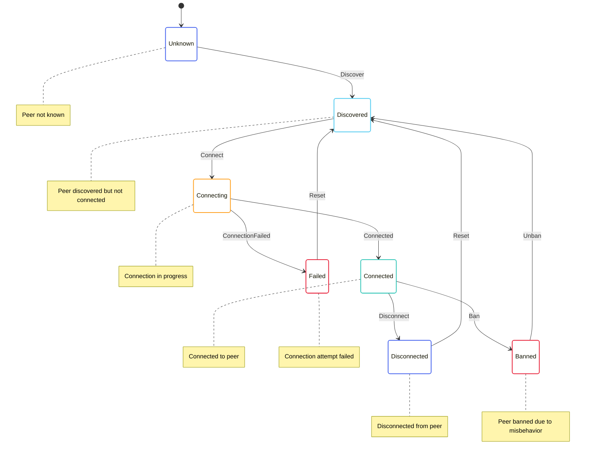

# Peer State Machine

The Peer State Machine is responsible for managing the state of peers in the network. It handles peer discovery, connection management, and peer reputation, ensuring reliable communication with trusted peers.

## State Diagram



## State Definition

The Peer State Machine state is defined in [p2p/src/peer/peer_state.rs](../../../p2p/src/peer/peer_state.rs):

```rust
#[derive(Serialize, Deserialize, Debug, Clone)]
pub enum PeerState {
    Unknown,
    Discovered {
        time: redux::Timestamp,
        addresses: Vec<Multiaddr>,
    },
    Connecting {
        time: redux::Timestamp,
        address: Multiaddr,
        attempts: u32,
        max_attempts: u32,
    },
    Connected {
        time: redux::Timestamp,
        address: Multiaddr,
        version: String,
        user_agent: String,
        reputation: i32,
    },
    Failed {
        time: redux::Timestamp,
        address: Multiaddr,
        error: String,
        attempts: u32,
        max_attempts: u32,
    },
    Disconnected {
        time: redux::Timestamp,
        address: Multiaddr,
        reason: String,
    },
    Banned {
        time: redux::Timestamp,
        reason: String,
        until: redux::Timestamp,
    },
}
```

This state includes:
- `Unknown`: Peer not known
- `Discovered`: Peer discovered but not connected
- `Connecting`: Connection attempt in progress
- `Connected`: Successfully connected to peer
- `Failed`: Connection attempt failed
- `Disconnected`: Disconnected from peer
- `Banned`: Peer banned due to misbehavior

## Actions

The Peer State Machine defines several actions for interacting with the state:

```rust
pub enum PeerAction {
    Discover {
        peer_id: PeerId,
        addresses: Vec<Multiaddr>,
    },
    Connect {
        peer_id: PeerId,
        address: Multiaddr,
    },
    Connected {
        peer_id: PeerId,
        address: Multiaddr,
        version: String,
        user_agent: String,
    },
    ConnectionFailed {
        peer_id: PeerId,
        address: Multiaddr,
        error: String,
    },
    Disconnect {
        peer_id: PeerId,
        reason: String,
    },
    Disconnected {
        peer_id: PeerId,
        reason: String,
    },
    UpdateReputation {
        peer_id: PeerId,
        delta: i32,
    },
    Ban {
        peer_id: PeerId,
        reason: String,
        duration: Duration,
    },
    Unban {
        peer_id: PeerId,
    },
    Reset {
        peer_id: PeerId,
    },
}
```

These actions allow for:
- Discovering a peer
- Initiating a connection to a peer
- Handling successful connections
- Handling failed connections
- Disconnecting from a peer
- Handling disconnections
- Updating peer reputation
- Banning a peer
- Unbanning a peer
- Resetting peer state

## Enabling Conditions

The Peer State Machine defines enabling conditions for its actions:

```rust
impl EnablingCondition<State> for PeerAction {
    fn is_enabled(&self, state: &State, time: Timestamp) -> bool {
        match self {
            PeerAction::Discover { peer_id, .. } => {
                // We can always discover a peer
                true
            },
            PeerAction::Connect { peer_id, .. } => {
                // Check if the peer is discovered and not banned
                if let Some(peer_state) = state.p2p.peers.get(peer_id) {
                    matches!(peer_state, PeerState::Discovered { .. })
                        || matches!(peer_state, PeerState::Failed { .. })
                        || matches!(peer_state, PeerState::Disconnected { .. })
                } else {
                    false
                }
            },
            PeerAction::Connected { peer_id, .. } => {
                // Check if we're connecting to this peer
                if let Some(peer_state) = state.p2p.peers.get(peer_id) {
                    matches!(peer_state, PeerState::Connecting { .. })
                } else {
                    false
                }
            },
            PeerAction::ConnectionFailed { peer_id, .. } => {
                // Check if we're connecting to this peer
                if let Some(peer_state) = state.p2p.peers.get(peer_id) {
                    matches!(peer_state, PeerState::Connecting { .. })
                } else {
                    false
                }
            },
            PeerAction::Disconnect { peer_id, .. } => {
                // Check if we're connected to this peer
                if let Some(peer_state) = state.p2p.peers.get(peer_id) {
                    matches!(peer_state, PeerState::Connected { .. })
                } else {
                    false
                }
            },
            PeerAction::Disconnected { peer_id, .. } => {
                // Check if we're connected to this peer
                if let Some(peer_state) = state.p2p.peers.get(peer_id) {
                    matches!(peer_state, PeerState::Connected { .. })
                } else {
                    false
                }
            },
            PeerAction::UpdateReputation { peer_id, .. } => {
                // Check if we're connected to this peer
                if let Some(peer_state) = state.p2p.peers.get(peer_id) {
                    matches!(peer_state, PeerState::Connected { .. })
                } else {
                    false
                }
            },
            PeerAction::Ban { peer_id, .. } => {
                // We can ban any peer that's not already banned
                if let Some(peer_state) = state.p2p.peers.get(peer_id) {
                    !matches!(peer_state, PeerState::Banned { .. })
                } else {
                    false
                }
            },
            PeerAction::Unban { peer_id } => {
                // Check if the peer is banned
                if let Some(peer_state) = state.p2p.peers.get(peer_id) {
                    matches!(peer_state, PeerState::Banned { .. })
                } else {
                    false
                }
            },
            PeerAction::Reset { peer_id } => {
                // We can reset any peer that's not unknown
                if let Some(peer_state) = state.p2p.peers.get(peer_id) {
                    !matches!(peer_state, PeerState::Unknown)
                } else {
                    false
                }
            },
        }
    }
}
```

These enabling conditions ensure that actions are only processed when they make sense based on the current state.

## Reducer

The Peer State Machine reducer is defined in [p2p/src/peer/peer_reducer.rs](../../../p2p/src/peer/peer_reducer.rs):

```rust
impl PeerState {
    pub fn reducer<State, Action>(
        mut state_context: Substate<Action, State, Self>,
        action: ActionWithMeta<PeerAction>,
        peer_id: &PeerId,
    ) where
        State: SubstateAccess<Self>,
        Action: From<PeerAction>
            + From<ConnectionAction>
            + From<redux::AnyAction>
            + EnablingCondition<State>,
    {
        let Ok(state) = state_context.get_substate_mut() else {
            // TODO: log or propagate
            return;
        };
        let (action, meta) = action.split();

        match action {
            PeerAction::Discover { peer_id, addresses } => {
                match state {
                    PeerState::Unknown => {
                        // Transition to discovered state
                        *state = PeerState::Discovered {
                            time: meta.time(),
                            addresses: addresses.clone(),
                        };
                    },
                    PeerState::Discovered { addresses: existing_addresses, .. } => {
                        // Update addresses
                        let mut new_addresses = existing_addresses.clone();
                        for address in addresses {
                            if !new_addresses.contains(&address) {
                                new_addresses.push(address);
                            }
                        }
                        *state = PeerState::Discovered {
                            time: meta.time(),
                            addresses: new_addresses,
                        };
                    },
                    _ => {
                        // Ignore discovery for other states
                    },
                }
            },
            PeerAction::Connect { peer_id, address } => {
                // Transition to connecting state
                *state = PeerState::Connecting {
                    time: meta.time(),
                    address: address.clone(),
                    attempts: 1,
                    max_attempts: 3,
                };

                // Dispatch connection action
                let dispatcher = state_context.dispatcher();
                dispatcher.dispatch(ConnectionAction::Connect {
                    peer_id: peer_id.clone(),
                    address: address.clone(),
                });
            },
            PeerAction::Connected { peer_id, address, version, user_agent } => {
                // Transition to connected state
                *state = PeerState::Connected {
                    time: meta.time(),
                    address: address.clone(),
                    version: version.clone(),
                    user_agent: user_agent.clone(),
                    reputation: 0,
                };
            },
            PeerAction::ConnectionFailed { peer_id, address, error } => {
                // Get current attempts and max attempts
                let (attempts, max_attempts) = match state {
                    PeerState::Connecting { attempts, max_attempts, .. } => (*attempts, *max_attempts),
                    _ => (1, 3),
                };

                // Transition to failed state
                *state = PeerState::Failed {
                    time: meta.time(),
                    address: address.clone(),
                    error: error.clone(),
                    attempts,
                    max_attempts,
                };
            },
            PeerAction::Disconnect { peer_id, reason } => {
                // Get current address
                let address = match state {
                    PeerState::Connected { address, .. } => address.clone(),
                    _ => return,
                };

                // Transition to disconnected state
                *state = PeerState::Disconnected {
                    time: meta.time(),
                    address: address.clone(),
                    reason: reason.clone(),
                };

                // Dispatch connection action
                let dispatcher = state_context.dispatcher();
                dispatcher.dispatch(ConnectionAction::Disconnect {
                    peer_id: peer_id.clone(),
                });
            },
            PeerAction::Disconnected { peer_id, reason } => {
                // Get current address
                let address = match state {
                    PeerState::Connected { address, .. } => address.clone(),
                    _ => return,
                };

                // Transition to disconnected state
                *state = PeerState::Disconnected {
                    time: meta.time(),
                    address: address.clone(),
                    reason: reason.clone(),
                };
            },
            PeerAction::UpdateReputation { peer_id, delta } => {
                // Update reputation
                if let PeerState::Connected { reputation, .. } = state {
                    *reputation += delta;

                    // If reputation is too low, ban the peer
                    if *reputation < -100 {
                        let dispatcher = state_context.dispatcher();
                        dispatcher.dispatch(PeerAction::Ban {
                            peer_id: peer_id.clone(),
                            reason: "Reputation too low".to_string(),
                            duration: Duration::from_secs(3600), // 1 hour
                        });
                    }
                }
            },
            PeerAction::Ban { peer_id, reason, duration } => {
                // Transition to banned state
                *state = PeerState::Banned {
                    time: meta.time(),
                    reason: reason.clone(),
                    until: meta.time() + duration,
                };

                // If connected, disconnect
                if matches!(state, PeerState::Connected { .. }) {
                    let dispatcher = state_context.dispatcher();
                    dispatcher.dispatch(PeerAction::Disconnect {
                        peer_id: peer_id.clone(),
                        reason: format!("Banned: {}", reason),
                    });
                }
            },
            PeerAction::Unban { peer_id } => {
                // Get addresses if available
                let addresses = match state {
                    PeerState::Banned { .. } => {
                        // We don't have addresses in the banned state
                        Vec::new()
                    },
                    _ => return,
                };

                // Transition to discovered state
                *state = PeerState::Discovered {
                    time: meta.time(),
                    addresses,
                };
            },
            PeerAction::Reset { peer_id } => {
                // Get addresses if available
                let addresses = match state {
                    PeerState::Discovered { addresses, .. } => addresses.clone(),
                    PeerState::Connecting { address, .. } => vec![address.clone()],
                    PeerState::Connected { address, .. } => vec![address.clone()],
                    PeerState::Failed { address, .. } => vec![address.clone()],
                    PeerState::Disconnected { address, .. } => vec![address.clone()],
                    _ => Vec::new(),
                };

                // Transition to discovered state
                *state = PeerState::Discovered {
                    time: meta.time(),
                    addresses,
                };
            },
        }
    }
}
```

This reducer handles the state transitions based on the actions received.

## Key Workflows

### Peer Discovery

1. The `Discover` action is dispatched with a peer ID and addresses
2. If the peer is unknown, the state transitions to `Discovered`
3. If the peer is already discovered, the addresses are updated

### Connection Establishment

1. The `Connect` action is dispatched with a peer ID and address
2. The state transitions to `Connecting`
3. A connection action is dispatched to the Connection State Machine
4. If the connection is successful, the `Connected` action is dispatched and the state transitions to `Connected`
5. If the connection fails, the `ConnectionFailed` action is dispatched and the state transitions to `Failed`

### Disconnection

1. The `Disconnect` action is dispatched with a peer ID and reason
2. The state transitions to `Disconnected`
3. A disconnection action is dispatched to the Connection State Machine

### Reputation Management

1. The `UpdateReputation` action is dispatched with a peer ID and reputation delta
2. The peer's reputation is updated
3. If the reputation falls below a threshold, the peer is banned

### Banning and Unbanning

1. The `Ban` action is dispatched with a peer ID, reason, and duration
2. The state transitions to `Banned`
3. If the peer is connected, a disconnection action is dispatched
4. The `Unban` action can be dispatched to transition the peer back to `Discovered`

## Implementation Details

### Peer Discovery

Peer discovery involves several mechanisms:

1. **Bootstrap Nodes**: A list of well-known nodes that are used to bootstrap the network
2. **DHT**: A distributed hash table for finding peers
3. **mDNS**: Multicast DNS for finding peers on the local network
4. **Peer Exchange**: Exchanging peer information with connected peers

### Reputation System

The reputation system helps identify and avoid misbehaving peers:

1. Peers start with a neutral reputation (0)
2. Good behavior (e.g., providing useful data) increases reputation
3. Bad behavior (e.g., providing invalid data) decreases reputation
4. Peers with very low reputation are banned

### Ban Management

The ban system helps protect the node from malicious peers:

1. Peers can be banned for various reasons (e.g., low reputation, protocol violations)
2. Bans have a duration after which the peer can be unbanned
3. Banned peers are not connected to until the ban expires

## Interactions with Other Components

The Peer State Machine interacts with:

- **Connection State Machine**: For managing connections to peers
- **Channel State Machines**: For setting up communication channels with peers
- **Discovery**: For finding new peers

These interactions are managed through actions and effects.

## Error Handling

The Peer State Machine handles errors by:

- Transitioning to the `Failed` state with detailed error information
- Updating peer reputation based on behavior
- Banning peers that consistently misbehave

This allows for robust peer management in the face of network issues and malicious peers.
