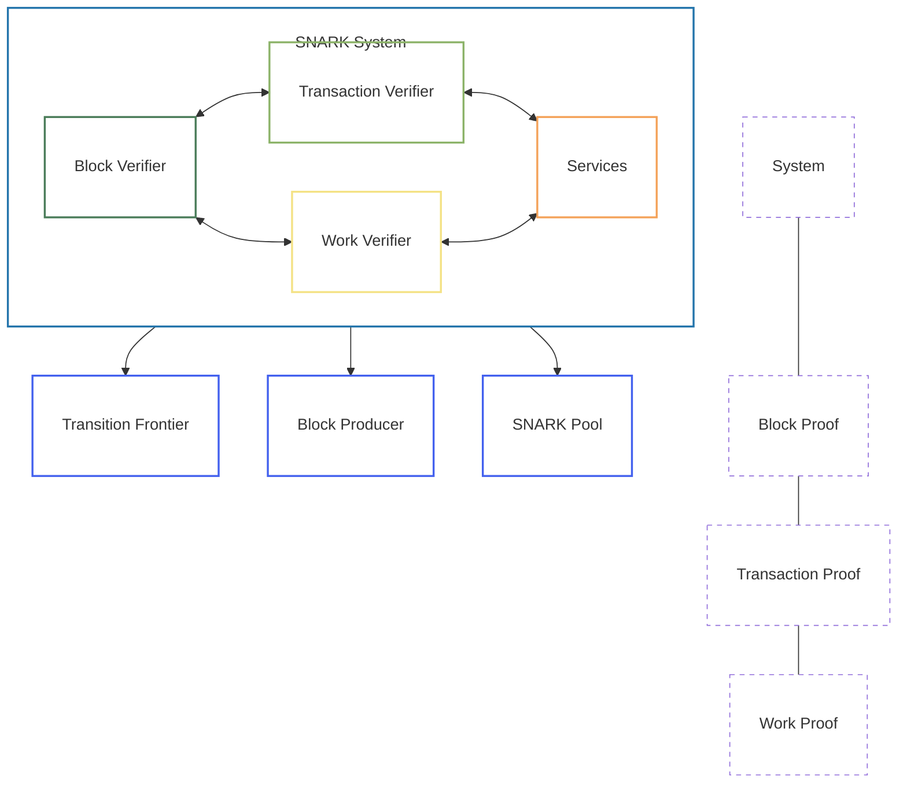

# SNARK System

The SNARK (Succinct Non-interactive ARgument of Knowledge) system is a core component of the OpenMina node that handles zero-knowledge proof verification. It is essential for the Mina protocol, which relies heavily on zero-knowledge proofs to maintain a small blockchain size.

## Component Overview

The SNARK system component consists of several subcomponents, each with its own state machine:

- **Block Verification**: Verifies block proofs
- **Transaction Verification**: Verifies transaction proofs
- **Work Verification**: Verifies SNARK work proofs

## Component Diagram



**Diagram Legend:**
- **SNARK System**: Core component handling zero-knowledge proof verification
- **Block Verifier**: Verifies block proofs and validates state transitions
- **Transaction Verifier**: Verifies transaction proofs
- **Work Verifier**: Verifies SNARK work proofs
- **Services**: Handles computationally heavy verification operations

## State Definition

The SNARK system state is defined in [snark/src/snark_state.rs](../../../snark/src/snark_state.rs):

```rust
pub struct SnarkState {
    pub config: SnarkConfig,
    pub block_verify: BlockVerifyState,
    pub user_command_verify: UserCommandVerifyState,
    pub work_verify: WorkVerifyState,
}
```

This state includes:
- Configuration for the SNARK system
- Block verification state
- Transaction verification state
- Work verification state

## Actions

The SNARK system component defines several actions for interacting with the state:

```rust
pub enum SnarkAction {
    BlockVerify(BlockVerifyAction),
    UserCommandVerify(UserCommandVerifyAction),
    WorkVerify(WorkVerifyAction),
}
```

These actions allow for:
- Verifying block proofs
- Verifying transaction proofs
- Verifying SNARK work proofs

## State Machines

The SNARK system component includes several state machines:

- [Block Verification State Machine](block-verification-state-machine.md): Verifies block proofs
- [Transaction Verification State Machine](transaction-verification-state-machine.md): Verifies transaction proofs
- [Work Verification State Machine](work-verification-state-machine.md): Verifies SNARK work proofs

Each state machine has its own state, actions, reducers, and effects.

## Interactions with Other Components

The SNARK system interacts with several other components:

- **Transition Frontier**: For verifying block proofs during block validation
- **Block Producer**: For verifying block proofs during block production
- **SNARK Pool**: For verifying SNARK work proofs

These interactions are managed through actions and effects.

## Key Workflows

### Block Verification

1. The Transition Frontier component dispatches a block verification action
2. The SNARK system verifies the block proof
3. The SNARK system dispatches a block verification result action
4. The Transition Frontier component updates the state based on the verification result

### Transaction Verification

1. The Transition Frontier component dispatches a transaction verification action
2. The SNARK system verifies the transaction proof
3. The SNARK system dispatches a transaction verification result action
4. The Transition Frontier component updates the state based on the verification result

### Work Verification

1. The SNARK Pool component dispatches a work verification action
2. The SNARK system verifies the SNARK work proof
3. The SNARK system dispatches a work verification result action
4. The SNARK Pool component updates the state based on the verification result

## Implementation Details

### Kimchi Proof System

The SNARK system uses the Kimchi proof system, which is based on the PLONK proof system. The verification process involves:

1. Loading the verifier index and SRS (Structured Reference String)
2. Deserializing the proof
3. Verifying the proof against the verifier index
4. Checking that the proof's public input matches the expected value

### Parallel Verification

The SNARK system supports parallel verification, which allows multiple proofs to be verified simultaneously. This is important for performance, as verification can be computationally intensive.

### Verification Caching

The SNARK system caches verification results to avoid redundant verification of the same proof. This is important for performance, as verification can be computationally intensive.

## Next Steps

To learn more about specific aspects of the SNARK system component, see:

- [Block Verification State Machine](block-verification-state-machine.md)
- [Transaction Verification State Machine](transaction-verification-state-machine.md)
- [Work Verification State Machine](work-verification-state-machine.md)
