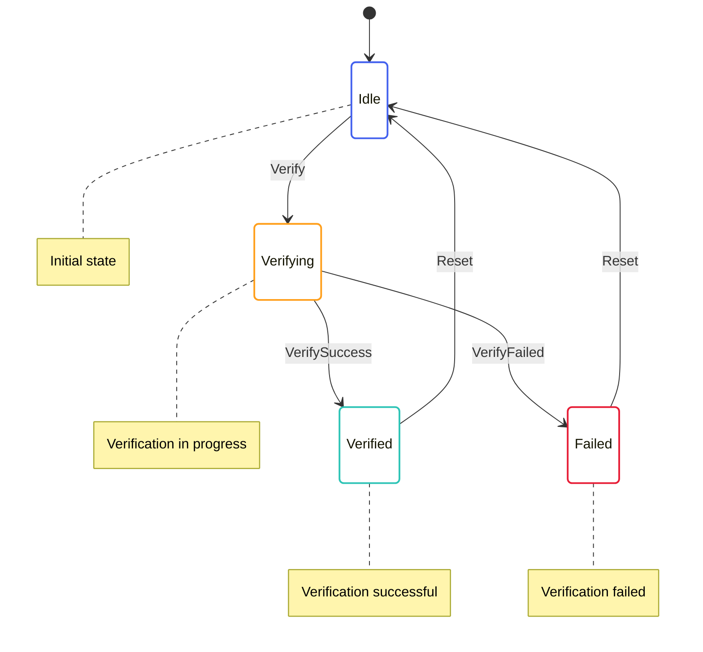

# Block Verification State Machine

The Block Verification State Machine is responsible for verifying block proofs. It handles the verification of SNARK proofs for blocks, which is essential for the Mina protocol's small blockchain size.

## State Diagram



## State Definition

The Block Verification State Machine state is defined in [snark/src/block_verify/block_verify_state.rs](../../../snark/src/block_verify/block_verify_state.rs):

```rust
#[derive(Serialize, Deserialize, Debug, Clone)]
pub struct BlockVerifyState {
    pub verifying: BTreeMap<StateHash, BlockVerifyingState>,
    pub verified: BTreeMap<StateHash, BlockVerifiedState>,
    pub failed: BTreeMap<StateHash, BlockVerifyFailedState>,
}

#[derive(Serialize, Deserialize, Debug, Clone)]
pub struct BlockVerifyingState {
    pub time: redux::Timestamp,
    pub input: Box<ProverExtendBlockchainInputStableV2>,
}

#[derive(Serialize, Deserialize, Debug, Clone)]
pub struct BlockVerifiedState {
    pub time: redux::Timestamp,
}

#[derive(Serialize, Deserialize, Debug, Clone)]
pub struct BlockVerifyFailedState {
    pub time: redux::Timestamp,
    pub error: String,
}
```

This state includes:
- A map of block hashes to verifying states
- A map of block hashes to verified states
- A map of block hashes to failed states

## Actions

The Block Verification State Machine defines several actions for interacting with the state:

```rust
pub enum BlockVerifyAction {
    Verify {
        block_hash: StateHash,
        input: Box<ProverExtendBlockchainInputStableV2>,
    },
    VerifySuccess {
        block_hash: StateHash,
    },
    VerifyFailed {
        block_hash: StateHash,
        error: String,
    },
    Reset {
        block_hash: StateHash,
    },
}
```

These actions allow for:
- Initiating block verification
- Handling verification success
- Handling verification failure
- Resetting the verification state

The Block Verification State Machine also defines effectful actions for interacting with services:

```rust
pub enum BlockVerifyEffectfulAction {
    VerifyInit {
        block_hash: StateHash,
        input: Box<ProverExtendBlockchainInputStableV2>,
    },
}
```

These actions allow for:
- Initializing block verification

## Enabling Conditions

The Block Verification State Machine defines enabling conditions for its actions:

```rust
impl EnablingCondition<State> for BlockVerifyAction {
    fn is_enabled(&self, state: &State, _time: Timestamp) -> bool {
        match self {
            BlockVerifyAction::Verify { block_hash, .. } => {
                // Check if we're already verifying this block
                !state.snark.block_verify.verifying.contains_key(block_hash)
                    && !state.snark.block_verify.verified.contains_key(block_hash)
                    && !state.snark.block_verify.failed.contains_key(block_hash)
            },
            BlockVerifyAction::VerifySuccess { block_hash } => {
                // Check if we're verifying this block
                state.snark.block_verify.verifying.contains_key(block_hash)
            },
            BlockVerifyAction::VerifyFailed { block_hash, .. } => {
                // Check if we're verifying this block
                state.snark.block_verify.verifying.contains_key(block_hash)
            },
            BlockVerifyAction::Reset { block_hash } => {
                // Check if we have this block in any state
                state.snark.block_verify.verifying.contains_key(block_hash)
                    || state.snark.block_verify.verified.contains_key(block_hash)
                    || state.snark.block_verify.failed.contains_key(block_hash)
            },
        }
    }
}
```

These enabling conditions ensure that actions are only processed when they make sense based on the current state.

## Reducer

The Block Verification State Machine reducer is defined in [snark/src/block_verify/block_verify_reducer.rs](../../../snark/src/block_verify/block_verify_reducer.rs):

```rust
impl BlockVerifyState {
    pub fn reducer<State, Action>(
        mut state_context: Substate<Action, State, Self>,
        action: ActionWithMeta<BlockVerifyAction>,
    ) where
        State: SubstateAccess<Self>,
        Action: From<BlockVerifyAction>
            + From<BlockVerifyEffectfulAction>
            + From<redux::AnyAction>
            + EnablingCondition<State>,
    {
        let Ok(state) = state_context.get_substate_mut() else {
            // TODO: log or propagate
            return;
        };
        let (action, meta) = action.split();

        match action {
            BlockVerifyAction::Verify { block_hash, input } => {
                // Add the block to the verifying map
                state.verifying.insert(
                    block_hash.clone(),
                    BlockVerifyingState {
                        time: meta.time(),
                        input: input.clone(),
                    },
                );

                // Dispatch effectful action to perform verification
                let dispatcher = state_context.dispatcher();
                dispatcher.dispatch(BlockVerifyEffectfulAction::VerifyInit {
                    block_hash: block_hash.clone(),
                    input: input.clone(),
                });
            },
            BlockVerifyAction::VerifySuccess { block_hash } => {
                // Remove the block from the verifying map
                if let Some(verifying) = state.verifying.remove(&block_hash) {
                    // Add the block to the verified map
                    state.verified.insert(
                        block_hash.clone(),
                        BlockVerifiedState {
                            time: meta.time(),
                        },
                    );
                }
            },
            BlockVerifyAction::VerifyFailed { block_hash, error } => {
                // Remove the block from the verifying map
                if let Some(verifying) = state.verifying.remove(&block_hash) {
                    // Add the block to the failed map
                    state.failed.insert(
                        block_hash.clone(),
                        BlockVerifyFailedState {
                            time: meta.time(),
                            error: error.clone(),
                        },
                    );
                }
            },
            BlockVerifyAction::Reset { block_hash } => {
                // Remove the block from all maps
                state.verifying.remove(&block_hash);
                state.verified.remove(&block_hash);
                state.failed.remove(&block_hash);
            },
        }
    }
}
```

This reducer handles the state transitions based on the actions received.

## Effects

The Block Verification State Machine effectful actions are handled by the effects function in [snark/src/block_verify_effectful/block_verify_effectful_effects.rs](../../../snark/src/block_verify_effectful/block_verify_effectful_effects.rs):

```rust
impl BlockVerifyEffectfulAction {
    pub fn effects<S>(&self, _: &ActionMeta, store: &mut Store<S>)
    where
        S: redux::Service + BlockVerifyService,
    {
        match self {
            BlockVerifyEffectfulAction::VerifyInit { block_hash, input } => {
                // Log the verification request
                log::info!("Verifying block {}", block_hash);

                // Call the service to verify the block
                store.service.verify(
                    block_hash.clone(),
                    input.clone(),
                    Box::new(move |result| {
                        match result {
                            Ok(()) => {
                                // Log the successful verification
                                log::info!("Block {} verified successfully", block_hash);

                                // Dispatch success action
                                store.dispatch(BlockVerifyAction::VerifySuccess {
                                    block_hash: block_hash.clone(),
                                });
                            },
                            Err(error) => {
                                // Log the verification failure
                                log::error!("Failed to verify block {}: {}", block_hash, error);

                                // Dispatch failure action
                                store.dispatch(BlockVerifyAction::VerifyFailed {
                                    block_hash: block_hash.clone(),
                                    error: error.to_string(),
                                });
                            },
                        }
                    }),
                );
            },
        }
    }
}
```

This effects function delegates to the service for handling the actual verification.

## Key Workflows

### Block Verification

1. The `Verify` action is dispatched with a block hash and verification input
2. The block is added to the verifying map
3. The `VerifyInit` effectful action is dispatched to perform the verification
4. The service performs the verification
5. When the verification is complete, either `VerifySuccess` or `VerifyFailed` is dispatched
6. The block is moved from the verifying map to either the verified or failed map

### Verification Reset

1. The `Reset` action is dispatched with a block hash
2. The block is removed from all maps
3. This allows the block to be verified again if needed

## Implementation Details

### Verification Process

The verification process involves several steps:

1. **Loading the Verifier Index**: Loading the verifier index for the block
2. **Deserializing the Proof**: Deserializing the SNARK proof from the block
3. **Verifying the Proof**: Verifying the proof against the verifier index
4. **Checking the Public Input**: Checking that the proof's public input matches the expected value

### Parallel Verification

The Block Verification State Machine supports parallel verification, which allows multiple blocks to be verified simultaneously. This is important for performance, as verification can be computationally intensive.

### Verification Caching

The Block Verification State Machine caches verification results to avoid redundant verification of the same block. This is important for performance, as verification can be computationally intensive.

## Interactions with Other Components

The Block Verification State Machine interacts with:

- **Transition Frontier**: For verifying blocks during block validation
- **Block Producer**: For verifying blocks during block production

These interactions are managed through actions and effects.

## Error Handling

The Block Verification State Machine handles errors by:

- Moving blocks to the failed map if verification fails
- Providing detailed error messages for failed verifications
- Logging errors for debugging purposes

This allows for proper monitoring and debugging of the verification process.
