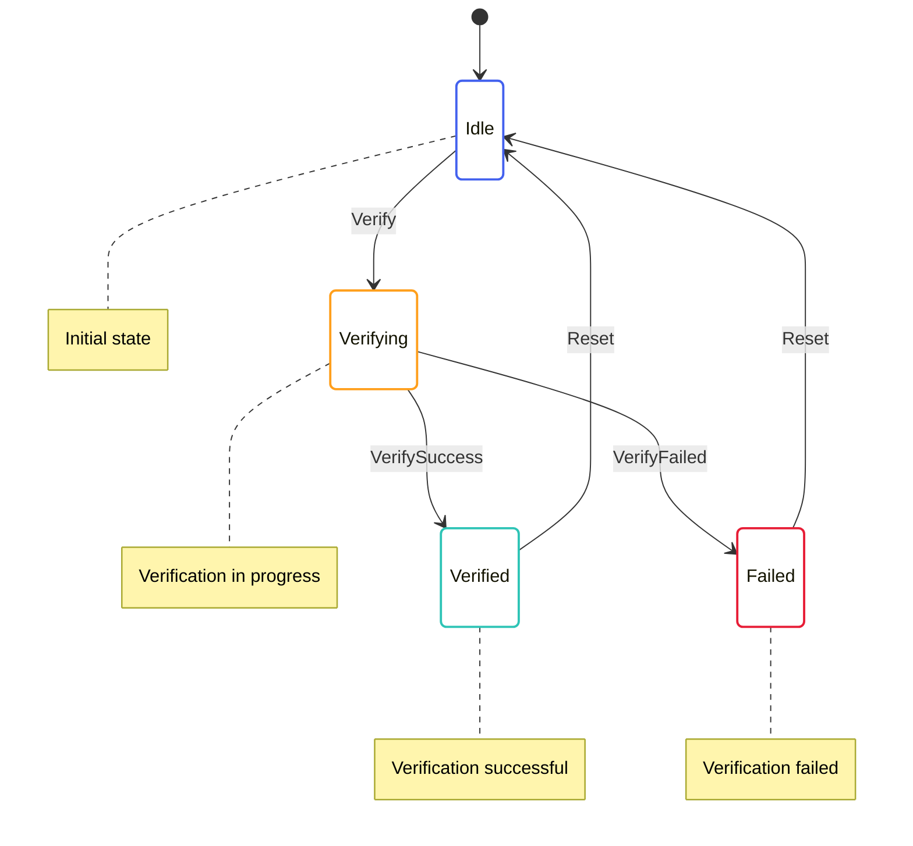

# Transaction Verification State Machine

The Transaction Verification State Machine is responsible for verifying transaction proofs. It handles the verification of SNARK proofs for transactions, which is essential for the Mina protocol's privacy and security features.

## State Diagram



## State Definition

The Transaction Verification State Machine state is defined in [snark/src/user_command_verify/user_command_verify_state.rs](../../../snark/src/user_command_verify/user_command_verify_state.rs):

```rust
#[derive(Serialize, Deserialize, Debug, Clone)]
pub struct UserCommandVerifyState {
    pub verifying: BTreeMap<TransactionHash, UserCommandVerifyingState>,
    pub verified: BTreeMap<TransactionHash, UserCommandVerifiedState>,
    pub failed: BTreeMap<TransactionHash, UserCommandVerifyFailedState>,
}

#[derive(Serialize, Deserialize, Debug, Clone)]
pub struct UserCommandVerifyingState {
    pub time: redux::Timestamp,
    pub input: Box<UserCommandVerifyInput>,
}

#[derive(Serialize, Deserialize, Debug, Clone)]
pub struct UserCommandVerifiedState {
    pub time: redux::Timestamp,
}

#[derive(Serialize, Deserialize, Debug, Clone)]
pub struct UserCommandVerifyFailedState {
    pub time: redux::Timestamp,
    pub error: String,
}
```

This state includes:
- A map of transaction hashes to verifying states
- A map of transaction hashes to verified states
- A map of transaction hashes to failed states

## Actions

The Transaction Verification State Machine defines several actions for interacting with the state:

```rust
pub enum UserCommandVerifyAction {
    Verify {
        transaction_hash: TransactionHash,
        input: Box<UserCommandVerifyInput>,
    },
    VerifySuccess {
        transaction_hash: TransactionHash,
    },
    VerifyFailed {
        transaction_hash: TransactionHash,
        error: String,
    },
    Reset {
        transaction_hash: TransactionHash,
    },
}
```

These actions allow for:
- Initiating transaction verification
- Handling verification success
- Handling verification failure
- Resetting the verification state

The Transaction Verification State Machine also defines effectful actions for interacting with services:

```rust
pub enum UserCommandVerifyEffectfulAction {
    VerifyInit {
        transaction_hash: TransactionHash,
        input: Box<UserCommandVerifyInput>,
    },
}
```

These actions allow for:
- Initializing transaction verification

## Enabling Conditions

The Transaction Verification State Machine defines enabling conditions for its actions:

```rust
impl EnablingCondition<State> for UserCommandVerifyAction {
    fn is_enabled(&self, state: &State, _time: Timestamp) -> bool {
        match self {
            UserCommandVerifyAction::Verify { transaction_hash, .. } => {
                // Check if we're already verifying this transaction
                !state.snark.user_command_verify.verifying.contains_key(transaction_hash)
                    && !state.snark.user_command_verify.verified.contains_key(transaction_hash)
                    && !state.snark.user_command_verify.failed.contains_key(transaction_hash)
            },
            UserCommandVerifyAction::VerifySuccess { transaction_hash } => {
                // Check if we're verifying this transaction
                state.snark.user_command_verify.verifying.contains_key(transaction_hash)
            },
            UserCommandVerifyAction::VerifyFailed { transaction_hash, .. } => {
                // Check if we're verifying this transaction
                state.snark.user_command_verify.verifying.contains_key(transaction_hash)
            },
            UserCommandVerifyAction::Reset { transaction_hash } => {
                // Check if we have this transaction in any state
                state.snark.user_command_verify.verifying.contains_key(transaction_hash)
                    || state.snark.user_command_verify.verified.contains_key(transaction_hash)
                    || state.snark.user_command_verify.failed.contains_key(transaction_hash)
            },
        }
    }
}
```

These enabling conditions ensure that actions are only processed when they make sense based on the current state.

## Reducer

The Transaction Verification State Machine reducer is defined in [snark/src/user_command_verify/user_command_verify_reducer.rs](../../../snark/src/user_command_verify/user_command_verify_reducer.rs):

```rust
impl UserCommandVerifyState {
    pub fn reducer<State, Action>(
        mut state_context: Substate<Action, State, Self>,
        action: ActionWithMeta<UserCommandVerifyAction>,
    ) where
        State: SubstateAccess<Self>,
        Action: From<UserCommandVerifyAction>
            + From<UserCommandVerifyEffectfulAction>
            + From<redux::AnyAction>
            + EnablingCondition<State>,
    {
        let Ok(state) = state_context.get_substate_mut() else {
            // TODO: log or propagate
            return;
        };
        let (action, meta) = action.split();

        match action {
            UserCommandVerifyAction::Verify { transaction_hash, input } => {
                // Add the transaction to the verifying map
                state.verifying.insert(
                    transaction_hash.clone(),
                    UserCommandVerifyingState {
                        time: meta.time(),
                        input: input.clone(),
                    },
                );

                // Dispatch effectful action to perform verification
                let dispatcher = state_context.dispatcher();
                dispatcher.dispatch(UserCommandVerifyEffectfulAction::VerifyInit {
                    transaction_hash: transaction_hash.clone(),
                    input: input.clone(),
                });
            },
            UserCommandVerifyAction::VerifySuccess { transaction_hash } => {
                // Remove the transaction from the verifying map
                if let Some(verifying) = state.verifying.remove(&transaction_hash) {
                    // Add the transaction to the verified map
                    state.verified.insert(
                        transaction_hash.clone(),
                        UserCommandVerifiedState {
                            time: meta.time(),
                        },
                    );
                }
            },
            UserCommandVerifyAction::VerifyFailed { transaction_hash, error } => {
                // Remove the transaction from the verifying map
                if let Some(verifying) = state.verifying.remove(&transaction_hash) {
                    // Add the transaction to the failed map
                    state.failed.insert(
                        transaction_hash.clone(),
                        UserCommandVerifyFailedState {
                            time: meta.time(),
                            error: error.clone(),
                        },
                    );
                }
            },
            UserCommandVerifyAction::Reset { transaction_hash } => {
                // Remove the transaction from all maps
                state.verifying.remove(&transaction_hash);
                state.verified.remove(&transaction_hash);
                state.failed.remove(&transaction_hash);
            },
        }
    }
}
```

This reducer handles the state transitions based on the actions received.

## Effects

The Transaction Verification State Machine effectful actions are handled by the effects function in [snark/src/user_command_verify_effectful/user_command_verify_effectful_effects.rs](../../../snark/src/user_command_verify_effectful/user_command_verify_effectful_effects.rs):

```rust
impl UserCommandVerifyEffectfulAction {
    pub fn effects<S>(&self, _: &ActionMeta, store: &mut Store<S>)
    where
        S: redux::Service + UserCommandVerifyService,
    {
        match self {
            UserCommandVerifyEffectfulAction::VerifyInit { transaction_hash, input } => {
                // Log the verification request
                log::info!("Verifying transaction {}", transaction_hash);

                // Call the service to verify the transaction
                store.service.verify(
                    transaction_hash.clone(),
                    input.clone(),
                    Box::new(move |result| {
                        match result {
                            Ok(()) => {
                                // Log the successful verification
                                log::info!("Transaction {} verified successfully", transaction_hash);

                                // Dispatch success action
                                store.dispatch(UserCommandVerifyAction::VerifySuccess {
                                    transaction_hash: transaction_hash.clone(),
                                });
                            },
                            Err(error) => {
                                // Log the verification failure
                                log::error!("Failed to verify transaction {}: {}", transaction_hash, error);

                                // Dispatch failure action
                                store.dispatch(UserCommandVerifyAction::VerifyFailed {
                                    transaction_hash: transaction_hash.clone(),
                                    error: error.to_string(),
                                });
                            },
                        }
                    }),
                );
            },
        }
    }
}
```

This effects function delegates to the service for handling the actual verification.

## Key Workflows

### Transaction Verification

1. The `Verify` action is dispatched with a transaction hash and verification input
2. The transaction is added to the verifying map
3. The `VerifyInit` effectful action is dispatched to perform the verification
4. The service performs the verification
5. When the verification is complete, either `VerifySuccess` or `VerifyFailed` is dispatched
6. The transaction is moved from the verifying map to either the verified or failed map

### Verification Reset

1. The `Reset` action is dispatched with a transaction hash
2. The transaction is removed from all maps
3. This allows the transaction to be verified again if needed

## Implementation Details

### Verification Process

The verification process involves several steps:

1. **Loading the Verifier Index**: Loading the verifier index for the transaction
2. **Deserializing the Proof**: Deserializing the SNARK proof from the transaction
3. **Verifying the Proof**: Verifying the proof against the verifier index
4. **Checking the Public Input**: Checking that the proof's public input matches the expected value

### Transaction Types

The Transaction Verification State Machine supports several types of transactions:

1. **Payment**: Transfers funds from one account to another
2. **Delegation**: Delegates stake to a delegate
3. **Create Token**: Creates a new token
4. **Create Account**: Creates a new account
5. **Mint Token**: Mints new tokens
6. **Fee Transfer**: Transfers fees

Each transaction type has its own verification logic.

### Parallel Verification

The Transaction Verification State Machine supports parallel verification, which allows multiple transactions to be verified simultaneously. This is important for performance, as verification can be computationally intensive.

## Interactions with Other Components

The Transaction Verification State Machine interacts with:

- **Transition Frontier**: For verifying transactions during block validation
- **Transaction Pool**: For verifying transactions before adding them to the pool

These interactions are managed through actions and effects.

## Error Handling

The Transaction Verification State Machine handles errors by:

- Moving transactions to the failed map if verification fails
- Providing detailed error messages for failed verifications
- Logging errors for debugging purposes

This allows for proper monitoring and debugging of the verification process.
