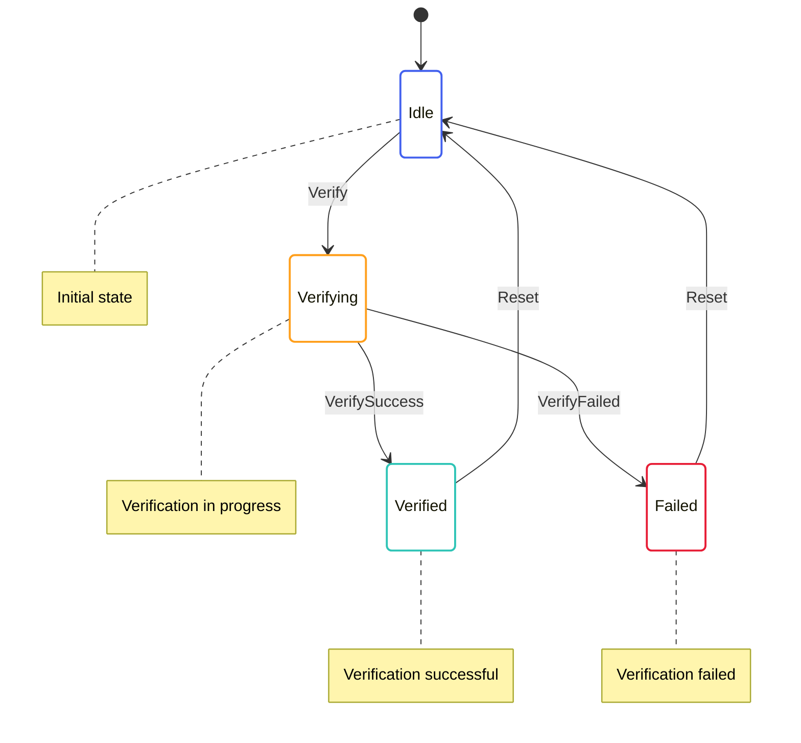

# Work Verification State Machine

The Work Verification State Machine is responsible for verifying SNARK work proofs. It handles the verification of SNARK proofs for work, which is essential for the Mina protocol's decentralized proof generation.

## State Diagram



## State Definition

The Work Verification State Machine state is defined in [snark/src/work_verify/work_verify_state.rs](../../../snark/src/work_verify/work_verify_state.rs):

```rust
#[derive(Serialize, Deserialize, Debug, Clone)]
pub struct WorkVerifyState {
    pub verifying: BTreeMap<WorkHash, WorkVerifyingState>,
    pub verified: BTreeMap<WorkHash, WorkVerifiedState>,
    pub failed: BTreeMap<WorkHash, WorkVerifyFailedState>,
}

#[derive(Serialize, Deserialize, Debug, Clone)]
pub struct WorkVerifyingState {
    pub time: redux::Timestamp,
    pub input: Box<WorkVerifyInput>,
}

#[derive(Serialize, Deserialize, Debug, Clone)]
pub struct WorkVerifiedState {
    pub time: redux::Timestamp,
}

#[derive(Serialize, Deserialize, Debug, Clone)]
pub struct WorkVerifyFailedState {
    pub time: redux::Timestamp,
    pub error: String,
}
```

This state includes:
- A map of work hashes to verifying states
- A map of work hashes to verified states
- A map of work hashes to failed states

## Actions

The Work Verification State Machine defines several actions for interacting with the state:

```rust
pub enum WorkVerifyAction {
    Verify {
        work_hash: WorkHash,
        input: Box<WorkVerifyInput>,
    },
    VerifySuccess {
        work_hash: WorkHash,
    },
    VerifyFailed {
        work_hash: WorkHash,
        error: String,
    },
    Reset {
        work_hash: WorkHash,
    },
}
```

These actions allow for:
- Initiating work verification
- Handling verification success
- Handling verification failure
- Resetting the verification state

The Work Verification State Machine also defines effectful actions for interacting with services:

```rust
pub enum WorkVerifyEffectfulAction {
    VerifyInit {
        work_hash: WorkHash,
        input: Box<WorkVerifyInput>,
    },
}
```

These actions allow for:
- Initializing work verification

## Enabling Conditions

The Work Verification State Machine defines enabling conditions for its actions:

```rust
impl EnablingCondition<State> for WorkVerifyAction {
    fn is_enabled(&self, state: &State, _time: Timestamp) -> bool {
        match self {
            WorkVerifyAction::Verify { work_hash, .. } => {
                // Check if we're already verifying this work
                !state.snark.work_verify.verifying.contains_key(work_hash)
                    && !state.snark.work_verify.verified.contains_key(work_hash)
                    && !state.snark.work_verify.failed.contains_key(work_hash)
            },
            WorkVerifyAction::VerifySuccess { work_hash } => {
                // Check if we're verifying this work
                state.snark.work_verify.verifying.contains_key(work_hash)
            },
            WorkVerifyAction::VerifyFailed { work_hash, .. } => {
                // Check if we're verifying this work
                state.snark.work_verify.verifying.contains_key(work_hash)
            },
            WorkVerifyAction::Reset { work_hash } => {
                // Check if we have this work in any state
                state.snark.work_verify.verifying.contains_key(work_hash)
                    || state.snark.work_verify.verified.contains_key(work_hash)
                    || state.snark.work_verify.failed.contains_key(work_hash)
            },
        }
    }
}
```

These enabling conditions ensure that actions are only processed when they make sense based on the current state.

## Reducer

The Work Verification State Machine reducer is defined in [snark/src/work_verify/work_verify_reducer.rs](../../../snark/src/work_verify/work_verify_reducer.rs):

```rust
impl WorkVerifyState {
    pub fn reducer<State, Action>(
        mut state_context: Substate<Action, State, Self>,
        action: ActionWithMeta<WorkVerifyAction>,
    ) where
        State: SubstateAccess<Self>,
        Action: From<WorkVerifyAction>
            + From<WorkVerifyEffectfulAction>
            + From<redux::AnyAction>
            + EnablingCondition<State>,
    {
        let Ok(state) = state_context.get_substate_mut() else {
            // TODO: log or propagate
            return;
        };
        let (action, meta) = action.split();

        match action {
            WorkVerifyAction::Verify { work_hash, input } => {
                // Add the work to the verifying map
                state.verifying.insert(
                    work_hash.clone(),
                    WorkVerifyingState {
                        time: meta.time(),
                        input: input.clone(),
                    },
                );

                // Dispatch effectful action to perform verification
                let dispatcher = state_context.dispatcher();
                dispatcher.dispatch(WorkVerifyEffectfulAction::VerifyInit {
                    work_hash: work_hash.clone(),
                    input: input.clone(),
                });
            },
            WorkVerifyAction::VerifySuccess { work_hash } => {
                // Remove the work from the verifying map
                if let Some(verifying) = state.verifying.remove(&work_hash) {
                    // Add the work to the verified map
                    state.verified.insert(
                        work_hash.clone(),
                        WorkVerifiedState {
                            time: meta.time(),
                        },
                    );
                }
            },
            WorkVerifyAction::VerifyFailed { work_hash, error } => {
                // Remove the work from the verifying map
                if let Some(verifying) = state.verifying.remove(&work_hash) {
                    // Add the work to the failed map
                    state.failed.insert(
                        work_hash.clone(),
                        WorkVerifyFailedState {
                            time: meta.time(),
                            error: error.clone(),
                        },
                    );
                }
            },
            WorkVerifyAction::Reset { work_hash } => {
                // Remove the work from all maps
                state.verifying.remove(&work_hash);
                state.verified.remove(&work_hash);
                state.failed.remove(&work_hash);
            },
        }
    }
}
```

This reducer handles the state transitions based on the actions received.

## Effects

The Work Verification State Machine effectful actions are handled by the effects function in [snark/src/work_verify_effectful/work_verify_effectful_effects.rs](../../../snark/src/work_verify_effectful/work_verify_effectful_effects.rs):

```rust
impl WorkVerifyEffectfulAction {
    pub fn effects<S>(&self, _: &ActionMeta, store: &mut Store<S>)
    where
        S: redux::Service + WorkVerifyService,
    {
        match self {
            WorkVerifyEffectfulAction::VerifyInit { work_hash, input } => {
                // Log the verification request
                log::info!("Verifying work {}", work_hash);

                // Call the service to verify the work
                store.service.verify(
                    work_hash.clone(),
                    input.clone(),
                    Box::new(move |result| {
                        match result {
                            Ok(()) => {
                                // Log the successful verification
                                log::info!("Work {} verified successfully", work_hash);

                                // Dispatch success action
                                store.dispatch(WorkVerifyAction::VerifySuccess {
                                    work_hash: work_hash.clone(),
                                });
                            },
                            Err(error) => {
                                // Log the verification failure
                                log::error!("Failed to verify work {}: {}", work_hash, error);

                                // Dispatch failure action
                                store.dispatch(WorkVerifyAction::VerifyFailed {
                                    work_hash: work_hash.clone(),
                                    error: error.to_string(),
                                });
                            },
                        }
                    }),
                );
            },
        }
    }
}
```

This effects function delegates to the service for handling the actual verification.

## Key Workflows

### Work Verification

1. The `Verify` action is dispatched with a work hash and verification input
2. The work is added to the verifying map
3. The `VerifyInit` effectful action is dispatched to perform the verification
4. The service performs the verification
5. When the verification is complete, either `VerifySuccess` or `VerifyFailed` is dispatched
6. The work is moved from the verifying map to either the verified or failed map

### Verification Reset

1. The `Reset` action is dispatched with a work hash
2. The work is removed from all maps
3. This allows the work to be verified again if needed

## Implementation Details

### Verification Process

The verification process involves several steps:

1. **Loading the Verifier Index**: Loading the verifier index for the work
2. **Deserializing the Proof**: Deserializing the SNARK proof from the work
3. **Verifying the Proof**: Verifying the proof against the verifier index
4. **Checking the Public Input**: Checking that the proof's public input matches the expected value

### Work Types

The Work Verification State Machine supports several types of work:

1. **Transaction SNARK**: Proves the validity of a transaction
2. **Blockchain SNARK**: Proves the validity of a blockchain state transition
3. **Merge SNARK**: Merges multiple SNARKs into a single SNARK

Each work type has its own verification logic.

### Parallel Verification

The Work Verification State Machine supports parallel verification, which allows multiple works to be verified simultaneously. This is important for performance, as verification can be computationally intensive.

## Interactions with Other Components

The Work Verification State Machine interacts with:

- **SNARK Pool**: For verifying SNARK work before adding it to the pool
- **Block Producer**: For verifying SNARK work during block production

These interactions are managed through actions and effects.

## Error Handling

The Work Verification State Machine handles errors by:

- Moving works to the failed map if verification fails
- Providing detailed error messages for failed verifications
- Logging errors for debugging purposes

This allows for proper monitoring and debugging of the verification process.
