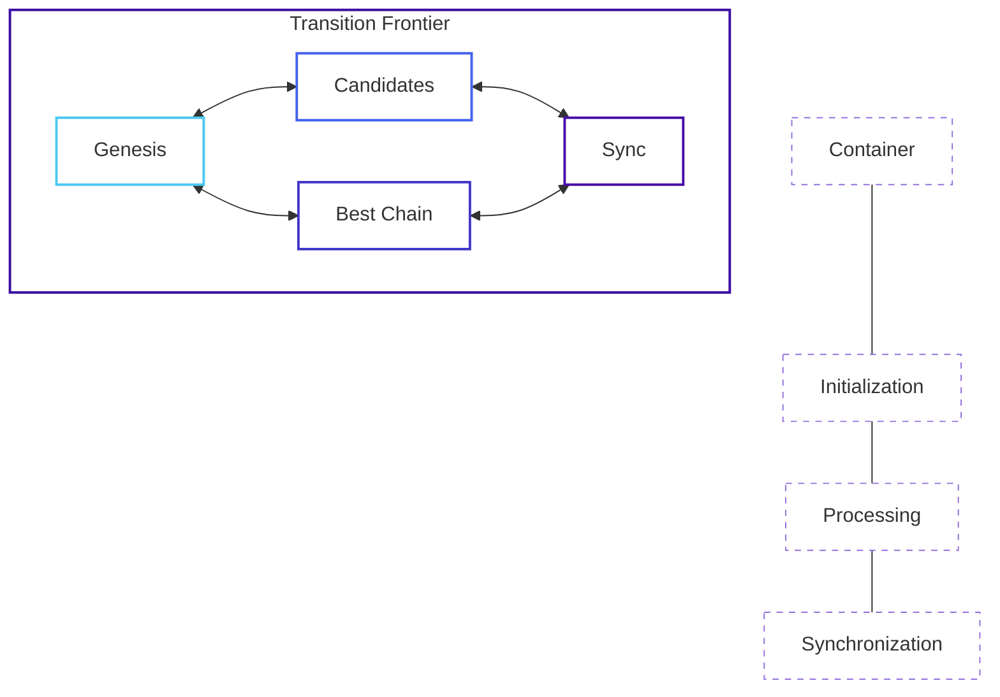

# Transition Frontier

The Transition Frontier is a core component of the OpenMina node that manages the blockchain state and transitions. It is responsible for maintaining the best chain of blocks, handling block candidates and verification, managing the genesis state, and synchronizing with other nodes.

## Component Overview

The Transition Frontier component consists of several subcomponents, each with its own state machine:

- **Genesis**: Initializes the blockchain state from the genesis configuration
- **Candidates**: Manages block candidates received from peers or produced locally
- **Best Chain**: Maintains the current best chain of blocks
- **Sync**: Synchronizes the node's state with other nodes

## Component Diagram



**Diagram Legend:**
- **Transition Frontier**: Main component managing blockchain state
- **Genesis**: Initializes blockchain state from genesis configuration
- **Candidates**: Manages block candidates received from peers or produced locally
- **Best Chain**: Maintains the current best chain of blocks
- **Sync**: Synchronizes the node's state with other nodes

## State Definition

The Transition Frontier state is defined in [node/src/transition_frontier/transition_frontier_state.rs](../../../node/src/transition_frontier/transition_frontier_state.rs):

```rust
#[derive(Serialize, Deserialize, Debug, Clone)]
pub struct TransitionFrontierState {
    pub config: TransitionFrontierConfig,
    /// Genesis block generation/proving state
    pub genesis: TransitionFrontierGenesisState,
    /// Current best known chain, from root of the transition frontier to best tip
    pub best_chain: Vec<AppliedBlock>,
    /// Needed protocol states for applying transactions in the root
    /// scan state that we don't have in the `best_chain` list.
    pub needed_protocol_states: BTreeMap<StateHash, MinaStateProtocolStateValueStableV2>,
    pub candidates: TransitionFrontierCandidatesState,
    /// Transition frontier synchronization state
    pub sync: TransitionFrontierSyncState,
    // ...
}
```

This state includes:
- Configuration for the transition frontier
- Genesis state for initializing the blockchain
- Best chain of blocks
- Protocol states needed for transaction application
- Candidate blocks
- Synchronization state

## Actions

The Transition Frontier component defines several actions for interacting with the state:

```rust
pub enum TransitionFrontierAction {
    Genesis(TransitionFrontierGenesisAction),
    GenesisEffect(TransitionFrontierGenesisEffectfulAction),
    GenesisInject,
    GenesisProvenInject,
    Candidate(TransitionFrontierCandidateAction),
    Sync(TransitionFrontierSyncAction),
    Synced {
        needed_protocol_states: BTreeSet<StateHash>,
    },
    SyncFailed {
        error: SyncError,
        needed_protocol_states: BTreeSet<StateHash>,
    },
}
```

These actions allow for:
- Managing the genesis state
- Handling genesis effects
- Injecting genesis blocks
- Managing block candidates
- Synchronizing the blockchain
- Handling synchronization success and failure

## Reducer

The Transition Frontier reducer is defined in [node/src/transition_frontier/transition_frontier_reducer.rs](../../../node/src/transition_frontier/transition_frontier_reducer.rs):

```rust
impl TransitionFrontierState {
    pub fn reducer(
        mut state_context: crate::Substate<Self>,
        action: TransitionFrontierActionWithMetaRef<'_>,
    ) {
        let Ok(state) = state_context.get_substate_mut() else {
            // TODO: log or propagate
            return;
        };
        let (action, meta) = action.split();

        // Drop the diff, it's been processed in the effect
        state.chain_diff.take();

        match action {
            TransitionFrontierAction::Genesis(a) => {
                super::genesis::TransitionFrontierGenesisState::reducer(
                    openmina_core::Substate::from_compatible_substate(state_context),
                    meta.with_action(a),
                )
            }
            // ...
        }
    }
}
```

The reducer delegates to subcomponent reducers for handling specific actions.

## Effects

The Transition Frontier effects are defined in [node/src/transition_frontier/transition_frontier_effects.rs](../../../node/src/transition_frontier/transition_frontier_effects.rs):

```rust
pub fn transition_frontier_effects<S>(
    store: &mut Store<S>,
    action: ActionWithMeta<TransitionFrontierAction>,
) where
    S: TransitionFrontierService,
{
    let (action, meta) = action.split();

    match action {
        TransitionFrontierAction::Genesis(a) => {
            // TODO(refactor): this should be handled by a callback and removed from here
            // whenever any of these is going to happen, genesisinject must happen first
            match &a {
                TransitionFrontierGenesisAction::Produce => {
                    store.dispatch(TransitionFrontierAction::GenesisInject);
                }
                TransitionFrontierGenesisAction::ProveSuccess { .. } => {
                    store.dispatch(TransitionFrontierAction::GenesisProvenInject);
                }
                _ => {}
            }
        }
        // ...
    }
}
```

The effects handle side effects and dispatch new actions as needed.

## State Machines

The Transition Frontier component includes several state machines:

- [Genesis State Machine](genesis-state-machine.md): Manages the initialization of the blockchain from the genesis configuration
- [Candidates State Machine](candidates-state-machine.md): Manages block candidates received from peers or produced locally
- [Sync State Machine](sync-state-machine.md): Manages the synchronization of the blockchain with other nodes

Each state machine has its own state, actions, reducers, and effects.

## Interactions with Other Components

The Transition Frontier interacts with several other components:

- **SNARK System**: For verifying block proofs
- **P2P Network**: For receiving and sending blocks and sync messages
- **Block Producer**: For receiving newly produced blocks
- **Transaction Pool**: For providing transactions to be included in blocks

These interactions are managed through actions and effects.

## Key Workflows

### Block Reception and Validation

1. A block is received from a peer via the P2P network
2. The P2P component dispatches an action to process the block
3. The Transition Frontier component validates the block
4. If validation requires SNARK verification, the Transition Frontier dispatches an action to the SNARK component
5. The SNARK component verifies the proof and dispatches an action with the result
6. The Transition Frontier updates the state based on the verification result
7. If the block is valid, it may be added to the best chain

### Blockchain Synchronization

1. The Transition Frontier component detects that it's behind the network
2. It initiates a sync process by dispatching a sync action
3. The sync process requests missing blocks from peers
4. As blocks are received, they are validated and added to the sync state
5. Once all blocks are received and validated, the sync process updates the best chain
6. The Transition Frontier component transitions to the synced state

## Implementation Details

### Best Chain Management

The best chain is maintained as a vector of applied blocks, with the first block being the root and the last block being the tip:

```rust
pub best_chain: Vec<AppliedBlock>,
```

The Transition Frontier provides methods for accessing the best chain:

```rust
pub fn best_tip(&self) -> Option<&ArcBlockWithHash> {
    self.best_chain.last().map(|b| &b.block)
}

pub fn root(&self) -> Option<&ArcBlockWithHash> {
    self.best_chain.first().map(|b| &b.block)
}
```

### Candidate Management

Candidates are blocks that have been received but not yet added to the best chain. They are managed by the `TransitionFrontierCandidatesState`:

```rust
pub candidates: TransitionFrontierCandidatesState,
```

### Sync Management

Synchronization is managed by the `TransitionFrontierSyncState`:

```rust
pub sync: TransitionFrontierSyncState,
```

This state tracks the progress of synchronization and manages the transition to the synced state.

## Next Steps

To learn more about specific aspects of the Transition Frontier component, see:

- [Genesis State Machine](genesis-state-machine.md)
- [Candidates State Machine](candidates-state-machine.md)
- [Sync State Machine](sync-state-machine.md)
