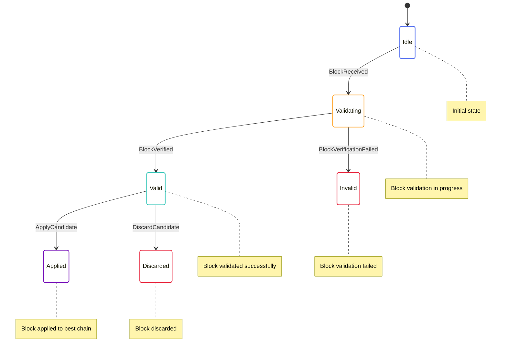

# Candidates State Machine

The Candidates State Machine is responsible for managing block candidates that are received from peers or produced locally. It handles validating block candidates, storing valid candidates, and selecting candidates for inclusion in the best chain.

## State Diagram



## State Definition

The Candidates State Machine state is defined in [node/src/transition_frontier/candidate/transition_frontier_candidates_state.rs](../../../node/src/transition_frontier/candidate/transition_frontier_candidates_state.rs):

```rust
#[derive(Serialize, Deserialize, Debug, Clone)]
pub struct TransitionFrontierCandidatesState {
    pub blocks: BTreeMap<StateHash, CandidateBlock>,
}

#[derive(Serialize, Deserialize, Debug, Clone)]
pub struct CandidateBlock {
    pub block: ArcBlockWithHash,
    pub status: CandidateBlockStatus,
    pub sender: Option<PeerId>,
}

#[derive(Serialize, Deserialize, Debug, Clone)]
pub enum CandidateBlockStatus {
    Validating,
    Valid,
    Invalid {
        reason: String,
    },
    Applied,
    Discarded {
        reason: String,
    },
}
```

This state includes:
- A map of block hashes to candidate blocks
- Each candidate block includes the block itself, its status, and the peer that sent it (if any)
- The status can be one of: Validating, Valid, Invalid, Applied, or Discarded

## Actions

The Candidates State Machine defines several actions for interacting with the state:

```rust
pub enum TransitionFrontierCandidateAction {
    BlockReceived {
        block: Arc<MinaBlockExternalTransitionStableV2>,
        sender: Option<PeerId>,
    },
    BlockVerified {
        block_hash: StateHash,
    },
    BlockVerificationFailed {
        block_hash: StateHash,
        error: String,
    },
    ApplyCandidate {
        block_hash: StateHash,
    },
    DiscardCandidate {
        block_hash: StateHash,
        reason: String,
    },
}
```

These actions allow for:
- Receiving a block from a peer or local production
- Handling block verification success and failure
- Applying a candidate to the best chain
- Discarding a candidate

## Enabling Conditions

The Candidates State Machine defines enabling conditions for its actions:

```rust
impl EnablingCondition<State> for TransitionFrontierCandidateAction {
    fn is_enabled(&self, state: &State, _time: Timestamp) -> bool {
        match self {
            TransitionFrontierCandidateAction::BlockReceived { block, .. } => {
                // Check if we already have this block
                let block_hash = block.hash();
                !state.transition_frontier.candidates.blocks.contains_key(&block_hash)
            },
            TransitionFrontierCandidateAction::BlockVerified { block_hash } => {
                // Check if we're validating this block
                if let Some(candidate) = state.transition_frontier.candidates.blocks.get(block_hash) {
                    matches!(candidate.status, CandidateBlockStatus::Validating)
                } else {
                    false
                }
            },
            TransitionFrontierCandidateAction::BlockVerificationFailed { block_hash, .. } => {
                // Check if we're validating this block
                if let Some(candidate) = state.transition_frontier.candidates.blocks.get(block_hash) {
                    matches!(candidate.status, CandidateBlockStatus::Validating)
                } else {
                    false
                }
            },
            TransitionFrontierCandidateAction::ApplyCandidate { block_hash } => {
                // Check if we have a valid candidate for this block
                if let Some(candidate) = state.transition_frontier.candidates.blocks.get(block_hash) {
                    matches!(candidate.status, CandidateBlockStatus::Valid)
                } else {
                    false
                }
            },
            TransitionFrontierCandidateAction::DiscardCandidate { block_hash, .. } => {
                // Check if we have a valid candidate for this block
                if let Some(candidate) = state.transition_frontier.candidates.blocks.get(block_hash) {
                    matches!(candidate.status, CandidateBlockStatus::Valid)
                } else {
                    false
                }
            },
        }
    }
}
```

These enabling conditions ensure that actions are only processed when they make sense based on the current state.

## Reducer

The Candidates State Machine reducer is defined in [node/src/transition_frontier/candidate/transition_frontier_candidates_reducer.rs](../../../node/src/transition_frontier/candidate/transition_frontier_candidates_reducer.rs):

```rust
impl TransitionFrontierCandidatesState {
    pub fn reducer<State, Action>(
        mut state_context: Substate<Action, State, Self>,
        action: ActionWithMeta<TransitionFrontierCandidateAction>,
    ) where
        State: SubstateAccess<Self>,
        Action: From<TransitionFrontierCandidateAction>
            + From<SnarkAction>
            + From<redux::AnyAction>
            + EnablingCondition<State>,
    {
        let Ok(state) = state_context.get_substate_mut() else {
            // TODO: log or propagate
            return;
        };
        let (action, meta) = action.split();

        match action {
            TransitionFrontierCandidateAction::BlockReceived { block, sender } => {
                // Validate the block syntax
                if !validate_block_syntax(&block) {
                    return;
                }
                
                // Add the block to candidates
                let block_hash = block.hash();
                let block_with_hash = ArcBlockWithHash::new(block.clone(), block_hash.clone());
                state.blocks.insert(
                    block_hash.clone(),
                    CandidateBlock {
                        block: block_with_hash,
                        status: CandidateBlockStatus::Validating,
                        sender: sender.clone(),
                    },
                );
                
                // Dispatch an action to verify the block's SNARK proof
                let dispatcher = state_context.dispatcher();
                dispatcher.dispatch(Action::Snark(SnarkAction::BlockVerify(BlockVerifyAction::Verify {
                    block_hash: block_hash.clone(),
                    input: Box::new(create_verify_input(&block)),
                })));
            },
            TransitionFrontierCandidateAction::BlockVerified { block_hash } => {
                // Update the block status to Valid
                if let Some(candidate) = state.blocks.get_mut(&block_hash) {
                    candidate.status = CandidateBlockStatus::Valid;
                }
            },
            TransitionFrontierCandidateAction::BlockVerificationFailed { block_hash, error } => {
                // Update the block status to Invalid
                if let Some(candidate) = state.blocks.get_mut(&block_hash) {
                    candidate.status = CandidateBlockStatus::Invalid {
                        reason: error.clone(),
                    };
                }
            },
            TransitionFrontierCandidateAction::ApplyCandidate { block_hash } => {
                // Update the block status to Applied
                if let Some(candidate) = state.blocks.get_mut(&block_hash) {
                    candidate.status = CandidateBlockStatus::Applied;
                }
            },
            TransitionFrontierCandidateAction::DiscardCandidate { block_hash, reason } => {
                // Update the block status to Discarded
                if let Some(candidate) = state.blocks.get_mut(&block_hash) {
                    candidate.status = CandidateBlockStatus::Discarded {
                        reason: reason.clone(),
                    };
                }
            },
        }
    }
}
```

This reducer handles the state transitions based on the actions received.

## Key Workflows

### Block Reception and Validation

1. A block is received from a peer via the P2P network or produced locally
2. The `BlockReceived` action is dispatched
3. The block is validated for syntax
4. If valid, the block is added to the candidates list with status `Validating`
5. An action is dispatched to the SNARK system to verify the block's proof
6. When the verification is complete, either `BlockVerified` or `BlockVerificationFailed` is dispatched
7. The block's status is updated accordingly

### Block Application

1. A valid block is selected for application to the best chain
2. The `ApplyCandidate` action is dispatched
3. The block's status is updated to `Applied`
4. The block is added to the best chain

### Block Discarding

1. A valid block is determined to be unnecessary (e.g., it's on a fork that's not the best chain)
2. The `DiscardCandidate` action is dispatched
3. The block's status is updated to `Discarded`

## Implementation Details

### Block Validation

Block validation involves several steps:

1. **Syntax Validation**: Checking that the block has the correct format and structure
2. **SNARK Proof Verification**: Verifying the block's SNARK proof using the SNARK system
3. **State Transition Validation**: Verifying that the block represents a valid state transition

### Candidate Selection

Candidates are selected for application to the best chain based on several factors:

1. **Validity**: Only valid candidates can be applied
2. **Height**: Higher blocks are preferred
3. **Difficulty**: Higher difficulty blocks are preferred
4. **Timestamp**: More recent blocks are preferred

### Candidate Pruning

Candidates are pruned from the candidates list when:

1. They are applied to the best chain
2. They are discarded
3. They are invalid
4. They are too old

## Interactions with Other Components

The Candidates State Machine interacts with:

- **SNARK System**: For verifying block proofs
- **P2P Network**: For receiving blocks from peers
- **Best Chain**: For applying candidates to the best chain

These interactions are managed through actions and effects.

## Error Handling

The Candidates State Machine handles errors by:

- Marking blocks as invalid if they fail verification
- Providing detailed error messages for invalid blocks
- Logging errors for debugging purposes

This allows for proper monitoring and debugging of the block validation process.
