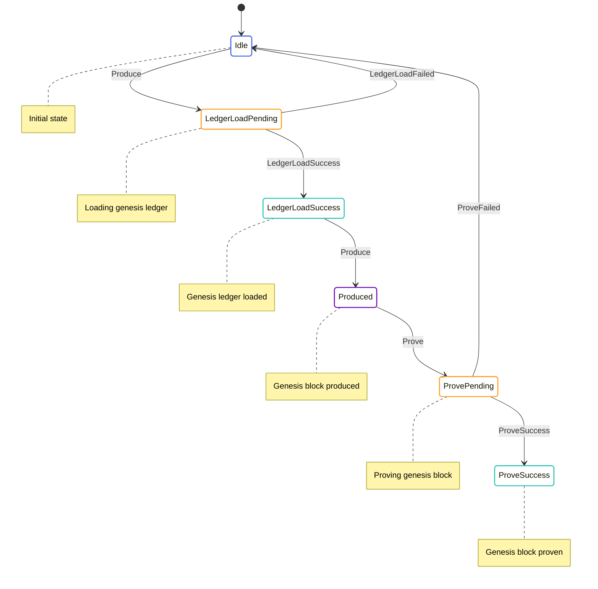

# Genesis State Machine

The Genesis State Machine is responsible for initializing the blockchain state from the genesis configuration. It handles loading the genesis ledger, producing the genesis block, and proving the genesis block.

## State Diagram



## State Definition

The Genesis State Machine state is defined in [node/src/transition_frontier/genesis/transition_frontier_genesis_state.rs](../../../node/src/transition_frontier/genesis/transition_frontier_genesis_state.rs):

```rust
#[derive(Serialize, Deserialize, Debug, Clone)]
pub enum TransitionFrontierGenesisState {
    Idle,
    LedgerLoadPending {
        time: redux::Timestamp,
    },
    LedgerLoadSuccess {
        time: redux::Timestamp,
        data: GenesisConfigLoaded,
    },
    Produced {
        time: redux::Timestamp,
        negative_one: v2::MinaStateProtocolStateValueStableV2,
        genesis: v2::MinaStateProtocolStateValueStableV2,
        genesis_hash: v2::StateHash,
        genesis_producer_stake_proof: v2::MinaBaseSparseLedgerBaseStableV2,
    },
    ProvePending {
        time: redux::Timestamp,
        negative_one: v2::MinaStateProtocolStateValueStableV2,
        genesis: v2::MinaStateProtocolStateValueStableV2,
        genesis_hash: v2::StateHash,
        genesis_producer_stake_proof: v2::MinaBaseSparseLedgerBaseStableV2,
    },
    ProveSuccess {
        time: redux::Timestamp,
        negative_one: v2::MinaStateProtocolStateValueStableV2,
        genesis: v2::MinaStateProtocolStateValueStableV2,
        genesis_hash: v2::StateHash,
        genesis_producer_stake_proof: v2::MinaBaseSparseLedgerBaseStableV2,
        genesis_with_proof: ArcBlockWithHash,
    },
}
```

This state includes:
- `Idle`: The initial state
- `LedgerLoadPending`: Loading the genesis ledger
- `LedgerLoadSuccess`: Genesis ledger loaded successfully
- `Produced`: Genesis block produced
- `ProvePending`: Proving the genesis block
- `ProveSuccess`: Genesis block proven successfully

## Actions

The Genesis State Machine defines several actions for interacting with the state:

```rust
pub enum TransitionFrontierGenesisAction {
    Produce,
    LedgerLoadSuccess {
        data: GenesisConfigLoaded,
    },
    LedgerLoadFailed {
        error: String,
    },
    Prove,
    ProveSuccess {
        genesis_with_proof: ArcBlockWithHash,
    },
    ProveFailed {
        error: String,
    },
}
```

These actions allow for:
- Producing the genesis block
- Handling ledger load success and failure
- Proving the genesis block
- Handling proof success and failure

The Genesis State Machine also defines effectful actions for interacting with services:

```rust
pub enum TransitionFrontierGenesisEffectfulAction {
    LedgerLoadInit {
        config: Arc<GenesisConfig>,
    },
    ProveInit {
        block_hash: StateHash,
        input: Box<ProverExtendBlockchainInputStableV2>,
    },
}
```

These actions allow for:
- Initializing ledger loading
- Initializing block proving

## Enabling Conditions

The Genesis State Machine defines enabling conditions for its actions:

```rust
impl EnablingCondition<State> for TransitionFrontierGenesisAction {
    fn is_enabled(&self, state: &State, _time: Timestamp) -> bool {
        match self {
            TransitionFrontierGenesisAction::Produce => {
                matches!(state.transition_frontier.genesis, TransitionFrontierGenesisState::Idle)
                    || matches!(
                        state.transition_frontier.genesis,
                        TransitionFrontierGenesisState::LedgerLoadSuccess { .. }
                    )
            },
            TransitionFrontierGenesisAction::LedgerLoadSuccess { .. } => {
                matches!(
                    state.transition_frontier.genesis,
                    TransitionFrontierGenesisState::LedgerLoadPending { .. }
                )
            },
            TransitionFrontierGenesisAction::LedgerLoadFailed { .. } => {
                matches!(
                    state.transition_frontier.genesis,
                    TransitionFrontierGenesisState::LedgerLoadPending { .. }
                )
            },
            TransitionFrontierGenesisAction::Prove => {
                matches!(
                    state.transition_frontier.genesis,
                    TransitionFrontierGenesisState::Produced { .. }
                )
            },
            TransitionFrontierGenesisAction::ProveSuccess { .. } => {
                matches!(
                    state.transition_frontier.genesis,
                    TransitionFrontierGenesisState::ProvePending { .. }
                )
            },
            TransitionFrontierGenesisAction::ProveFailed { .. } => {
                matches!(
                    state.transition_frontier.genesis,
                    TransitionFrontierGenesisState::ProvePending { .. }
                )
            },
        }
    }
}
```

These enabling conditions ensure that actions are only processed when they make sense based on the current state.

## Reducer

The Genesis State Machine reducer is defined in [node/src/transition_frontier/genesis/transition_frontier_genesis_reducer.rs](../../../node/src/transition_frontier/genesis/transition_frontier_genesis_reducer.rs):

```rust
impl TransitionFrontierGenesisState {
    pub fn reducer<State, Action>(
        mut state_context: Substate<Action, State, Self>,
        action: ActionWithMeta<TransitionFrontierGenesisAction>,
    ) where
        State: SubstateAccess<Self>,
        Action: From<TransitionFrontierGenesisAction>
            + From<TransitionFrontierGenesisEffectfulAction>
            + From<redux::AnyAction>
            + EnablingCondition<State>,
    {
        let Ok(state) = state_context.get_substate_mut() else {
            // TODO: log or propagate
            return;
        };
        let (action, meta) = action.split();

        match action {
            TransitionFrontierGenesisAction::Produce => match state {
                TransitionFrontierGenesisState::Idle => {
                    *state = TransitionFrontierGenesisState::LedgerLoadPending {
                        time: meta.time(),
                    };

                    let dispatcher = state_context.dispatcher();
                    dispatcher.dispatch(TransitionFrontierGenesisEffectfulAction::LedgerLoadInit {
                        config: Arc::new(GenesisConfig::default()),
                    });
                }
                TransitionFrontierGenesisState::LedgerLoadSuccess { time, data } => {
                    let time = *time;
                    let data = data.clone();

                    // Produce genesis block
                    let (negative_one, genesis, genesis_hash, genesis_producer_stake_proof) =
                        produce_genesis_block(&data);

                    *state = TransitionFrontierGenesisState::Produced {
                        time: meta.time(),
                        negative_one,
                        genesis,
                        genesis_hash,
                        genesis_producer_stake_proof,
                    };
                }
                _ => {}
            },
            TransitionFrontierGenesisAction::LedgerLoadSuccess { data } => {
                *state = TransitionFrontierGenesisState::LedgerLoadSuccess {
                    time: meta.time(),
                    data,
                };
            }
            TransitionFrontierGenesisAction::LedgerLoadFailed { .. } => {
                *state = TransitionFrontierGenesisState::Idle;
            }
            TransitionFrontierGenesisAction::Prove => {
                if let TransitionFrontierGenesisState::Produced {
                    time,
                    negative_one,
                    genesis,
                    genesis_hash,
                    genesis_producer_stake_proof,
                } = state
                {
                    let time = *time;
                    let negative_one = negative_one.clone();
                    let genesis = genesis.clone();
                    let genesis_hash = genesis_hash.clone();
                    let genesis_producer_stake_proof = genesis_producer_stake_proof.clone();

                    *state = TransitionFrontierGenesisState::ProvePending {
                        time: meta.time(),
                        negative_one,
                        genesis,
                        genesis_hash: genesis_hash.clone(),
                        genesis_producer_stake_proof,
                    };

                    // Create proof input
                    let input = create_proof_input(&genesis_hash);

                    let dispatcher = state_context.dispatcher();
                    dispatcher.dispatch(TransitionFrontierGenesisEffectfulAction::ProveInit {
                        block_hash: genesis_hash,
                        input: Box::new(input),
                    });
                }
            }
            TransitionFrontierGenesisAction::ProveSuccess { genesis_with_proof } => {
                if let TransitionFrontierGenesisState::ProvePending {
                    time,
                    negative_one,
                    genesis,
                    genesis_hash,
                    genesis_producer_stake_proof,
                } = state
                {
                    let time = *time;
                    let negative_one = negative_one.clone();
                    let genesis = genesis.clone();
                    let genesis_hash = genesis_hash.clone();
                    let genesis_producer_stake_proof = genesis_producer_stake_proof.clone();

                    *state = TransitionFrontierGenesisState::ProveSuccess {
                        time: meta.time(),
                        negative_one,
                        genesis,
                        genesis_hash,
                        genesis_producer_stake_proof,
                        genesis_with_proof,
                    };
                }
            }
            TransitionFrontierGenesisAction::ProveFailed { .. } => {
                *state = TransitionFrontierGenesisState::Idle;
            }
        }
    }
}
```

This reducer handles the state transitions based on the actions received.

## Effects

The Genesis State Machine effectful actions are handled by the effects function in [node/src/transition_frontier/genesis_effectful/transition_frontier_genesis_effectful_effects.rs](../../../node/src/transition_frontier/genesis_effectful/transition_frontier_genesis_effectful_effects.rs):

```rust
impl TransitionFrontierGenesisEffectfulAction {
    pub fn effects<S>(&self, _: &ActionMeta, store: &mut Store<S>)
    where
        S: redux::Service + TransitionFrontierGenesisService,
    {
        match self {
            TransitionFrontierGenesisEffectfulAction::LedgerLoadInit { config } => {
                store.service.load_genesis(config.clone());
            }
            TransitionFrontierGenesisEffectfulAction::ProveInit { block_hash, input } => {
                store.service.prove(block_hash.clone(), input.clone());
            }
        }
    }
}
```

This effects function delegates to the service for handling the actual IO operations.

## Key Workflows

### Genesis Block Production

1. The `Produce` action is dispatched when the state is `Idle`
2. The state transitions to `LedgerLoadPending`
3. The `LedgerLoadInit` effectful action is dispatched to load the genesis ledger
4. When the ledger is loaded, the `LedgerLoadSuccess` action is dispatched
5. The state transitions to `LedgerLoadSuccess`
6. The `Produce` action is dispatched again
7. The state transitions to `Produced` with the genesis block

### Genesis Block Proving

1. The `Prove` action is dispatched when the state is `Produced`
2. The state transitions to `ProvePending`
3. The `ProveInit` effectful action is dispatched to prove the genesis block
4. When the proof is generated, the `ProveSuccess` action is dispatched
5. The state transitions to `ProveSuccess` with the proven genesis block

## Implementation Details

### Genesis Block Production

The genesis block is produced by the `produce_genesis_block` function, which:

1. Creates the negative one block (the block before genesis)
2. Creates the genesis block
3. Computes the genesis block hash
4. Creates the genesis producer stake proof

### Genesis Block Proving

The genesis block is proven by the `create_proof_input` function, which:

1. Creates the input for the prover
2. The prover generates a proof for the genesis block
3. The proof is attached to the genesis block

## Interactions with Other Components

The Genesis State Machine interacts with:

- **Transition Frontier**: The genesis block is injected into the transition frontier
- **SNARK System**: The genesis block proof is verified by the SNARK system

These interactions are managed through actions and effects.

## Error Handling

The Genesis State Machine handles errors by:

- Transitioning to the `Idle` state on ledger load failure
- Transitioning to the `Idle` state on proof failure

This allows the process to be retried if needed.
