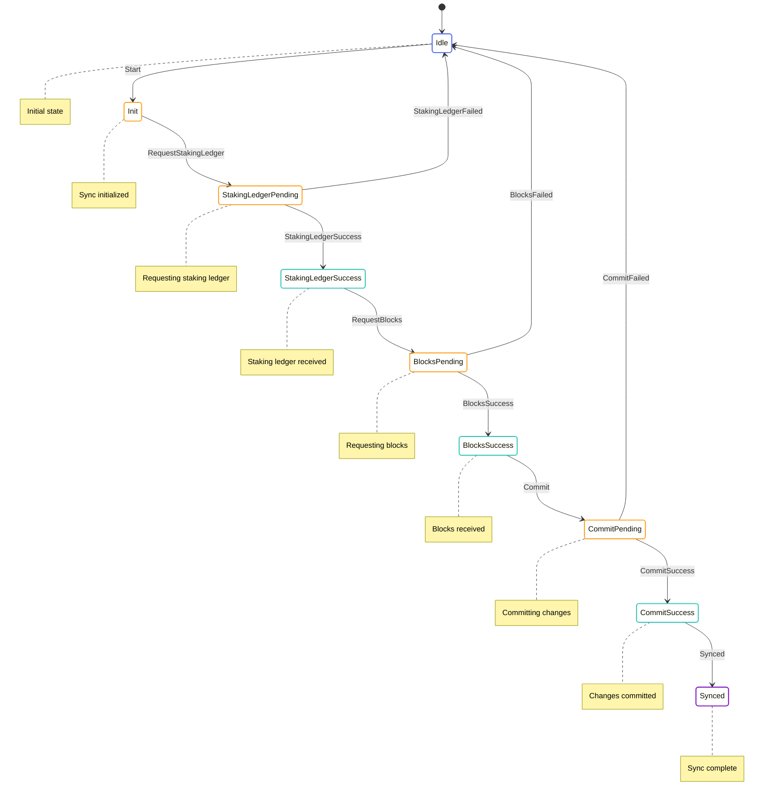

# Sync State Machine

The Sync State Machine is responsible for synchronizing the node's blockchain state with other nodes in the network. It handles requesting missing blocks, validating received blocks, and updating the best chain.

## State Diagram



## State Definition

The Sync State Machine state is defined in [node/src/transition_frontier/sync/transition_frontier_sync_state.rs](../../../node/src/transition_frontier/sync/transition_frontier_sync_state.rs):

```rust
#[derive(Serialize, Deserialize, Display, Debug, Clone)]
pub enum TransitionFrontierSyncState {
    Idle,
    Init {
        time: Timestamp,
        best_tip: ArcBlockWithHash,
        root_block: ArcBlockWithHash,
        blocks_inbetween: Vec<StateHash>,
    },
    StakingLedgerPending(TransitionFrontierSyncLedgerPending),
    StakingLedgerSuccess {
        time: Timestamp,
        best_tip: ArcBlockWithHash,
        root_block: ArcBlockWithHash,
        blocks_inbetween: Vec<StateHash>,
        needed_protocol_states: BTreeMap<StateHash, MinaStateProtocolStateValueStableV2>,
    },
    BlocksPending {
        time: Timestamp,
        best_tip: ArcBlockWithHash,
        root_block: ArcBlockWithHash,
        blocks_inbetween: Vec<StateHash>,
        needed_protocol_states: BTreeMap<StateHash, MinaStateProtocolStateValueStableV2>,
        pending_blocks: BTreeSet<StateHash>,
    },
    BlocksSuccess {
        time: Timestamp,
        chain: Vec<AppliedBlock>,
        root_snarked_ledger_updates: TransitionFrontierRootSnarkedLedgerUpdates,
        needed_protocol_states: BTreeMap<StateHash, MinaStateProtocolStateValueStableV2>,
    },
    CommitPending {
        time: Timestamp,
        chain: Vec<AppliedBlock>,
        root_snarked_ledger_updates: TransitionFrontierRootSnarkedLedgerUpdates,
        needed_protocol_states: BTreeMap<StateHash, MinaStateProtocolStateValueStableV2>,
    },
    CommitSuccess {
        time: Timestamp,
        chain: Vec<AppliedBlock>,
        root_snarked_ledger_updates: TransitionFrontierRootSnarkedLedgerUpdates,
        needed_protocol_states: BTreeMap<StateHash, MinaStateProtocolStateValueStableV2>,
    },
    Synced {
        time: Timestamp,
    },
}
```

This state includes:
- `Idle`: The initial state
- `Init`: Sync initialized with best tip and root block
- `StakingLedgerPending`: Requesting staking ledger
- `StakingLedgerSuccess`: Staking ledger received
- `BlocksPending`: Requesting blocks
- `BlocksSuccess`: Blocks received
- `CommitPending`: Committing changes
- `CommitSuccess`: Changes committed
- `Synced`: Sync complete

## Actions

The Sync State Machine defines several actions for interacting with the state:

```rust
pub enum TransitionFrontierSyncAction {
    Start {
        target: StateHash,
    },
    RequestStakingLedger,
    StakingLedgerSuccess {
        needed_protocol_states: BTreeMap<StateHash, MinaStateProtocolStateValueStableV2>,
    },
    StakingLedgerFailed {
        error: String,
    },
    RequestBlocks,
    BlockReceived {
        block: ArcBlockWithHash,
    },
    BlocksFailed {
        error: String,
    },
    Commit,
    CommitSuccess,
    CommitFailed {
        error: String,
    },
}
```

These actions allow for:
- Starting the sync process
- Requesting the staking ledger
- Handling staking ledger success and failure
- Requesting blocks
- Handling block reception
- Handling block request failure
- Committing changes
- Handling commit success and failure

## Enabling Conditions

The Sync State Machine defines enabling conditions for its actions:

```rust
impl EnablingCondition<State> for TransitionFrontierSyncAction {
    fn is_enabled(&self, state: &State, _time: Timestamp) -> bool {
        match self {
            TransitionFrontierSyncAction::Start { target } => {
                matches!(state.transition_frontier.sync, TransitionFrontierSyncState::Idle)
                    && state
                        .transition_frontier
                        .best_chain
                        .iter()
                        .all(|b| b.hash() != target)
            },
            TransitionFrontierSyncAction::RequestStakingLedger => {
                matches!(state.transition_frontier.sync, TransitionFrontierSyncState::Init { .. })
            },
            TransitionFrontierSyncAction::StakingLedgerSuccess { .. } => {
                matches!(
                    state.transition_frontier.sync,
                    TransitionFrontierSyncState::StakingLedgerPending(..)
                )
            },
            TransitionFrontierSyncAction::StakingLedgerFailed { .. } => {
                matches!(
                    state.transition_frontier.sync,
                    TransitionFrontierSyncState::StakingLedgerPending(..)
                )
            },
            TransitionFrontierSyncAction::RequestBlocks => {
                matches!(
                    state.transition_frontier.sync,
                    TransitionFrontierSyncState::StakingLedgerSuccess { .. }
                )
            },
            TransitionFrontierSyncAction::BlockReceived { block } => {
                if let TransitionFrontierSyncState::BlocksPending {
                    pending_blocks, ..
                } = &state.transition_frontier.sync
                {
                    pending_blocks.contains(block.hash())
                } else {
                    false
                }
            },
            TransitionFrontierSyncAction::BlocksFailed { .. } => {
                matches!(
                    state.transition_frontier.sync,
                    TransitionFrontierSyncState::BlocksPending { .. }
                )
            },
            TransitionFrontierSyncAction::Commit => {
                matches!(
                    state.transition_frontier.sync,
                    TransitionFrontierSyncState::BlocksSuccess { .. }
                )
            },
            TransitionFrontierSyncAction::CommitSuccess => {
                matches!(
                    state.transition_frontier.sync,
                    TransitionFrontierSyncState::CommitPending { .. }
                )
            },
            TransitionFrontierSyncAction::CommitFailed { .. } => {
                matches!(
                    state.transition_frontier.sync,
                    TransitionFrontierSyncState::CommitPending { .. }
                )
            },
        }
    }
}
```

These enabling conditions ensure that actions are only processed when they make sense based on the current state.

## Reducer

The Sync State Machine reducer is defined in [node/src/transition_frontier/sync/transition_frontier_sync_reducer.rs](../../../node/src/transition_frontier/sync/transition_frontier_sync_reducer.rs):

```rust
impl TransitionFrontierSyncState {
    pub fn reducer<State, Action>(
        mut state_context: Substate<Action, State, Self>,
        action: ActionWithMeta<TransitionFrontierSyncAction>,
        best_chain: &[AppliedBlock],
    ) -> Result<(), String>
    where
        State: SubstateAccess<Self> + SubstateAccess<TransitionFrontierState>,
        Action: From<TransitionFrontierSyncAction>
            + From<TransitionFrontierAction>
            + From<redux::AnyAction>
            + EnablingCondition<State>,
    {
        let Ok(state) = state_context.get_substate_mut() else {
            return Err("Failed to get substate".to_string());
        };
        let (action, meta) = action.split();

        match action {
            TransitionFrontierSyncAction::Start { target } => {
                // Find the target block in the candidates
                let tf_state = state_context.get_global_state().transition_frontier();
                let target_block = tf_state
                    .candidates
                    .blocks
                    .values()
                    .find(|b| b.hash() == &target)
                    .map(|b| b.block.clone());

                if let Some(target_block) = target_block {
                    // Initialize sync state
                    *state = TransitionFrontierSyncState::Init {
                        time: meta.time(),
                        best_tip: target_block,
                        root_block: best_chain.first().unwrap().block.clone(),
                        blocks_inbetween: Vec::new(),
                    };

                    // Dispatch action to request staking ledger
                    let dispatcher = state_context.dispatcher();
                    dispatcher.dispatch(TransitionFrontierSyncAction::RequestStakingLedger);
                }
            }
            TransitionFrontierSyncAction::RequestStakingLedger => {
                if let TransitionFrontierSyncState::Init {
                    time,
                    best_tip,
                    root_block,
                    blocks_inbetween,
                } = state
                {
                    let time = *time;
                    let best_tip = best_tip.clone();
                    let root_block = root_block.clone();
                    let blocks_inbetween = blocks_inbetween.clone();

                    // Transition to staking ledger pending state
                    *state = TransitionFrontierSyncState::StakingLedgerPending(
                        TransitionFrontierSyncLedgerPending {
                            time: meta.time(),
                            best_tip,
                            root_block,
                            blocks_inbetween,
                        },
                    );

                    // Request staking ledger from service
                    // This would be handled by an effectful action
                }
            }
            // ... other action handlers
        }

        Ok(())
    }
}
```

This reducer handles the state transitions based on the actions received.

## Key Workflows

### Sync Initialization

1. The `Start` action is dispatched with a target block hash
2. The state transitions to `Init` with the target block and current root block
3. The `RequestStakingLedger` action is dispatched
4. The state transitions to `StakingLedgerPending`
5. When the staking ledger is received, the `StakingLedgerSuccess` action is dispatched
6. The state transitions to `StakingLedgerSuccess`

### Block Synchronization

1. The `RequestBlocks` action is dispatched
2. The state transitions to `BlocksPending` with a list of pending blocks
3. As blocks are received, the `BlockReceived` action is dispatched for each block
4. When all blocks are received, the state transitions to `BlocksSuccess`

### Commit and Finalization

1. The `Commit` action is dispatched
2. The state transitions to `CommitPending`
3. When the commit is complete, the `CommitSuccess` action is dispatched
4. The state transitions to `CommitSuccess`
5. The `Synced` action is dispatched by the Transition Frontier component
6. The state transitions to `Synced`

## Implementation Details

### Block Request Management

The Sync State Machine manages block requests by:

1. Maintaining a set of pending block hashes
2. Removing hashes from the set as blocks are received
3. Transitioning to `BlocksSuccess` when all blocks are received

### Chain Validation

Before committing the new chain, the Sync State Machine validates it by:

1. Checking that the chain forms a valid blockchain
2. Verifying that the chain connects to the current best chain
3. Ensuring that all necessary protocol states are available

### Commit Process

The commit process involves:

1. Updating the best chain with the new blocks
2. Updating the needed protocol states
3. Notifying other components of the chain update

## Interactions with Other Components

The Sync State Machine interacts with:

- **P2P Network**: For requesting blocks from peers
- **SNARK System**: For verifying block proofs
- **Ledger**: For updating the ledger state

These interactions are managed through actions and effects.

## Error Handling

The Sync State Machine handles errors by:

- Transitioning to the `Idle` state on staking ledger failure
- Transitioning to the `Idle` state on block request failure
- Transitioning to the `Idle` state on commit failure

This allows the sync process to be retried if needed.
