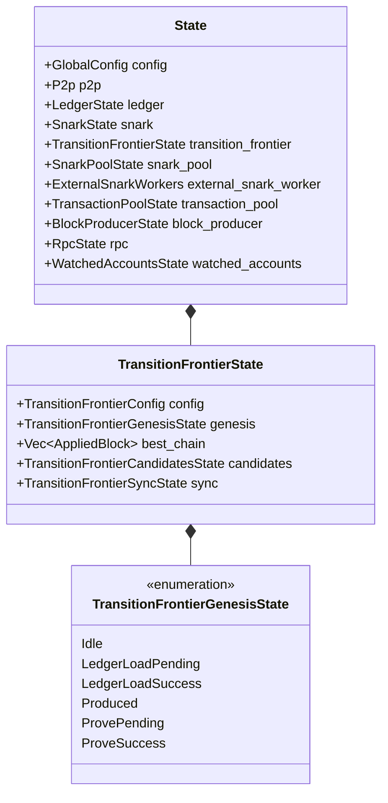
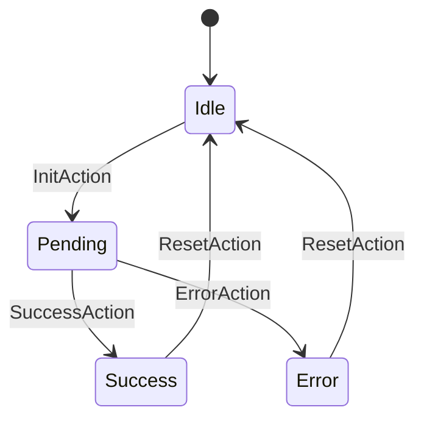
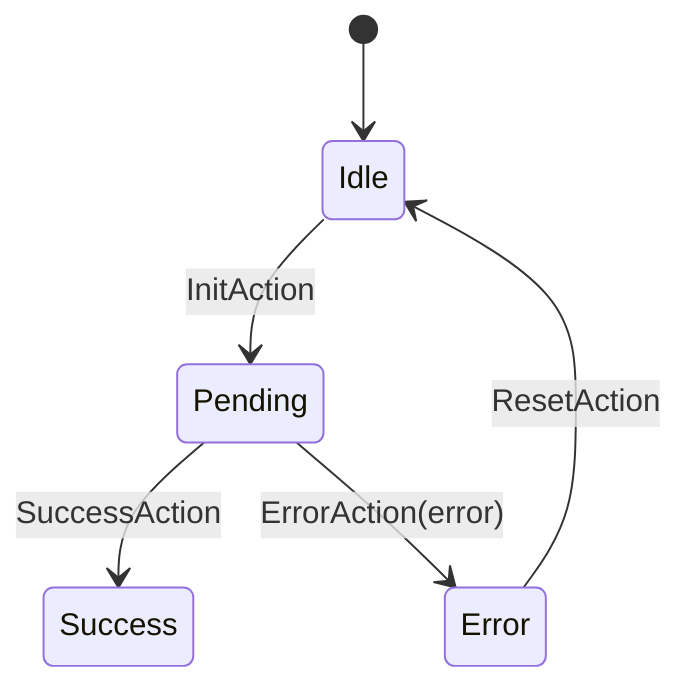
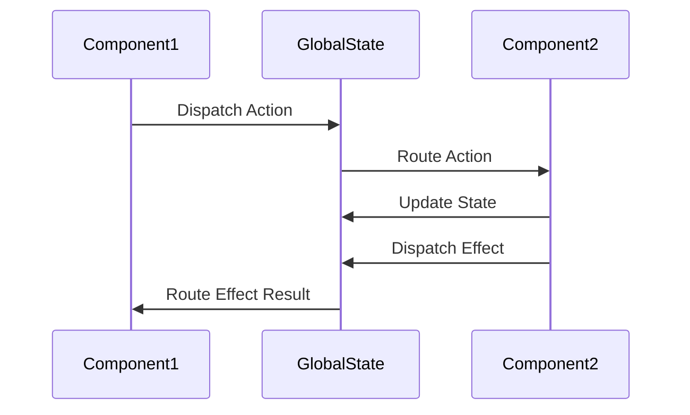

# Common Patterns

This document describes common patterns used in the OpenMina codebase, focusing on recurring patterns in state machine implementation, composition, and interaction.

## State Machine Patterns

OpenMina uses several common patterns for implementing state machines:

### State Machine Composition

State machines in OpenMina are composed hierarchically, with the global state machine containing component state machines, which may contain subcomponent state machines.



For more details, see [State Machine Composition](state-machine-composition.md).

### Async Operation Pattern

OpenMina uses a common pattern for handling asynchronous operations:



This pattern is used for operations like:
- Loading data from disk
- Network requests
- Computationally intensive operations

For more details, see [Async Operations](async-operations.md).

### Error Handling Pattern

OpenMina uses a common pattern for handling errors:



Errors are typically handled by:
- Transitioning to an error state
- Including error information in the state
- Providing a way to reset and retry

For more details, see [Error Handling](error-handling.md).

## Implementation Patterns

### Enum-Based State Pattern

OpenMina uses enums to represent state machines with distinct states:

```rust
pub enum TransitionFrontierGenesisState {
    Idle,
    LedgerLoadPending {
        time: redux::Timestamp,
    },
    LedgerLoadSuccess {
        time: redux::Timestamp,
        data: GenesisConfigLoaded,
    },
    // ...
}
```

This pattern allows for:
- Clear representation of state transitions
- Type safety for state-specific data
- Pattern matching in reducers

### Struct-Based State Pattern

OpenMina uses structs to represent state machines with complex state:

```rust
pub struct TransitionFrontierState {
    pub config: TransitionFrontierConfig,
    pub genesis: TransitionFrontierGenesisState,
    pub best_chain: Vec<AppliedBlock>,
    pub candidates: TransitionFrontierCandidatesState,
    pub sync: TransitionFrontierSyncState,
    // ...
}
```

This pattern allows for:
- Composition of multiple state machines
- Sharing of data between state machines
- More complex state relationships

### Action Hierarchy Pattern

OpenMina uses a hierarchy of actions to organize and route actions to the appropriate component:

```rust
pub enum Action {
    CheckTimeouts(CheckTimeoutsAction),
    P2p(P2pAction),
    Ledger(LedgerAction),
    Snark(SnarkAction),
    TransitionFrontier(TransitionFrontierAction),
    // ...
}

pub enum TransitionFrontierAction {
    Genesis(TransitionFrontierGenesisAction),
    GenesisEffect(TransitionFrontierGenesisEffectfulAction),
    Candidate(TransitionFrontierCandidateAction),
    Sync(TransitionFrontierSyncAction),
    // ...
}
```

This pattern allows for:
- Clear organization of actions
- Routing of actions to the appropriate component
- Composition of state machines

### Enabling Condition Pattern

OpenMina uses enabling conditions to determine if an action can be processed:

```rust
impl EnablingCondition<State> for TransitionFrontierGenesisAction {
    fn is_enabled(&self, state: &State, _time: Timestamp) -> bool {
        match self {
            TransitionFrontierGenesisAction::Produce => {
                matches!(state.transition_frontier.genesis, TransitionFrontierGenesisState::Idle)
            },
            // ...
        }
    }
}
```

This pattern allows for:
- Prevention of impossible or duplicate states
- Clear specification of when actions can be processed
- Separation of concerns between action handling and state validation

### Effectful Action Pattern

OpenMina uses effectful actions to handle side effects:

```rust
pub enum TransitionFrontierGenesisEffectfulAction {
    LedgerLoadInit {
        config: Arc<GenesisConfig>,
    },
    ProveInit {
        block_hash: StateHash,
        input: Box<ProverExtendBlockchainInputStableV2>,
    },
}
```

This pattern allows for:
- Separation of state updates and side effects
- Clear specification of side effects
- Testing of side effects in isolation

## Testing Patterns

### State Machine Testing Pattern

OpenMina uses a pattern for testing state machines:

```rust
#[test]
fn test_transition_frontier_genesis_produce() {
    // Arrange
    let mut state = TransitionFrontierGenesisState::Idle;
    let action = TransitionFrontierGenesisAction::Produce;
    
    // Act
    let mut dispatcher = MockDispatcher::new();
    let mut state_context = Substate::new(&mut state, &mut dispatcher);
    TransitionFrontierGenesisState::reducer(state_context, ActionWithMeta::new(action));
    
    // Assert
    assert!(matches!(state, TransitionFrontierGenesisState::LedgerLoadPending { .. }));
    assert!(dispatcher.dispatched_action::<TransitionFrontierGenesisEffectfulAction>(
        |a| matches!(a, TransitionFrontierGenesisEffectfulAction::LedgerLoadInit { .. })
    ));
}
```

This pattern allows for:
- Testing of state transitions
- Testing of action dispatching
- Isolation of state machine logic

For more details, see [Testing State Machines](testing-state-machines.md).

## Cross-Component Patterns

### Component Interaction Pattern

OpenMina uses a pattern for component interaction:



This pattern allows for:
- Loose coupling between components
- Clear specification of component interactions
- Testing of component interactions in isolation

### Service Abstraction Pattern

OpenMina uses a service abstraction pattern for IO and computationally heavy tasks:

```rust
pub trait TransitionFrontierGenesisService: redux::Service {
    fn load_genesis(&mut self, config: Arc<GenesisConfig>);
    fn prove(&mut self, block_hash: StateHash, input: Box<ProverExtendBlockchainInputStableV2>);
}
```

This pattern allows for:
- Separation of core logic and IO
- Testing of core logic in isolation
- Platform independence

## Next Steps

To learn more about specific patterns in OpenMina, see:

- [State Machine Composition](state-machine-composition.md)
- [Async Operations](async-operations.md)
- [Error Handling](error-handling.md)
- [Testing State Machines](testing-state-machines.md)
