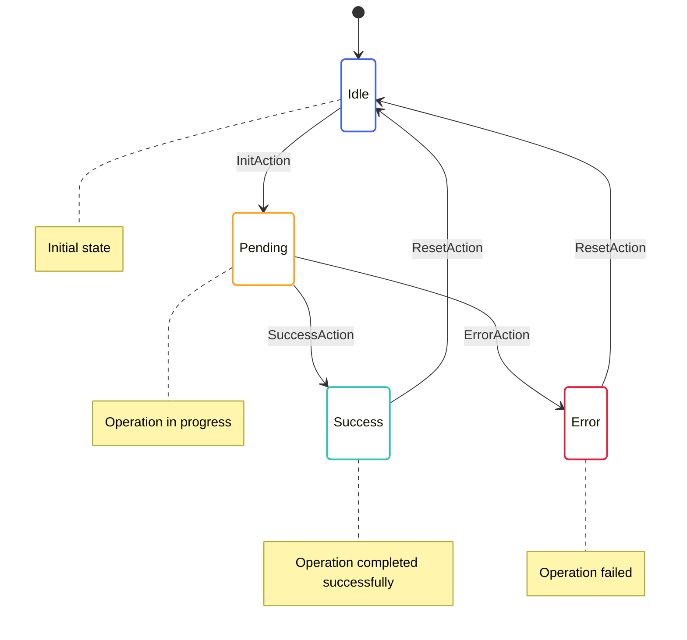

# Async Operations

This document explains how asynchronous operations are handled in OpenMina's state machines.

## Async Operation Pattern

OpenMina uses a common pattern for handling asynchronous operations:



This pattern is used for operations like:

-   Loading data from disk
-   Network requests
-   Computationally intensive operations

## State Definition

The async operation pattern typically uses an enum to represent the different states of the operation:

```rust
pub enum AsyncOperationState {
    Idle,
    Pending {
        time: Timestamp,
        // Additional data specific to the operation
    },
    Success {
        time: Timestamp,
        result: OperationResult,
        // Additional data specific to the operation
    },
    Error {
        time: Timestamp,
        error: String,
        // Additional data specific to the operation
    },
}
```

## Actions

The async operation pattern typically uses the following actions:

```rust
pub enum AsyncOperationAction {
    Init {
        // Parameters for the operation
    },
    Success {
        result: OperationResult,
    },
    Error {
        error: String,
    },
    Reset,
}
```

## Effectful Actions

The async operation pattern typically uses effectful actions to handle the actual asynchronous operation:

```rust
pub enum AsyncOperationEffectfulAction {
    InitOperation {
        // Parameters for the operation
    },
}
```

## Reducer

The reducer for the async operation pattern typically looks like this:

```rust
impl AsyncOperationState {
    pub fn reducer(
        mut state_context: Substate<Self>,
        action: ActionWithMeta<AsyncOperationAction>,
    ) {
        let Ok(state) = state_context.get_substate_mut() else {
            return;
        };
        let (action, meta) = action.split();

        match action {
            AsyncOperationAction::Init { .. } => {
                // Transition to pending state
                *state = AsyncOperationState::Pending {
                    time: meta.time(),
                    // Additional data specific to the operation
                };

                // Dispatch effectful action to perform the operation
                let dispatcher = state_context.dispatcher();
                dispatcher.dispatch(AsyncOperationEffectfulAction::InitOperation {
                    // Parameters for the operation
                });
            },
            AsyncOperationAction::Success { result } => {
                // Transition to success state
                *state = AsyncOperationState::Success {
                    time: meta.time(),
                    result,
                    // Additional data specific to the operation
                };
            },
            AsyncOperationAction::Error { error } => {
                // Transition to error state
                *state = AsyncOperationState::Error {
                    time: meta.time(),
                    error,
                    // Additional data specific to the operation
                };
            },
            AsyncOperationAction::Reset => {
                // Transition to idle state
                *state = AsyncOperationState::Idle;
            },
        }
    }
}
```

## Effects

The effects for the async operation pattern typically look like this:

```rust
impl AsyncOperationEffectfulAction {
    pub fn effects<S>(&self, _: &ActionMeta, store: &mut Store<S>)
    where
        S: redux::Service + AsyncOperationService,
    {
        match self {
            AsyncOperationEffectfulAction::InitOperation { .. } => {
                // Perform the operation using the service
                store.service.perform_operation(
                    // Parameters for the operation
                    Box::new(move |result| {
                        // Dispatch success or error action based on the result
                        match result {
                            Ok(result) => {
                                store.dispatch(AsyncOperationAction::Success {
                                    result,
                                });
                            },
                            Err(error) => {
                                store.dispatch(AsyncOperationAction::Error {
                                    error: error.to_string(),
                                });
                            },
                        }
                    }),
                );
            },
        }
    }
}
```

## Service

The service for the async operation pattern typically looks like this:

```rust
pub trait AsyncOperationService: redux::Service {
    fn perform_operation(
        &mut self,
        // Parameters for the operation
        callback: Box<dyn FnOnce(Result<OperationResult, OperationError>) + Send>,
    );
}
```

## Example: Genesis Ledger Loading

Here's an example of the async operation pattern used for loading the genesis ledger:

### State

```rust
pub enum TransitionFrontierGenesisState {
    Idle,
    LedgerLoadPending {
        time: redux::Timestamp,
    },
    LedgerLoadSuccess {
        time: redux::Timestamp,
        data: GenesisConfigLoaded,
    },
    // ... other states
}
```

### Actions

```rust
pub enum TransitionFrontierGenesisAction {
    Produce,
    LedgerLoadSuccess {
        data: GenesisConfigLoaded,
    },
    LedgerLoadFailed {
        error: String,
    },
    // ... other actions
}

pub enum TransitionFrontierGenesisEffectfulAction {
    LedgerLoadInit {
        config: Arc<GenesisConfig>,
    },
    // ... other effectful actions
}
```

### Reducer

```rust
impl TransitionFrontierGenesisState {
    pub fn reducer(
        mut state_context: Substate<Self>,
        action: ActionWithMeta<TransitionFrontierGenesisAction>,
    ) {
        let Ok(state) = state_context.get_substate_mut() else {
            return;
        };
        let (action, meta) = action.split();

        match action {
            TransitionFrontierGenesisAction::Produce => {
                if let TransitionFrontierGenesisState::Idle = state {
                    // Transition to pending state
                    *state = TransitionFrontierGenesisState::LedgerLoadPending {
                        time: meta.time(),
                    };

                    // Dispatch effectful action to load the ledger
                    let dispatcher = state_context.dispatcher();
                    dispatcher.dispatch(TransitionFrontierGenesisEffectfulAction::LedgerLoadInit {
                        config: Arc::new(GenesisConfig::default()),
                    });
                }
            },
            TransitionFrontierGenesisAction::LedgerLoadSuccess { data } => {
                // Transition to success state
                *state = TransitionFrontierGenesisState::LedgerLoadSuccess {
                    time: meta.time(),
                    data,
                };
            },
            TransitionFrontierGenesisAction::LedgerLoadFailed { .. } => {
                // Transition to idle state (error handling)
                *state = TransitionFrontierGenesisState::Idle;
            },
            // ... other action handlers
        }
    }
}
```

### Effects

```rust
impl TransitionFrontierGenesisEffectfulAction {
    pub fn effects<S>(&self, _: &ActionMeta, store: &mut Store<S>)
    where
        S: redux::Service + TransitionFrontierGenesisService,
    {
        match self {
            TransitionFrontierGenesisEffectfulAction::LedgerLoadInit { config } => {
                // Load the genesis ledger using the service
                store.service.load_genesis(config.clone());
            },
            // ... other effectful action handlers
        }
    }
}
```

### Service

```rust
pub trait TransitionFrontierGenesisService: redux::Service {
    fn load_genesis(&mut self, config: Arc<GenesisConfig>);
    // ... other service methods
}
```

## Benefits of the Async Operation Pattern

The async operation pattern provides several benefits:

1. **Clear State Representation**: The state clearly represents the progress of the operation.
2. **Separation of Concerns**: The pattern separates state updates from the actual asynchronous operation.
3. **Error Handling**: The pattern includes explicit error handling.
4. **Testability**: The pattern makes it easy to test the state machine in isolation.
5. **Consistency**: The pattern provides a consistent way to handle asynchronous operations throughout the codebase.

## Variations

There are several variations of the async operation pattern used in OpenMina:

### Progress Tracking

Some async operations track progress:

```rust
pub enum AsyncOperationState {
    Idle,
    Pending {
        time: Timestamp,
        progress: f64,
    },
    // ... other states
}
```

### Multiple Pending States

Some async operations have multiple pending states:

```rust
pub enum AsyncOperationState {
    Idle,
    Pending1 {
        time: Timestamp,
    },
    Pending2 {
        time: Timestamp,
        intermediate_result: IntermediateResult,
    },
    // ... other states
}
```

### Retry Logic

Some async operations include retry logic:

```rust
pub enum AsyncOperationState {
    Idle,
    Pending {
        time: Timestamp,
        attempts: u32,
    },
    // ... other states
}
```

## Best Practices

When using the async operation pattern in OpenMina, follow these best practices:

1. **Include Timestamps**: Include timestamps in state variants to track when state transitions occurred.
2. **Use Descriptive State Names**: Use descriptive names for state variants to make the code more readable.
3. **Handle Errors Explicitly**: Include explicit error handling in the state machine.
4. **Provide Reset Mechanism**: Provide a way to reset the state machine to the idle state.
5. **Keep Effects Simple**: Keep effectful actions focused on the actual asynchronous operation.
6. **Test State Transitions**: Test all possible state transitions to ensure the state machine behaves correctly.
7. **Document Service Interface**: Document the service interface to make it clear how the asynchronous operation is performed.
