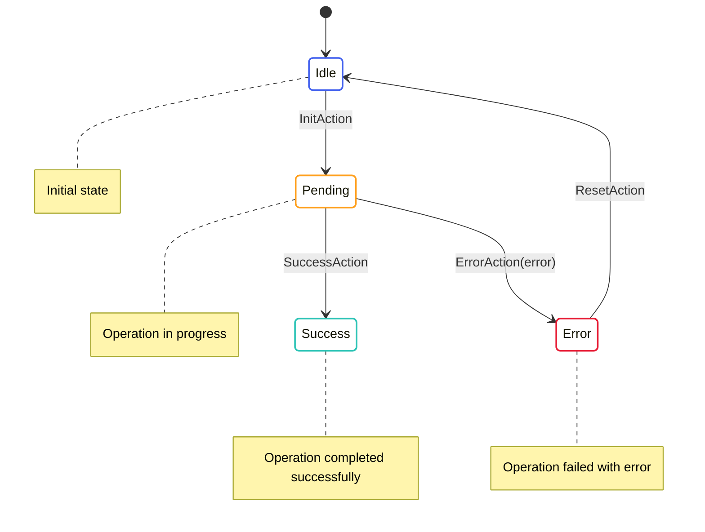

# Error Handling

This document explains how errors are handled in OpenMina's state machines.

## Error Handling Pattern

OpenMina uses a common pattern for handling errors in state machines:



This pattern is used for operations that can fail, such as:
- Loading data from disk
- Network requests
- Computationally intensive operations
- Operations that depend on external systems

## Error State

Errors are typically represented as a state variant in the state machine:

```rust
pub enum AsyncOperationState {
    Idle,
    Pending {
        time: Timestamp,
    },
    Success {
        time: Timestamp,
        result: OperationResult,
    },
    Error {
        time: Timestamp,
        error: String,
    },
}
```

The error state typically includes:
- A timestamp to track when the error occurred
- Error information, such as an error message or error code
- Additional context that might be useful for debugging

## Error Actions

Errors are typically handled by specific actions:

```rust
pub enum AsyncOperationAction {
    Init,
    Success {
        result: OperationResult,
    },
    Error {
        error: String,
    },
    Reset,
}
```

These actions allow for:
- Transitioning to the error state
- Including error information in the state
- Resetting the state machine to try again

## Error Handling in Reducers

Reducers handle error actions by transitioning to the error state:

```rust
impl AsyncOperationState {
    pub fn reducer(
        mut state_context: Substate<Self>,
        action: ActionWithMeta<AsyncOperationAction>,
    ) {
        let Ok(state) = state_context.get_substate_mut() else {
            return;
        };
        let (action, meta) = action.split();

        match action {
            AsyncOperationAction::Init => {
                // Transition to pending state
                *state = AsyncOperationState::Pending {
                    time: meta.time(),
                };

                // Dispatch effectful action to perform the operation
                let dispatcher = state_context.dispatcher();
                dispatcher.dispatch(AsyncOperationEffectfulAction::InitOperation);
            },
            AsyncOperationAction::Success { result } => {
                // Transition to success state
                *state = AsyncOperationState::Success {
                    time: meta.time(),
                    result,
                };
            },
            AsyncOperationAction::Error { error } => {
                // Transition to error state
                *state = AsyncOperationState::Error {
                    time: meta.time(),
                    error,
                };
            },
            AsyncOperationAction::Reset => {
                // Transition to idle state
                *state = AsyncOperationState::Idle;
            },
        }
    }
}
```

## Error Handling in Effects

Effects handle errors by dispatching error actions:

```rust
impl AsyncOperationEffectfulAction {
    pub fn effects<S>(&self, _: &ActionMeta, store: &mut Store<S>)
    where
        S: redux::Service + AsyncOperationService,
    {
        match self {
            AsyncOperationEffectfulAction::InitOperation => {
                // Perform the operation using the service
                store.service.perform_operation(
                    Box::new(move |result| {
                        // Dispatch success or error action based on the result
                        match result {
                            Ok(result) => {
                                store.dispatch(AsyncOperationAction::Success {
                                    result,
                                });
                            },
                            Err(error) => {
                                store.dispatch(AsyncOperationAction::Error {
                                    error: error.to_string(),
                                });
                            },
                        }
                    }),
                );
            },
        }
    }
}
```

## Error Propagation

Errors can be propagated up the state machine hierarchy:

```rust
impl TransitionFrontierState {
    pub fn reducer(
        mut state_context: crate::Substate<Self>,
        action: TransitionFrontierActionWithMetaRef<'_>,
    ) {
        let Ok(state) = state_context.get_substate_mut() else {
            // TODO: log or propagate
            return;
        };
        let (action, meta) = action.split();

        match action {
            TransitionFrontierAction::Genesis(a) => {
                super::genesis::TransitionFrontierGenesisState::reducer(
                    openmina_core::Substate::from_compatible_substate(state_context),
                    meta.with_action(a),
                )
            },
            TransitionFrontierAction::GenesisEffect(a) => {
                // Handle genesis effect
            },
            TransitionFrontierAction::Candidate(a) => {
                // Handle candidate action
            },
            TransitionFrontierAction::Sync(a) => {
                // Handle sync action
            },
            TransitionFrontierAction::SyncFailed { error, needed_protocol_states } => {
                // Handle sync failure
                // This is an example of error propagation
                // The sync component has failed, and the error is propagated to the transition frontier
                state.sync = TransitionFrontierSyncState::Idle;
                
                // Log the error
                log::error!("Sync failed: {}", error);
                
                // Dispatch an action to notify other components
                let dispatcher = state_context.dispatcher();
                dispatcher.dispatch(Action::Rpc(RpcAction::SyncFailed {
                    error: error.clone(),
                }));
            },
            // ... other action handlers
        }
    }
}
```

## Error Types

OpenMina uses several types of errors:

### String Errors

The simplest form of error is a string message:

```rust
pub enum AsyncOperationAction {
    Error {
        error: String,
    },
}
```

### Enum Errors

More complex errors are represented as enums:

```rust
pub enum SyncError {
    NoTarget,
    NoRoot,
    NoChain,
    LedgerLoadFailed(String),
    BlockRequestFailed(String),
    CommitFailed(String),
}

pub enum TransitionFrontierAction {
    SyncFailed {
        error: SyncError,
        needed_protocol_states: BTreeSet<StateHash>,
    },
}
```

### Structured Errors

Some errors include additional context:

```rust
pub struct BlockVerificationError {
    pub block_hash: StateHash,
    pub error: String,
}

pub enum SnarkAction {
    BlockVerificationFailed {
        error: BlockVerificationError,
    },
}
```

## Error Recovery

OpenMina uses several patterns for error recovery:

### Reset and Retry

The simplest form of recovery is to reset the state machine and try again:

```rust
pub enum AsyncOperationAction {
    Reset,
}
```

### Partial Reset

Some state machines reset to a specific state rather than the initial state:

```rust
pub enum TransitionFrontierSyncAction {
    StakingLedgerFailed {
        error: String,
    },
}

impl TransitionFrontierSyncState {
    pub fn reducer(
        mut state_context: Substate<Self>,
        action: ActionWithMeta<TransitionFrontierSyncAction>,
    ) {
        let Ok(state) = state_context.get_substate_mut() else {
            return;
        };
        let (action, meta) = action.split();

        match action {
            TransitionFrontierSyncAction::StakingLedgerFailed { error } => {
                // Reset to init state rather than idle
                if let TransitionFrontierSyncState::StakingLedgerPending(pending) = state {
                    *state = TransitionFrontierSyncState::Init {
                        time: meta.time(),
                        best_tip: pending.best_tip.clone(),
                        root_block: pending.root_block.clone(),
                        blocks_inbetween: pending.blocks_inbetween.clone(),
                    };
                }
            },
            // ... other action handlers
        }
    }
}
```

### Automatic Retry

Some state machines automatically retry operations:

```rust
pub enum P2pConnectionState {
    Connecting {
        time: Timestamp,
        attempts: u32,
        max_attempts: u32,
    },
    ConnectionFailed {
        time: Timestamp,
        error: String,
        attempts: u32,
        max_attempts: u32,
    },
}

impl P2pConnectionState {
    pub fn reducer(
        mut state_context: Substate<Self>,
        action: ActionWithMeta<P2pConnectionAction>,
    ) {
        let Ok(state) = state_context.get_substate_mut() else {
            return;
        };
        let (action, meta) = action.split();

        match action {
            P2pConnectionAction::ConnectionFailed { error } => {
                if let P2pConnectionState::Connecting { time, attempts, max_attempts } = state {
                    let attempts = *attempts;
                    let max_attempts = *max_attempts;
                    
                    if attempts < max_attempts {
                        // Retry connection
                        *state = P2pConnectionState::Connecting {
                            time: meta.time(),
                            attempts: attempts + 1,
                            max_attempts,
                        };
                        
                        // Dispatch effectful action to retry connection
                        let dispatcher = state_context.dispatcher();
                        dispatcher.dispatch(P2pConnectionEffectfulAction::ConnectInit);
                    } else {
                        // Max attempts reached, transition to failed state
                        *state = P2pConnectionState::ConnectionFailed {
                            time: meta.time(),
                            error,
                            attempts,
                            max_attempts,
                        };
                    }
                }
            },
            // ... other action handlers
        }
    }
}
```

## Error Logging

Errors are typically logged for debugging purposes:

```rust
impl TransitionFrontierState {
    pub fn reducer(
        mut state_context: crate::Substate<Self>,
        action: TransitionFrontierActionWithMetaRef<'_>,
    ) {
        let Ok(state) = state_context.get_substate_mut() else {
            // TODO: log or propagate
            return;
        };
        let (action, meta) = action.split();

        match action {
            TransitionFrontierAction::SyncFailed { error, needed_protocol_states } => {
                // Handle sync failure
                state.sync = TransitionFrontierSyncState::Idle;
                
                // Log the error
                log::error!("Sync failed: {}", error);
                
                // Dispatch an action to notify other components
                let dispatcher = state_context.dispatcher();
                dispatcher.dispatch(Action::Rpc(RpcAction::SyncFailed {
                    error: error.clone(),
                }));
            },
            // ... other action handlers
        }
    }
}
```

## Best Practices

When handling errors in OpenMina, follow these best practices:

1. **Be Explicit**: Use explicit error states rather than boolean flags or option types.
2. **Include Context**: Include enough context in error states to understand what went wrong.
3. **Log Errors**: Log errors for debugging purposes.
4. **Provide Recovery**: Provide a way to recover from errors.
5. **Handle All Cases**: Ensure that all possible error cases are handled.
6. **Use Appropriate Error Types**: Use string errors for simple cases, enum errors for more complex cases, and structured errors when additional context is needed.
7. **Document Error Handling**: Document how errors are handled in the state machine.
8. **Test Error Handling**: Test error handling to ensure the state machine behaves correctly in error cases.
