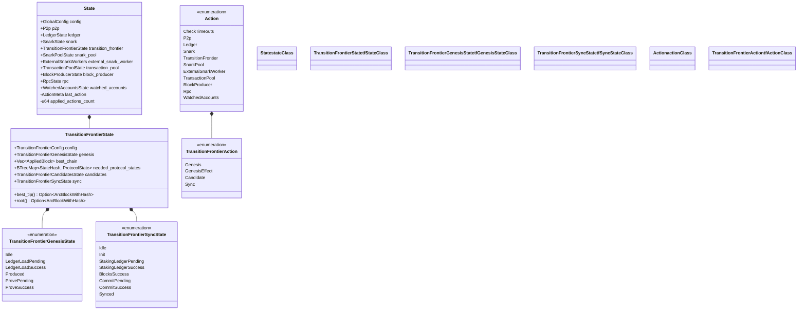

# State Machine Composition

This document explains how state machines are composed in OpenMina to create a hierarchical state machine architecture.

## What is State Machine Composition?

State machine composition is the practice of building complex state machines by combining simpler ones. In OpenMina, this is done by:

1. **Hierarchical State**: The global state contains component states, which may contain subcomponent states
2. **Action Routing**: Actions are routed to the appropriate component state machine
3. **Reducer Delegation**: Reducers delegate to subcomponent reducers
4. **Effect Composition**: Effects are composed to handle different types of effectful actions

## Hierarchical State

OpenMina uses a hierarchical state structure, where the global state contains component states, which may contain subcomponent states:

```rust
pub struct State {
    pub config: GlobalConfig,
    pub p2p: P2p,
    pub ledger: LedgerState,
    pub snark: SnarkState,
    pub transition_frontier: TransitionFrontierState,
    pub snark_pool: SnarkPoolState,
    pub external_snark_worker: ExternalSnarkWorkers,
    pub transaction_pool: TransactionPoolState,
    pub block_producer: BlockProducerState,
    pub rpc: RpcState,
    pub watched_accounts: WatchedAccountsState,
    last_action: ActionMeta,
    applied_actions_count: u64,
}
```

Component states may contain subcomponent states:

```rust
pub struct TransitionFrontierState {
    pub config: TransitionFrontierConfig,
    pub genesis: TransitionFrontierGenesisState,
    pub best_chain: Vec<AppliedBlock>,
    pub needed_protocol_states: BTreeMap<StateHash, MinaStateProtocolStateValueStableV2>,
    pub candidates: TransitionFrontierCandidatesState,
    pub sync: TransitionFrontierSyncState,
    // ...
}
```

This hierarchical structure allows for:
- **Modularity**: Each component can be developed and tested independently
- **Reusability**: Components can be reused in different contexts
- **Scalability**: The system can be extended by adding new components

## Action Hierarchy

OpenMina uses a hierarchical action structure, where the root action contains component actions, which may contain subcomponent actions:

```rust
pub enum Action {
    CheckTimeouts(CheckTimeoutsAction),
    P2p(P2pAction),
    Ledger(LedgerAction),
    Snark(SnarkAction),
    TransitionFrontier(TransitionFrontierAction),
    SnarkPool(SnarkPoolAction),
    ExternalSnarkWorker(ExternalSnarkWorkerAction),
    TransactionPool(TransactionPoolAction),
    BlockProducer(BlockProducerAction),
    Rpc(RpcAction),
    WatchedAccounts(WatchedAccountsAction),
    // ...
}
```

Component actions may contain subcomponent actions:

```rust
pub enum TransitionFrontierAction {
    Genesis(TransitionFrontierGenesisAction),
    GenesisEffect(TransitionFrontierGenesisEffectfulAction),
    Candidate(TransitionFrontierCandidateAction),
    Sync(TransitionFrontierSyncAction),
    // ...
}
```

This hierarchical structure allows for:
- **Action Routing**: Actions can be routed to the appropriate component
- **Action Composition**: Complex actions can be composed from simpler ones
- **Action Encapsulation**: Components can define their own actions without affecting others

## Reducer Delegation

OpenMina uses reducer delegation to route actions to the appropriate component reducer:

```rust
impl State {
    pub fn reducer(
        mut state_context: crate::Substate<Self>,
        action: ActionWithMetaRef<'_>,
    ) {
        let Ok(state) = state_context.get_substate_mut() else {
            // TODO: log or propagate
            return;
        };
        let (action, meta) = action.split();

        match action {
            Action::CheckTimeouts(a) => {
                // Handle check timeouts action
            },
            Action::P2p(a) => {
                P2p::reducer(
                    openmina_core::Substate::from_compatible_substate(state_context),
                    meta.with_action(a),
                )
            },
            Action::Ledger(a) => {
                LedgerState::reducer(
                    openmina_core::Substate::from_compatible_substate(state_context),
                    meta.with_action(a),
                )
            },
            // ... other action handlers
        }
    }
}
```

Component reducers may delegate to subcomponent reducers:

```rust
impl TransitionFrontierState {
    pub fn reducer(
        mut state_context: crate::Substate<Self>,
        action: TransitionFrontierActionWithMetaRef<'_>,
    ) {
        let Ok(state) = state_context.get_substate_mut() else {
            // TODO: log or propagate
            return;
        };
        let (action, meta) = action.split();

        match action {
            TransitionFrontierAction::Genesis(a) => {
                super::genesis::TransitionFrontierGenesisState::reducer(
                    openmina_core::Substate::from_compatible_substate(state_context),
                    meta.with_action(a),
                )
            },
            TransitionFrontierAction::Candidate(a) => {
                super::candidate::TransitionFrontierCandidatesState::reducer(
                    openmina_core::Substate::from_compatible_substate(state_context),
                    meta.with_action(a),
                )
            },
            // ... other action handlers
        }
    }
}
```

This delegation pattern allows for:
- **Modularity**: Each component can handle its own actions
- **Reusability**: Components can be reused in different contexts
- **Testability**: Components can be tested in isolation

## Effect Composition

OpenMina uses effect composition to handle different types of effectful actions:

```rust
pub fn effects<S>(
    store: &mut Store<S>,
    action: ActionWithMeta<Action>,
) where
    S: redux::Service
        + P2pService
        + LedgerService
        + SnarkService
        + TransitionFrontierService
        + SnarkPoolService
        + ExternalSnarkWorkerService
        + TransactionPoolService
        + BlockProducerService
        + RpcService
        + WatchedAccountsService,
{
    let (action, meta) = action.split();

    match action {
        Action::CheckTimeouts(a) => {
            // Handle check timeouts action
        },
        Action::P2p(a) => {
            p2p::p2p_effects(store, meta.with_action(a));
        },
        Action::Ledger(a) => {
            ledger::ledger_effects(store, meta.with_action(a));
        },
        // ... other action handlers
    }
}
```

Component effects may handle subcomponent effectful actions:

```rust
pub fn transition_frontier_effects<S>(
    store: &mut Store<S>,
    action: ActionWithMeta<TransitionFrontierAction>,
) where
    S: TransitionFrontierService,
{
    let (action, meta) = action.split();

    match action {
        TransitionFrontierAction::Genesis(a) => {
            // Handle genesis action
        },
        TransitionFrontierAction::GenesisEffect(a) => {
            a.effects(&meta, store);
        },
        TransitionFrontierAction::Candidate(a) => {
            // Handle candidate action
        },
        // ... other action handlers
    }
}
```

This composition pattern allows for:
- **Modularity**: Each component can handle its own effectful actions
- **Reusability**: Components can be reused in different contexts
- **Testability**: Components can be tested in isolation

## Substate Access

OpenMina uses the `Substate` context to provide access to the global state and dispatcher:

```rust
pub struct Substate<'a, Action, State, Substate> {
    state: &'a mut State,
    dispatcher: &'a mut dyn Dispatcher<Action>,
    _phantom: PhantomData<Substate>,
}

impl<'a, Action, State, Substate> Substate<'a, Action, State, Substate>
where
    State: SubstateAccess<Substate>,
{
    pub fn get_substate_mut(&mut self) -> Result<&mut Substate, SubstateError> {
        self.state.get_substate_mut()
    }

    pub fn get_global_state(&self) -> &State {
        self.state
    }

    pub fn dispatcher(&mut self) -> &mut dyn Dispatcher<Action> {
        self.dispatcher
    }
}
```

The `SubstateAccess` trait allows for accessing substates:

```rust
pub trait SubstateAccess<Substate> {
    fn get_substate_mut(&mut self) -> Result<&mut Substate, SubstateError>;
}
```

This pattern allows for:
- **State Access**: Components can access their own state
- **Global State Access**: Components can access the global state
- **Action Dispatching**: Components can dispatch actions

## Composition Diagram



This diagram shows the composition of the global state and action hierarchy.

## Benefits of Composition

State machine composition provides several benefits:

1. **Modularity**: Each component can be developed and tested independently
2. **Reusability**: Components can be reused in different contexts
3. **Scalability**: The system can be extended by adding new components
4. **Maintainability**: Changes to one component don't affect others
5. **Testability**: Components can be tested in isolation
6. **Readability**: The code is organized in a way that reflects the system's structure

## Challenges of Composition

State machine composition also presents some challenges:

1. **Complexity**: The system can become complex with many components
2. **Performance**: Delegation and composition can add overhead
3. **Coordination**: Components need to coordinate their actions
4. **State Sharing**: Components may need to access each other's state
5. **Action Routing**: Actions need to be routed to the appropriate component

## Best Practices

When using state machine composition in OpenMina, follow these best practices:

1. **Keep Components Focused**: Each component should have a single responsibility
2. **Use Hierarchical State**: Organize state in a hierarchical structure
3. **Use Action Hierarchy**: Organize actions in a hierarchical structure
4. **Delegate to Subcomponents**: Reducers should delegate to subcomponent reducers
5. **Compose Effects**: Effects should be composed to handle different types of effectful actions
6. **Use Substate Access**: Use the `Substate` context to access state and dispatch actions
7. **Test Components in Isolation**: Test each component independently
8. **Document Component Interactions**: Document how components interact with each other

## Example: Transition Frontier Composition

Here's a more detailed example of state machine composition in the Transition Frontier component:

```rust
pub struct TransitionFrontierState {
    pub config: TransitionFrontierConfig,
    pub genesis: TransitionFrontierGenesisState,
    pub best_chain: Vec<AppliedBlock>,
    pub needed_protocol_states: BTreeMap<StateHash, MinaStateProtocolStateValueStableV2>,
    pub candidates: TransitionFrontierCandidatesState,
    pub sync: TransitionFrontierSyncState,
    // ...
}

pub enum TransitionFrontierAction {
    Genesis(TransitionFrontierGenesisAction),
    GenesisEffect(TransitionFrontierGenesisEffectfulAction),
    Candidate(TransitionFrontierCandidateAction),
    Sync(TransitionFrontierSyncAction),
    // ...
}

impl TransitionFrontierState {
    pub fn reducer(
        mut state_context: crate::Substate<Self>,
        action: TransitionFrontierActionWithMetaRef<'_>,
    ) {
        let Ok(state) = state_context.get_substate_mut() else {
            // TODO: log or propagate
            return;
        };
        let (action, meta) = action.split();

        match action {
            TransitionFrontierAction::Genesis(a) => {
                super::genesis::TransitionFrontierGenesisState::reducer(
                    openmina_core::Substate::from_compatible_substate(state_context),
                    meta.with_action(a),
                )
            },
            TransitionFrontierAction::Candidate(a) => {
                super::candidate::TransitionFrontierCandidatesState::reducer(
                    openmina_core::Substate::from_compatible_substate(state_context),
                    meta.with_action(a),
                )
            },
            TransitionFrontierAction::Sync(a) => {
                super::sync::TransitionFrontierSyncState::reducer(
                    openmina_core::Substate::from_compatible_substate(state_context),
                    meta.with_action(a),
                    &state.best_chain,
                )
            },
            // ... other action handlers
        }
    }
}

pub fn transition_frontier_effects<S>(
    store: &mut Store<S>,
    action: ActionWithMeta<TransitionFrontierAction>,
) where
    S: TransitionFrontierService,
{
    let (action, meta) = action.split();

    match action {
        TransitionFrontierAction::Genesis(a) => {
            // Handle genesis action
        },
        TransitionFrontierAction::GenesisEffect(a) => {
            a.effects(&meta, store);
        },
        TransitionFrontierAction::Candidate(a) => {
            // Handle candidate action
        },
        TransitionFrontierAction::Sync(a) => {
            // Handle sync action
        },
        // ... other action handlers
    }
}
```

This example shows how the Transition Frontier component is composed of several subcomponents, each with its own state, actions, reducers, and effects.
