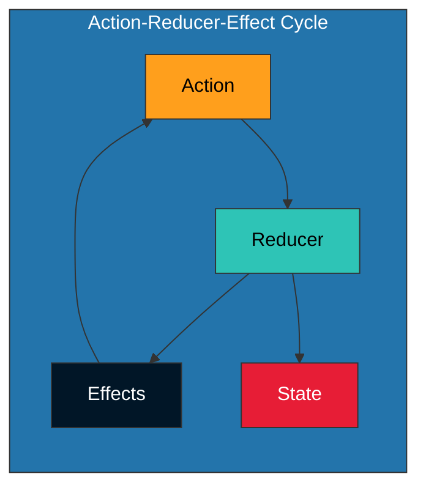

# Action-Reducer-Effect Cycle

This document provides practical examples of the action-reducer-effect cycle in the OpenMina codebase, showing how this pattern is used to manage state and side effects in a predictable and debuggable way.

## Cycle Diagram



## Example 1: P2P Connection

Let's walk through the action-reducer-effect cycle for establishing a P2P connection:

### Action

```rust
// P2P action to connect to a peer
pub enum P2pAction {
    // ...
    Connect {
        peer_id: PeerId,
        address: Multiaddr,
    },
    // ...
}
```

### Enabling Condition

```rust
impl EnablingCondition<State> for P2pAction {
    fn is_enabled(&self, state: &State, _time: Timestamp) -> bool {
        match self {
            P2pAction::Connect { peer_id, .. } => {
                // Check if we're already connected to this peer
                !state.p2p.peers.contains_key(peer_id)
            },
            // ...
        }
    }
}
```

### Reducer

```rust
fn reducer(substate: &mut Substate<P2pState>, action: &P2pAction) {
    match action {
        P2pAction::Connect { peer_id, address } => {
            // Update state to indicate we're attempting to connect
            substate.connecting_peers.insert(
                peer_id.clone(),
                ConnectingPeer {
                    address: address.clone(),
                    attempts: 1,
                    last_attempt: Timestamp::now(),
                },
            );

            // Dispatch an effectful action to actually establish the connection
            let dispatcher = substate.dispatcher();
            dispatcher.dispatch(P2pEffectfulAction::ConnectInit {
                peer_id: peer_id.clone(),
                address: address.clone(),
            });
        },
        // ...
    }
}
```

### Effects

```rust
fn effects(state: &P2pState, action: &P2pEffectfulAction) -> Vec<Action> {
    match action {
        P2pEffectfulAction::ConnectInit { peer_id, address } => {
            // This would be handled by a service that actually establishes the connection
            // The service would then dispatch a ConnectResult action
            vec![]
        },
        P2pEffectfulAction::ConnectResult { peer_id, result } => {
            match result {
                Ok(()) => {
                    // Connection successful, dispatch action to update state
                    vec![Action::P2p(P2pAction::Connected {
                        peer_id: peer_id.clone(),
                    })]
                },
                Err(error) => {
                    // Connection failed, dispatch action to handle error
                    vec![Action::P2p(P2pAction::ConnectFailed {
                        peer_id: peer_id.clone(),
                        error: error.clone(),
                    })]
                },
            }
        },
        // ...
    }
}
```

## Example 2: Block Verification

Let's walk through the action-reducer-effect cycle for verifying a block:

### Action

```rust
// Transition Frontier action to verify a block
pub enum TransitionFrontierCandidateAction {
    // ...
    BlockReceived {
        block: Arc<MinaBlockExternalTransitionStableV2>,
        sender: Option<PeerId>,
    },
    // ...
}
```

### Enabling Condition

```rust
impl EnablingCondition<State> for TransitionFrontierCandidateAction {
    fn is_enabled(&self, state: &State, _time: Timestamp) -> bool {
        match self {
            TransitionFrontierCandidateAction::BlockReceived { block, .. } => {
                // Check if we already have this block
                let block_hash = block.hash();
                !state.transition_frontier.candidates.blocks.contains_key(&block_hash)
            },
            // ...
        }
    }
}
```

### Reducer

```rust
fn reducer(substate: &mut Substate<TransitionFrontierState>, action: &TransitionFrontierCandidateAction) {
    match action {
        TransitionFrontierCandidateAction::BlockReceived { block, sender } => {
            // Validate the block syntax
            if !validate_block_syntax(block) {
                return;
            }

            // Add the block to candidates
            let block_hash = block.hash();
            substate.candidates.blocks.insert(
                block_hash.clone(),
                CandidateBlock {
                    block: block.clone(),
                    status: CandidateBlockStatus::Validating,
                    sender: sender.clone(),
                },
            );

            // Dispatch an action to verify the block's SNARK proof
            let dispatcher = substate.dispatcher();
            dispatcher.dispatch(Action::Snark(SnarkAction::BlockVerify(BlockVerifyAction::Verify {
                block_hash: block_hash.clone(),
                input: Box::new(create_verify_input(block)),
            })));
        },
        // ...
    }
}
```

### Effects

```rust
fn effects(state: &SnarkState, action: &BlockVerifyAction) -> Vec<Action> {
    match action {
        BlockVerifyAction::Verify { block_hash, input } => {
            // This would be handled by a service that performs the verification
            // The service would then dispatch a VerifyResult action
            vec![]
        },
        BlockVerifyAction::VerifyResult { block_hash, result } => {
            match result {
                Ok(()) => {
                    // Verification successful, dispatch action to update candidate status
                    vec![Action::TransitionFrontier(TransitionFrontierAction::Candidate(
                        TransitionFrontierCandidateAction::BlockVerified {
                            block_hash: block_hash.clone(),
                        },
                    ))]
                },
                Err(error) => {
                    // Verification failed, dispatch action to handle error
                    vec![Action::TransitionFrontier(TransitionFrontierAction::Candidate(
                        TransitionFrontierCandidateAction::BlockVerificationFailed {
                            block_hash: block_hash.clone(),
                            error: error.clone(),
                        },
                    ))]
                },
            }
        },
        // ...
    }
}
```

## Benefits of the Action-Reducer-Effect Cycle

The action-reducer-effect cycle provides several benefits:

1. **Predictability**: The flow of data and operations is predictable and easy to follow.
2. **Debuggability**: The state represents the flow, making it easy to debug by observing state transitions.
3. **Testability**: Actions, reducers, and effects can be tested in isolation.
4. **Separation of Concerns**: The pattern separates state updates (reducers) from side effects (effects).
5. **Concurrency**: The pattern makes it easier to reason about concurrent operations.

## Practical Considerations

When working with the action-reducer-effect cycle, keep in mind:

1. **Keep Reducers Pure**: Reducers should be pure functions that only update the state based on the action.
2. **Keep Effects Simple**: Effects should be simple and mainly focus on dispatching new actions.
3. **Use Enabling Conditions**: Enabling conditions help prevent impossible or duplicate states.
4. **Design State Carefully**: The state is the core of the system, so it should be carefully designed to represent the flow of the application.
5. **Follow the Flow**: When debugging, follow the flow of actions, reducers, and effects to understand how the system behaves.
