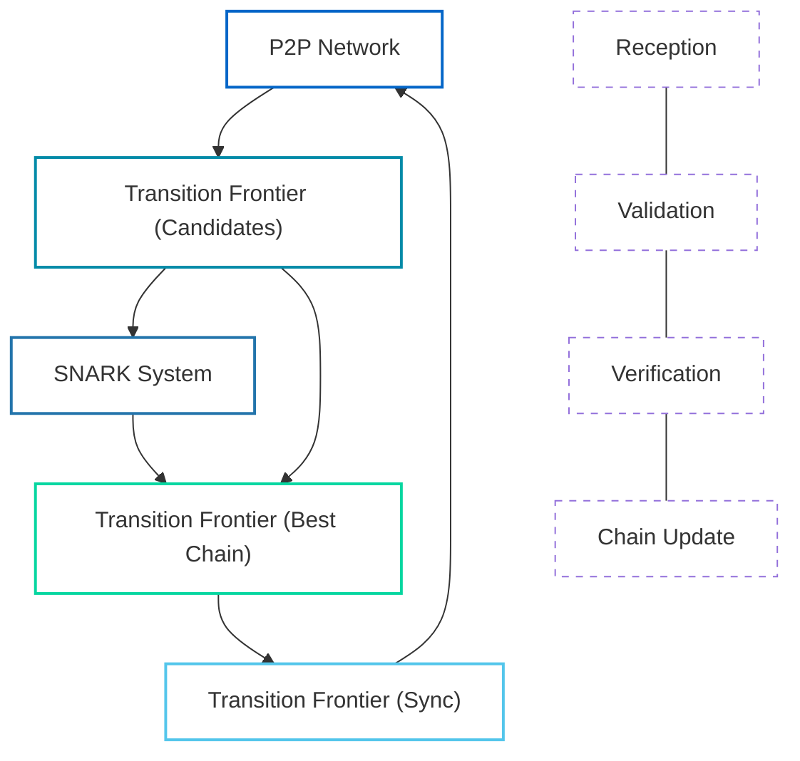

# Block Processing Flow

This document explains how blocks are processed in the OpenMina node, focusing on the interactions between different components and the flow of data through the system.

## Block Processing Diagram



**Diagram Legend:**

-   **P2P Network**: Receives and propagates blocks across the network
-   **Transition Frontier (Candidates)**: Validates block syntax and structure
-   **SNARK System**: Verifies zero-knowledge proofs in blocks
-   **Transition Frontier (Best Chain)**: Updates the best chain with validated blocks
-   **Transition Frontier (Sync)**: Synchronizes missing blocks with other nodes

## Block Processing Steps

### 1. Block Reception

The process begins when a block is received from a peer via the P2P network:

```rust
// P2P component receives a block message
pub enum P2pAction {
    // ...
    MessageReceived {
        peer_id: PeerId,
        message: Arc<MinaMessage>,
    },
    // ...
}
```

The P2P component dispatches an action to process the received block message.

### 2. Block Validation (Candidates)

The Transition Frontier component's Candidates subcomponent validates the block:

```rust
// Transition Frontier component processes the block
pub enum TransitionFrontierCandidateAction {
    // ...
    BlockReceived {
        block: Arc<MinaBlockExternalTransitionStableV2>,
        sender: Option<PeerId>,
    },
    // ...
}
```

The validation process includes:

-   Checking the block's syntax
-   Verifying the block's signatures
-   Checking the block's parent exists
-   Verifying the block's state transition

If the block requires SNARK verification, the Transition Frontier dispatches an action to the SNARK component.

### 3. SNARK Verification

The SNARK component verifies the block's proof:

```rust
// SNARK component verifies the block proof
pub enum BlockVerifyAction {
    // ...
    Verify {
        block_hash: StateHash,
        input: Box<ProverExtendBlockchainInputStableV2>,
    },
    // ...
}
```

The verification process includes:

-   Loading the verifier index and SRS
-   Deserializing the proof
-   Verifying the proof against the verifier index
-   Checking that the proof's public input matches the expected value

After verification, the SNARK component dispatches an action with the result.

### 4. Best Chain Update

If the block is valid, the Transition Frontier component's Best Chain subcomponent updates the best chain:

```rust
// Transition Frontier component updates the best chain
pub enum TransitionFrontierAction {
    // ...
    ApplyCandidate {
        block_hash: StateHash,
    },
    // ...
}
```

The update process includes:

-   Adding the block to the best chain
-   Handling chain reorganizations if necessary
-   Updating the state based on the new block

### 5. Block Propagation

If the block is valid and new, the Transition Frontier component may dispatch an action to the P2P component to propagate the block to other peers:

```rust
// P2P component propagates the block
pub enum P2pAction {
    // ...
    BroadcastMessage {
        message: Arc<MinaMessage>,
    },
    // ...
}
```

### 6. Sync (If Necessary)

If the block indicates that the node is behind the network, the Transition Frontier component's Sync subcomponent may initiate a sync process:

```rust
// Transition Frontier component initiates sync
pub enum TransitionFrontierSyncAction {
    // ...
    Start {
        target: StateHash,
    },
    // ...
}
```

The sync process includes:

-   Requesting missing blocks from peers
-   Validating and applying the received blocks
-   Updating the best chain once sync is complete

## State Transitions

Throughout the block processing flow, the state of various components is updated:

### P2P State

-   Tracks received and sent messages
-   Manages peer connections

### Transition Frontier State

-   Updates the candidates list
-   Updates the best chain
-   Manages the sync state

### SNARK State

-   Tracks verification requests and results

## Error Handling

The block processing flow includes error handling at various stages:

-   If a block fails validation, it is rejected and not added to the candidates list
-   If SNARK verification fails, the block is rejected
-   If a block cannot be applied to the best chain, it may be kept as a candidate for future application

## Optimizations

The block processing flow includes several optimizations:

-   Parallel SNARK verification
-   Caching of verification results
-   Prioritization of blocks based on their height and difficulty
