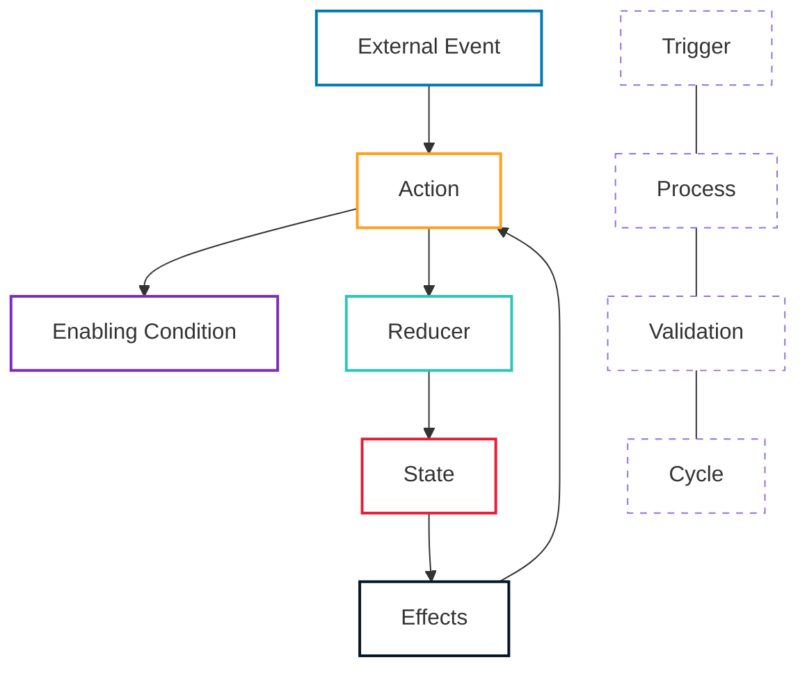

# Data Flow

This document explains how data flows through the OpenMina system, focusing on the interactions between components and the lifecycle of data as it moves through the system.

## Data Flow Diagram

**Diagram Legend:**

-   **External Event**: Triggers that initiate actions (user input, network message, etc.)
-   **Action**: Operation to be performed
-   **Enabling Condition**: Validates if an action can be processed in the current state
-   **Reducer**: Updates state based on action
-   **State**: Current state of the system
-   **Effects**: Handles side effects and may dispatch new actions

## Data Lifecycle

### 1. Action Creation

Actions can be created from:

-   External events (e.g., receiving a message from a peer)
-   User interactions (e.g., starting the node)
-   Effects of other actions (e.g., a timeout triggering a retry)

### 2. Enabling Condition Check

Before an action is processed, its enabling condition is checked to determine if it can be processed based on the current state. This helps prevent impossible or duplicate states.

### 3. Reducer Execution

If the enabling condition is met, the reducer is executed to update the state based on the action. Reducers are pure functions that take the current state and an action and return a new state.

### 4. Effect Handling

After the state is updated, effects are executed to handle side effects and potentially dispatch new actions. Effects should be kept as simple as possible and mainly focus on dispatching new actions.

### 5. State Update

The state is updated based on the reducer's output, and the cycle continues with any new actions dispatched by effects.

## Cross-Component Data Flow

Data often flows between different components of the system. Here are some common cross-component data flows:

### Block Processing Flow

1. A block is received from a peer via the P2P network
2. The P2P component dispatches an action to process the block
3. The Transition Frontier component validates the block
4. If validation requires SNARK verification, the Transition Frontier dispatches an action to the SNARK component
5. The SNARK component verifies the proof and dispatches an action with the result
6. The Transition Frontier updates the state based on the verification result
7. If the block is valid, it may be added to the best chain

For more details on block processing, see [Block Processing Flow](block-processing.md).

### Transaction Processing Flow

1. A transaction is received from a peer via the P2P network
2. The P2P component dispatches an action to process the transaction
3. The transaction is validated and potentially added to the transaction pool
4. When a block is produced, transactions from the pool are included
5. SNARK proofs for transactions are verified by the SNARK component

## Service Interactions

Services are abstracted components that handle IO or computationally heavy tasks. Data flows between the core state machine and services through a well-defined interface:

1. The state machine dispatches an action that requires a service
2. The service performs the requested operation
3. The service dispatches an action with the result
4. The state machine updates the state based on the result

This abstraction allows the core logic to be platform-independent and easier to test.
