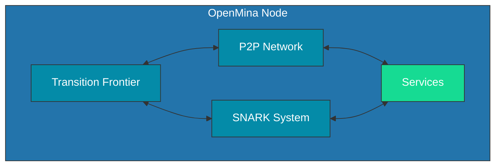

# System Overview

This document provides a high-level overview of the OpenMina system architecture, its main components, and how they interact with each other.

## System Architecture Diagram

## Main Components

### Transition Frontier

The Transition Frontier is responsible for managing the blockchain state and transitions. It:

-   Maintains the best chain of blocks
-   Handles block candidates and verification
-   Manages the genesis state
-   Synchronizes with other nodes

**Key Code Files:**

-   [node/src/transition_frontier/mod.rs](../node/src/transition_frontier/mod.rs)
-   [node/src/transition_frontier/transition_frontier_state.rs](../node/src/transition_frontier/transition_frontier_state.rs)

### SNARK System

The SNARK (Succinct Non-interactive ARgument of Knowledge) system handles zero-knowledge proof verification, which is essential for the Mina protocol. It:

-   Verifies transaction proofs
-   Verifies block proofs
-   Manages SNARK work verification

**Key Code Files:**

-   [snark/src/lib.rs](../snark/src/lib.rs)
-   [core/src/snark/snark.rs](../core/src/snark/snark.rs)

### P2P Network

The P2P (Peer-to-Peer) network component manages communication between nodes in the network. It:

-   Establishes and maintains connections with peers
-   Handles message passing between nodes
-   Implements the LibP2P networking stack
-   Manages encryption and security

**Key Code Files:**

-   [p2p/readme.md](../p2p/readme.md)
-   [core/src/p2p](../core/src/p2p)

### Services

Services are abstracted components that handle IO or computationally heavy tasks that run in separate threads. This abstraction allows the core logic to be platform-independent and easier to test.

**Key Code Files:**

-   [node/src/service.rs](../node/src/service.rs)

## State Machine Architecture

OpenMina uses a state machine architecture where:

-   **Actions** represent operations to be performed
-   **Reducers** update the state based on actions
-   **Effects** handle side effects and may dispatch new actions

This architecture provides a predictable and debuggable flow of data and operations.

For more details on the state machine architecture, see [State Machine Architecture](state-machine.md).

## Data Flow

Data flows through the system in a predictable manner:

1. Actions are dispatched, either from external events or as effects of other actions
2. Enabling conditions determine if an action can be processed
3. Reducers update the state based on the action
4. Effects handle side effects and may dispatch new actions

For more details on data flow, see [Data Flow](data-flow.md).
