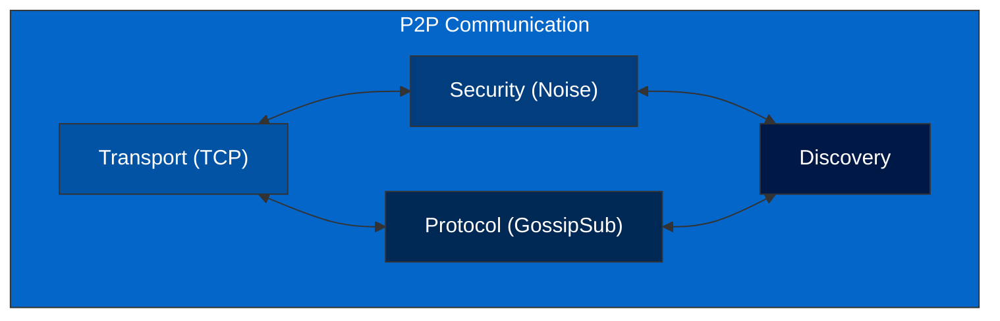

# P2P Communication

The P2P (Peer-to-Peer) communication component is responsible for managing network connections and message passing between nodes in the Mina network. It implements the LibP2P networking stack and provides a reliable, secure, and efficient communication layer.

## Component Diagram

## Subcomponents

### Transport

The Transport subcomponent is responsible for the low-level data transmission between peers. It handles:

-   Establishing TCP connections
-   Managing connection lifecycle
-   Handling connection errors

**Key Code Files:**

-   [p2p/src/transport.rs](../../../p2p/src/transport.rs)

### Security

The Security subcomponent is responsible for securing the communication between peers. It handles:

-   Implementing the Noise protocol for encryption
-   Providing forward secrecy
-   Authenticating peers

**Key Code Files:**

-   [p2p/src/noise.rs](../../../p2p/src/noise.rs)

### Protocol

The Protocol subcomponent is responsible for implementing the higher-level communication protocols. It handles:

-   Implementing the GossipSub protocol for message propagation
-   Managing message subscriptions
-   Handling message validation

**Key Code Files:**

-   [p2p/src/protocol.rs](../../../p2p/src/protocol.rs)

### Discovery

The Discovery subcomponent is responsible for finding and connecting to peers in the network. It handles:

-   Discovering new peers
-   Managing the peer list
-   Handling peer connections and disconnections

**Key Code Files:**

-   [p2p/src/discovery.rs](../../../p2p/src/discovery.rs)

## LibP2P Features

The P2P component utilizes LibP2P, a modular networking stack that provides a unified framework for building decentralized P2P network applications. Key features include:

### Modularity

LibP2P is designed to be modular, allowing for the selection of specific components based on the application's needs. This modularity enables the P2P component to be flexible and adaptable.

### Noise Encryption

The P2P component uses the Noise protocol for encryption, which provides:

-   Asynchronous communication
-   Forward secrecy
-   Resistance to tampering

### Transport Layer

The P2P component uses TCP as its transport layer, which provides:

-   Reliable, ordered, and error-checked delivery of data
-   Connection-oriented communication
-   Flow control and congestion control

## Interactions with Other Components

The P2P component interacts with several other components:

-   **Transition Frontier**: For propagating blocks and sync messages
-   **Services**: For handling network IO

For more details on these interactions, see [Block Processing Flow](../../architecture/block-processing.md).

## Technical Background

For more details on the P2P implementation in Mina, see [P2P Communication](../../../docs/p2p_service.md) and [GossipSub](https://github.com/openmina/mina-wiki/blob/3ea9041e52fb2e606918f6c60bd3a32b8652f016/p2p/mina-gossip.md).
