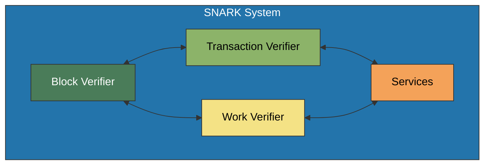

# SNARK System

The SNARK (Succinct Non-interactive ARgument of Knowledge) system is a core component of the OpenMina node that handles zero-knowledge proof verification. It is essential for the Mina protocol, which relies heavily on zero-knowledge proofs to maintain a small blockchain size.

## Component Diagram



## Subcomponents

### Block Verifier

The Block Verifier subcomponent is responsible for verifying block proofs. It handles:

-   Verifying the SNARK proof for a block
-   Validating the block's state transition

**Key Code Files:**

-   [snark/src/block_verify.rs](../../../snark/src/block_verify.rs)
-   [snark/src/block_verify_effectful.rs](../../../snark/src/block_verify_effectful.rs)

### Transaction Verifier

The Transaction Verifier subcomponent is responsible for verifying transaction proofs. It handles:

-   Verifying the SNARK proof for a transaction
-   Validating the transaction's state transition

**Key Code Files:**

-   [snark/src/user_command_verify.rs](../../../snark/src/user_command_verify.rs)
-   [snark/src/user_command_verify_effectful.rs](../../../snark/src/user_command_verify_effectful.rs)

### Work Verifier

The Work Verifier subcomponent is responsible for verifying SNARK work. It handles:

-   Verifying the SNARK proof for a work item
-   Validating the work's correctness

**Key Code Files:**

-   [snark/src/work_verify.rs](../../../snark/src/work_verify.rs)
-   [snark/src/work_verify_effectful.rs](../../../snark/src/work_verify_effectful.rs)

### Services

The Services subcomponent provides an abstraction for computationally heavy SNARK operations. It handles:

-   Offloading SNARK verification to separate threads
-   Managing the verification process

## State

The SNARK system state is defined in [snark/src/snark_state.rs](../../../snark/src/snark_state.rs):

```rust
pub struct SnarkState {
    pub config: SnarkConfig,
    pub block_verify: BlockVerifyState,
    pub user_command_verify: UserCommandVerifyState,
    pub work_verify: WorkVerifyState,
    // ...
}
```

## Actions

The SNARK system defines several actions for interacting with the state:

```rust
pub enum SnarkAction {
    BlockVerify(BlockVerifyAction),
    UserCommandVerify(UserCommandVerifyAction),
    WorkVerify(WorkVerifyAction),
    // ...
}
```

## Interactions with Other Components

The SNARK system interacts with several other components:

-   **Transition Frontier**: For verifying block and transaction proofs
-   **Services**: For offloading computationally heavy operations

For more details on these interactions, see [Block Processing Flow](../../architecture/block-processing.md).

## Technical Background

SNARK proofs in Mina use the Kimchi proof system, which is based on the PLONK proof system. The verification process involves:

1. Loading the verifier index and SRS (Structured Reference String)
2. Deserializing the proof
3. Verifying the proof against the verifier index
4. Checking that the proof's public input matches the expected value

For more details on SNARK work in Mina, see [SNARK Work](../../../docs/snark-work.md).
