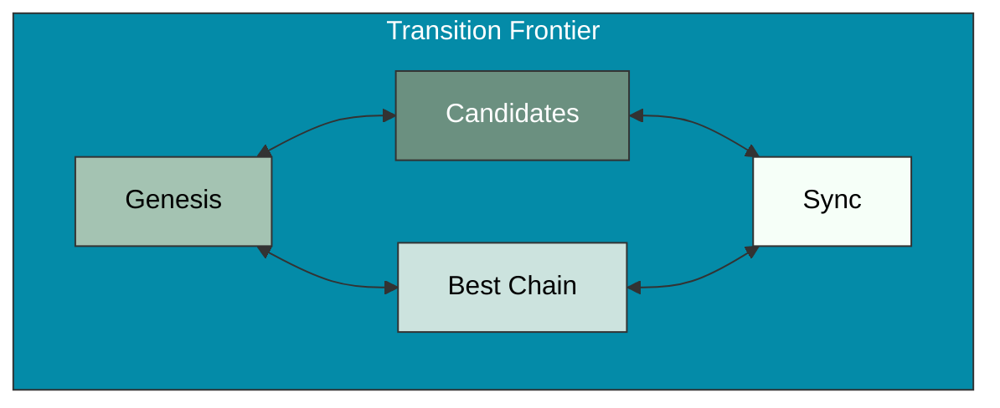

# Transition Frontier

The Transition Frontier is a core component of the OpenMina node that manages the blockchain state and transitions. It is responsible for maintaining the best chain of blocks, handling block candidates and verification, managing the genesis state, and synchronizing with other nodes.

## Component Diagram



## Subcomponents

### Genesis

The Genesis subcomponent is responsible for initializing the blockchain state from the genesis configuration. It handles:

-   Loading the genesis ledger
-   Initializing the genesis block
-   Proving the genesis block

**Key Code Files:**

-   [node/src/transition_frontier/genesis.rs](../../../node/src/transition_frontier/genesis.rs)
-   [node/src/transition_frontier/genesis_effectful.rs](../../../node/src/transition_frontier/genesis_effectful.rs)

### Candidates

The Candidates subcomponent manages block candidates that are received from peers or produced locally. It handles:

-   Validating block candidates
-   Storing valid candidates
-   Selecting candidates for inclusion in the best chain

**Key Code Files:**

-   [node/src/transition_frontier/candidate.rs](../../../node/src/transition_frontier/candidate.rs)

### Best Chain

The Best Chain subcomponent maintains the current best chain of blocks. It handles:

-   Updating the best chain when new blocks are validated
-   Handling chain reorganizations
-   Providing access to the current best tip and root

**Key Code Files:**

-   [node/src/transition_frontier/transition_frontier_state.rs](../../../node/src/transition_frontier/transition_frontier_state.rs)

### Sync

The Sync subcomponent is responsible for synchronizing the node's state with other nodes in the network. It handles:

-   Requesting missing blocks from peers
-   Handling sync requests from peers
-   Managing the sync state

**Key Code Files:**

-   [node/src/transition_frontier/sync.rs](../../../node/src/transition_frontier/sync.rs)

## State

The Transition Frontier state is defined in [node/src/transition_frontier/transition_frontier_state.rs](../../../node/src/transition_frontier/transition_frontier_state.rs):

```rust
pub struct TransitionFrontierState {
    pub config: TransitionFrontierConfig,
    pub genesis: TransitionFrontierGenesisState,
    pub best_chain: Vec<AppliedBlock>,
    pub needed_protocol_states: BTreeMap<StateHash, MinaStateProtocolStateValueStableV2>,
    pub candidates: TransitionFrontierCandidatesState,
    pub sync: TransitionFrontierSyncState,
    // ...
}
```

## Actions

The Transition Frontier component defines several actions for interacting with the state:

```rust
pub enum TransitionFrontierAction {
    Genesis(TransitionFrontierGenesisAction),
    Candidate(TransitionFrontierCandidateAction),
    Sync(TransitionFrontierSyncAction),
    // ...
}
```

## Interactions with Other Components

The Transition Frontier interacts with several other components:

-   **SNARK System**: For verifying block proofs
-   **P2P Network**: For receiving and sending blocks and sync messages
-   **Services**: For IO operations like loading the genesis ledger

For more details on these interactions, see [Block Processing Flow](../../architecture/block-processing.md).
