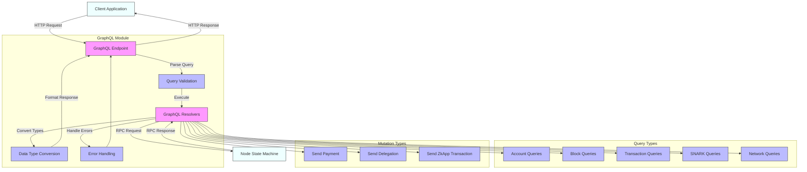

# OpenMina GraphQL API Module

## Overview

The GraphQL module implements a comprehensive API for the OpenMina node, providing a web-accessible interface for querying blockchain state and submitting transactions. [Ref: file:node/native/src/graphql/mod.rs (0.95)] It serves as the primary interface for external applications to interact with the node, offering a flexible and well-documented way to access blockchain data. [Ref: doc:/Users/lukasimrich/Code/GitHub/openmina/docs/components-overview.md (0.8)]

The module is built around the Juniper GraphQL framework and exposes its functionality through HTTP endpoints using Warp. [Ref: item:node/native/src/graphql/mod.rs::routes (0.95)] It defines a schema with query and mutation types that allow clients to read blockchain data and submit transactions. [Ref: item:node/native/src/graphql/mod.rs::Query (0.95)] [Ref: item:node/native/src/graphql/mod.rs::Mutation (0.95)]

## Core Components

The GraphQL API is organized into several key components:

- **Context**: Maintains request-scoped state and caching, providing access to the node's RPC interface. [Ref: item:node/native/src/graphql/mod.rs::Context (0.95)]
- **Query Root**: Entry point for all read operations, with resolvers for accounts, blocks, transactions, etc. [Ref: item:node/native/src/graphql/mod.rs::Query (0.95)]
- **Mutation Root**: Entry point for all write operations, with resolvers for submitting transactions. [Ref: item:node/native/src/graphql/mod.rs::Mutation (0.95)]
- **Data Loaders**: Implements efficient batched loading of related data (e.g., accounts). [Ref: item:node/native/src/graphql/account.rs::AccountLoader (0.9)]
- **Type Converters**: Converts between internal node data structures and GraphQL-compatible types. [Ref: multi:(account.rs, block.rs, zkapp.rs) (0.9)]

## Submodules

The GraphQL module is organized into several submodules, each handling a specific aspect of the blockchain:

- **account**: Types and resolvers for Mina accounts, balances, permissions, and zkApp state. [Ref: file:node/native/src/graphql/account.rs (0.95)]
- **block**: Types and resolvers for blocks, including metadata, transactions, and SNARK jobs. [Ref: file:node/native/src/graphql/block.rs (0.95)]
- **constants**: Types and resolvers for network constants and daemon status information. [Ref: file:node/native/src/graphql/constants.rs (0.95)]
- **snark**: Types and resolvers for SNARK-related functionality, jobs, and workers. [Ref: file:node/native/src/graphql/snark.rs (0.95)]
- **transaction**: Types for transaction status information and enums. [Ref: file:node/native/src/graphql/transaction.rs (0.95)]
- **user_command**: Types and resolvers for user commands (payments and delegations). [Ref: file:node/native/src/graphql/user_command.rs (0.95)]
- **zkapp**: Types and resolvers for zkApp transactions and commands. [Ref: file:node/native/src/graphql/zkapp.rs (0.95)]

## Usage

The GraphQL API exposes three main HTTP endpoints:

- `/graphql`: The main GraphQL endpoint for queries and mutations [Ref: item:node/native/src/graphql/mod.rs::routes (0.95)]
- `/graphiql`: A GraphiQL interface for interactive API exploration [Ref: item:node/native/src/graphql/mod.rs::routes (0.95)]
- `/playground`: A GraphQL Playground interface for interactive API exploration [Ref: item:node/native/src/graphql/mod.rs::routes (0.95)]

[Browse the GraphQL Module Source Code and Detailed Inline Documentation](./)
