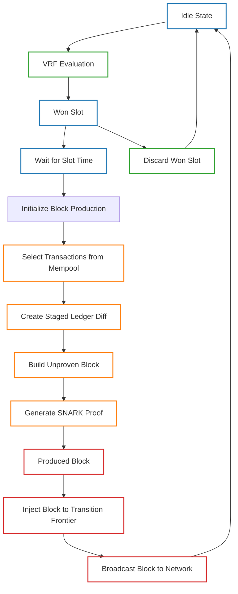

# Block Producer Module

## Overview

The Block Producer module is responsible for creating and injecting new blocks into the Mina blockchain when the node wins a slot through the Verifiable Random Function (VRF) lottery. [Ref: file:node/src/block_producer/mod.rs (0.95)]

The module implements a comprehensive state machine that manages the entire block production workflow, from slot winning through VRF evaluation to block construction, proving, and network propagation. [Ref: item:node/src/block_producer/block_producer_state.rs::BlockProducerCurrentState (0.95)]

Block production begins with VRF evaluation to determine if the node has won the right to produce a block in a specific slot based on stake weight. When a slot is won, the module retrieves transactions from the mempool, creates a staged ledger diff representing state transitions, builds the block structure, generates a SNARK proof for validity, and finally injects the block into the transition frontier and broadcasts it to peers. [Ref: multi:(node/src/block_producer/block_producer_state.rs, node/src/block_producer/vrf_evaluator/mod.rs) (0.9)]

The module interacts with several other components in the OpenMina architecture, including the Ledger for state transitions, Transaction Pool for pending transactions, VRF Service for slot winning, Transition Frontier for block injection, and P2P Network for block propagation. [Ref: multi:(node/src/block_producer/block_producer_reducer.rs, node/src/block_producer/block_producer_actions.rs) (0.85)]

## Key Components

-   **BlockProducerState**: The main state container that manages the block production state machine. [Ref: item:node/src/block_producer/block_producer_state.rs::BlockProducerState (0.95)]
-   **BlockProducerCurrentState**: An enum representing all possible states in the block production workflow. [Ref: item:node/src/block_producer/block_producer_state.rs::BlockProducerCurrentState (0.95)]
-   **VRF Evaluator**: Determines if the node has won a slot based on stake and randomness. [Ref: item:node/src/block_producer/vrf_evaluator/mod.rs (0.9)]
-   **BlockProducerWonSlot**: Represents a slot that the node has won and can produce a block for. [Ref: item:node/src/block_producer/mod.rs::BlockProducerWonSlot (0.95)]
-   **BlockWithoutProof**: Represents a block that has been constructed but not yet proven with a SNARK. [Ref: item:node/src/block_producer/mod.rs::BlockWithoutProof (0.95)]

[Browse the Block Producer Module Source Code and Detailed Inline Documentation](./)
