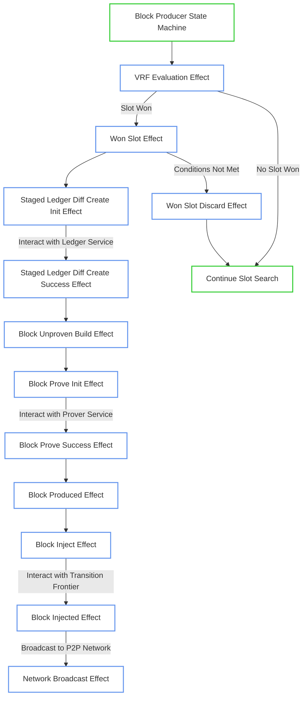

# Block Producer Effectful Module

## Block Production Effects Flow

## Module Overview

The Block Producer Effectful module implements the side effects layer for block production in the OpenMina node. It separates effectful operations (external service interactions) from pure state management in the block producer, following the Redux-inspired architecture pattern. [Ref: doc:docs/components-overview.md#New Pattern (0.95)]

This module is responsible for handling all interactions with external services required during the block production process, including VRF evaluation for slot winning, staged ledger diff creation, block proving, and block injection to the transition frontier and P2P network. [Ref: multi:(node/src/block_producer_effectful/block_producer_effectful_actions.rs::BlockProducerEffectfulAction, node/src/block_producer_effectful/block_producer_effectful_effects.rs::block_producer_effects) (0.9)] The module maintains a clear separation between state transitions (handled by the block producer module) and side effects (handled by this module), which improves testability and reasoning about the system. [Ref: doc:docs/components-overview.md#New Pattern (0.9)]

The block production process involves several key steps, each with corresponding effectful actions: VRF evaluation to determine slot eligibility, staged ledger diff creation to prepare transactions, block building to construct the unproven block, block proving to generate the cryptographic proof, and block injection to add the block to the transition frontier and broadcast it to the P2P network. [Ref: item:node/src/block_producer_effectful/block_producer_effectful_actions.rs::BlockProducerEffectfulAction (0.95)] Each step involves interaction with external services through well-defined service interfaces, and the results are communicated back to the block producer state machine through action dispatching. [Ref: item:node/src/block_producer_effectful/block_producer_effectful_effects.rs::block_producer_effects (0.9)]

## Key Components

-   **BlockProducerEffectfulAction**: Defines the actions that trigger side effects in the block production process. [Ref: item:node/src/block_producer_effectful/block_producer_effectful_actions.rs::BlockProducerEffectfulAction (0.95)]
-   **block_producer_effects**: The central handler function that processes effectful actions and translates them into service calls. [Ref: item:node/src/block_producer_effectful/block_producer_effectful_effects.rs::block_producer_effects (0.95)]
-   **BlockProducerService**: Service interface for block production operations like proving blocks and accessing producer keypairs. [Ref: item:node/src/block_producer_effectful/block_producer_effectful_service.rs::BlockProducerService (0.95)]
-   **VRF Evaluator Effectful**: Submodule that handles VRF evaluation effects for determining block production eligibility. [Ref: file:node/src/block_producer_effectful/vrf_evaluator_effectful/mod.rs (0.95)]
-   **Block Injection Effects**: Handles the injection of produced blocks into the transition frontier and broadcasting them to the P2P network. [Ref: item:node/src/block_producer/block_producer_reducer.rs::broadcast_injected_block (0.9)]

[Browse the Block Producer Effectful Module Source Code and Detailed Inline Documentation](./)
