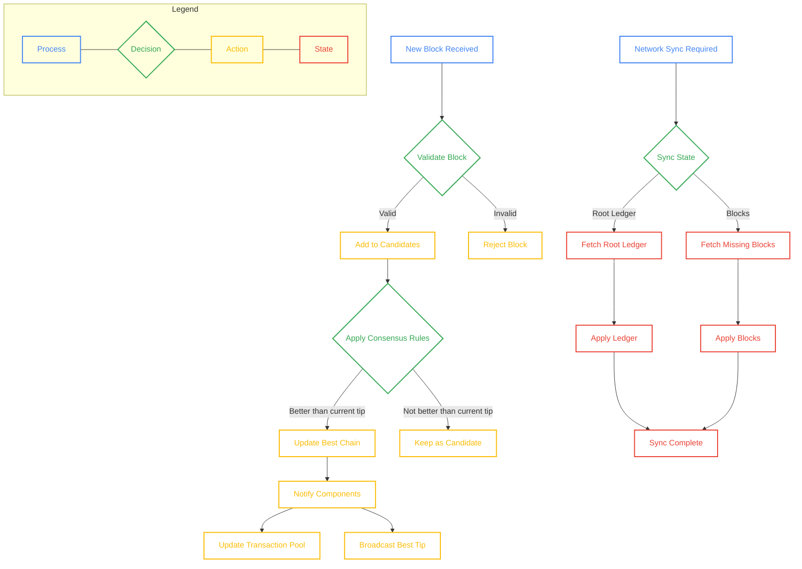

# Transition Frontier

## Overview

The Transition Frontier module is the core component responsible for maintaining the blockchain's current state and history in the Mina protocol. [Ref: doc:/Users/lukasimrich/Code/GitHub/openmina/docs/components-overview.md#Transition Frontier (0.95)] It serves as the central authority for consensus by processing incoming blocks, validating them according to protocol rules, and determining the canonical chain (best chain) from the root block to the current best tip. [Ref: item:openmina/node/src/transition_frontier/transition_frontier_state.rs::TransitionFrontierState::best_chain (1.0)]

The module implements critical blockchain operations including block validation and verification [Ref: file:openmina/node/src/transition_frontier/candidate/mod.rs (0.9)],

Ouroboros Samasika consensus protocol fork-choice rules (using both short-range and long-range rules) to select between competing chains [Ref: item:openmina/node/src/transition_frontier/candidate/transition_frontier_candidate_state.rs::TransitionFrontierCandidateState::cmp (0.95)], and network synchronization to ensure the local node stays up-to-date with the global blockchain state. [Ref: file:openmina/node/src/transition_frontier/sync/mod.rs (0.95)] When a new block is received, it undergoes validation and is added to the candidate pool, where consensus rules determine if it should become part of the best chain. [Ref: multi:(transition_frontier_actions.rs, candidate/transition_frontier_candidate_actions.rs) (0.85)]

The Transition Frontier maintains several key data structures, including the best chain (the current canonical chain from root to tip), candidate blocks (validated blocks that may become part of the best chain), and a blacklist of blocks that failed application despite having valid proofs. [Ref: item:openmina/node/src/transition_frontier/transition_frontier_state.rs::TransitionFrontierState (0.95)] It also manages the synchronization process through various states (Idle, Init, BlockFetchPending, BlockApplyPending, various LedgerPending states, BlocksSuccess, CommitPending, CommitSuccess, and Synced) to handle different phases of network synchronization. [Ref: item:openmina/node/src/transition_frontier/sync/transition_frontier_sync_state.rs::TransitionFrontierSyncState (0.95)]

Additionally, it provides basic archiving capabilities to maintain historical blockchain data beyond what is kept in the active transition frontier (note: currently in preliminary implementation state). [Ref: file:openmina/node/src/transition_frontier/archive/mod.rs (0.9)]

## Key Components

-   **State Management**: Maintains the blockchain state through the `TransitionFrontierState` structure [Ref: item:openmina/node/src/transition_frontier/transition_frontier_state.rs::TransitionFrontierState (1.0)]
-   **Candidate Management**: Handles validation and ordering of candidate blocks [Ref: file:openmina/node/src/transition_frontier/candidate/mod.rs (1.0)]
-   **Genesis Handling**: Manages the generation and initialization of the genesis block [Ref: file:openmina/node/src/transition_frontier/genesis/mod.rs (1.0)]
-   **Synchronization**: Coordinates the synchronization of blocks and ledger states with the network [Ref: file:openmina/node/src/transition_frontier/sync/mod.rs (1.0)]
-   **Archiving**: Provides functionality for storing historical blockchain data [Ref: file:openmina/node/src/transition_frontier/archive/mod.rs (1.0)]

[Browse the Transition Frontier Module Source Code and Detailed Inline Documentation](./)
