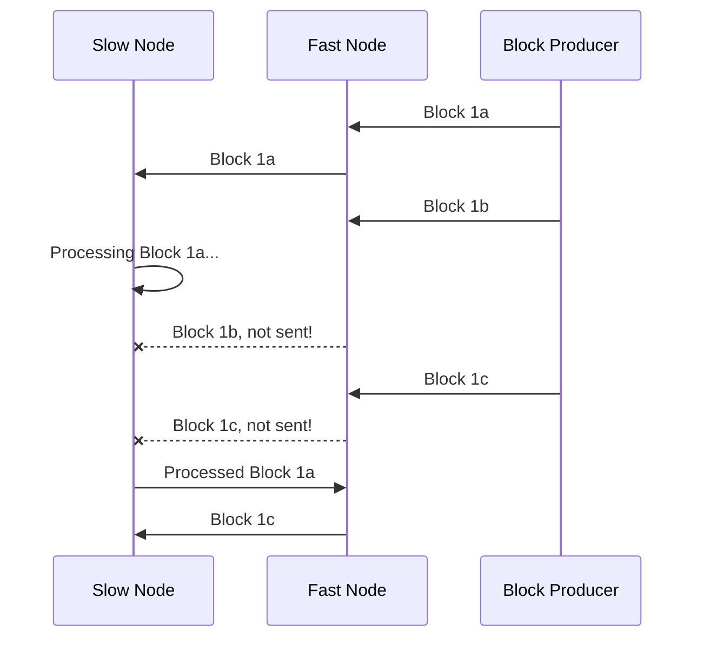

## Summary
[summary]: #summary

New Mina p2p protocol based on WebRTC.

## Goals
[design-goals]: #design-goals

1. **Full-node support**

   Protocol needs to be able to fully satisfy full-node's (block producer node's)
   needs.
2. **Low latency block and transaction propagation**

   To enable us to lower block time as low as possible.
3. **Efficient use of resources**

   To make running a node in mobile lighter on battery and enable wider
   availability.

   Also to enable the node to connect to as many peers as possible to
   decrease network diameter (minimum number of hops between the most
   distanced nodes).
4. **Low complexity**

   Needs to be as simple as possible.
5. **Very clear and strict rules for peers to follow**

   This again reduces complexity and makes network more byzantine node tolerant.

## Motivation
[motivation]: #motivation

In current implementation, full block (block header + included transactions)
are being broadcasted by every peer in the network.
> TODO(binier): maybe add here how Libp2p tries t solve it.

This is wasteful as we will receive same message from many peers. With
push based approach, this is inevitable.

Another bad thing about push based approach, is that it introduces more
complexity. At any given point, node might receive data through the
infinite stream.

While it's somewhat acceptable when the receiving node can process fast
enough, things get much worse when one node is processing messages faster
than the other one.

When that happens, kernel buffers on both sides gets filled up and
sender will have to choose:
1. **Start queueing messages**

   This can very quickly degrate/kill the network, unless fast nodes throttle
   themselves or slow nodes somehow become faster. Sure it can be mitigated
   by having bounds on the queue, but still eventualy peer connection will
   become unmanagable.
   Even if bounds are set, still the slow node will fall behind the network
   more and more, because it is processing old (maybe even no longer relevant)
   messages.
2. Simply drop messages which would need to be sent.

   This could cause whole lot of issues, handling of which will cause
   increase in complexity which we are trying to reduce.
3. Disconnect the peer.

   Makes network/topology less stable and will result in less resilient
   network topology.

Right now push based approach works, because the block time is much higher
than the block broadcasting and processing time. So this queue never gets
to accumulate, but closer we get those two numbers to each other, more
relevant/apparent this issue will become.

So we can't use **push** based approach, not only with block propagation,
but with anything.

Another option would be **poll** based approach. So we continously
poll data from the peer. While it's better than raw **push** based
approach, the only problem with that is that it's wasteful and increases
the cost of having each peer connected.

## Detailed design
[detailed-design]: #detailed-design

### Block propagation
[block-propagation]: #block-propagation

First thing that we need to take into account, is that thanks to Mina's
recursive proofs and it's consensus algorithm, we can verify blocks and
decide which one to use as the tip, without a need to have a complete
history.

This enables us to resolve forks without downloading and applying history
for each of them.

Now let's say we have a slow node or network.

Our peer saw 3 blocks on the same level: `1a`, `1b`, `1c`.
Now let's say we are very slow processing `1a` and before we finished,
our peer processed block `1b` and `1c`.

In push based architecture, we'd receive `1b` first and we would need to
download and process it. Even though in the end we are going to throw
it away and use `1c` instead. But we won't even know `1c` exists, until
we have finished or at least initiated processing of `1b`. And once we
have initiated it, it's hard to cancel it.

This means that we would have saved a lot of resources by skipping `1b`
completely.

Since forks happen a lot in the network (because two block producers can
often win the right to produce the block), this is a very relevant issue.

We can achieve above if we only allow 1 block to be sent at a time and
require feedback before sending another one, discarding all the transitions
in between.

This way for above example, we'd receive `1a`, when we are done, we send
confirmation and then we'd receive `1c`, never processing discarded `1b` block.

#### Rules

Channel for block propagation will be called: `best_tip_candidates`.

Peer sends just the block hash.
> TODO(binier): probably we should also include metadata for consensus,
> to resolve consensus even before we download full block.

- Peer should send the block once it:
  + Verifies the block.
  + Using consensus algorithm, decides this block is better than the
    last best tip candidate.
  + Has the full contents of the block as well as it's past blocks, because
    by sending the block hash, peer commits to provide all the necessary
    data for that block.

    > TODO(binier): should we require this for webnode as well?
- Peer shouldn't send another block until we give feedback about the last
  sent one.

We will send an error feedback on the block and blacklist a peer if:
- Peer sends us the block with an invalid proof.
- Peer sends us the block, which is weaker from consensus perspective,
  than the previously sent block by that peer on this channel.
- Peer fails to provide block contents for the hash sent in this channel,
  within athe reasonable timeout.
