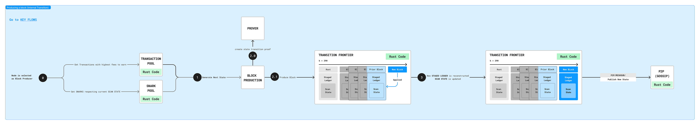
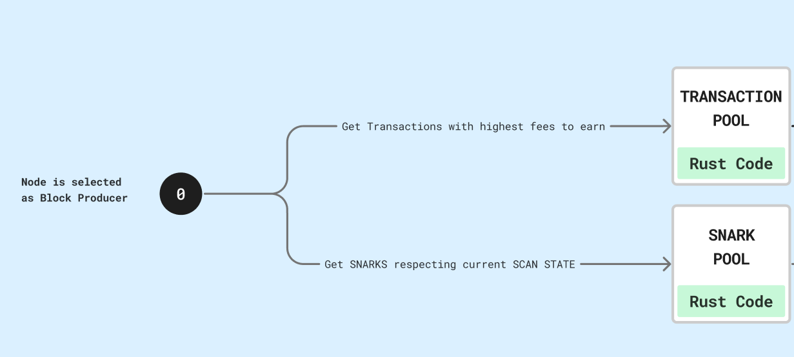
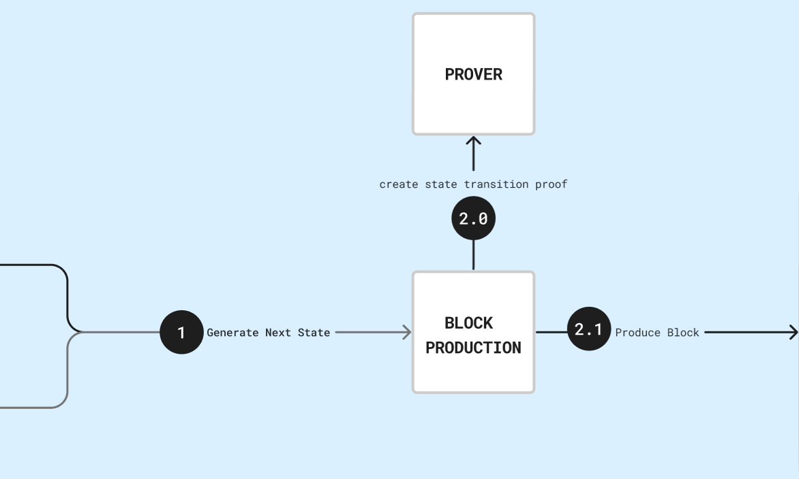
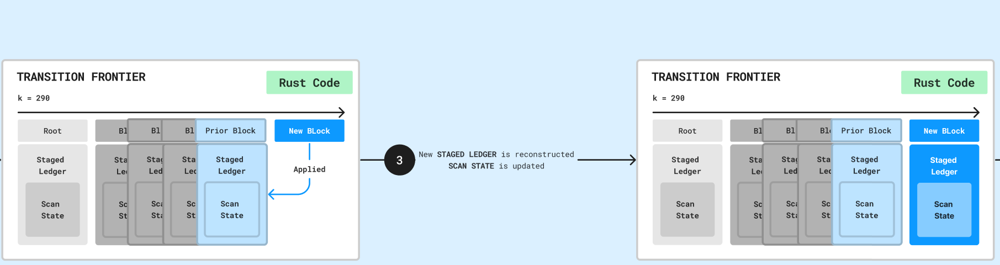
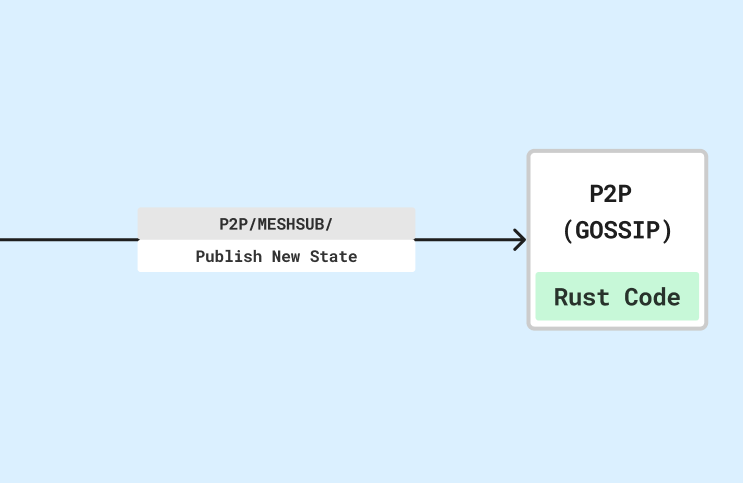

# Producing a block (internal transition)

Block production is a key process for a blockchain because it is responsible for
adding new transactions to the blockchain, securing the network, and maintaining
the chronological order of transactions. We have developed internal block
production for the Rust node. This document is an overview of how this process
works.

## Workflow overview

This is an overview of the internal block production workflow. Click on the
picture for a higher resolution:

## Block producer selection

The process begins with the node getting selected as a block producer.

## Block production requirements

To produce a block, it needs:

- **Transactions** with which it fills a block. Transactions are charged a
  certain fee - transactions with the highest fees are automatically selected by
  a producer (the fees are rewarded to the producer).
- **SNARKs** for transactions, however, due to the way the scan state operates,
  these SNARKs are usually not for the corresponding transactions included in
  the block.

## State transition

The combination of new transactions and SNARKs results in a new state for the
Mina blockchain. This is known as a state transition, which is why blocks are
sometimes known as transitions in Mina.

## Prover verification

Before this new state can be applied, it must be checked by a prover. The
block's SNARK proof is sent to a prover, who checks the SNARK proof. This
process is performed in OCaml. Once checked, the block can be produced.

## Ledger application

A new block is added to the head of the chain. The block is applied to the
staged ledger, but not yet to the SNARKed ledger. For that, it needs to have its
SNARK proof checked.

## Network broadcast

The block is applied to the SNARKed ledger, and a new state is then created,
which is broadcast across the PubSub P2P network.

